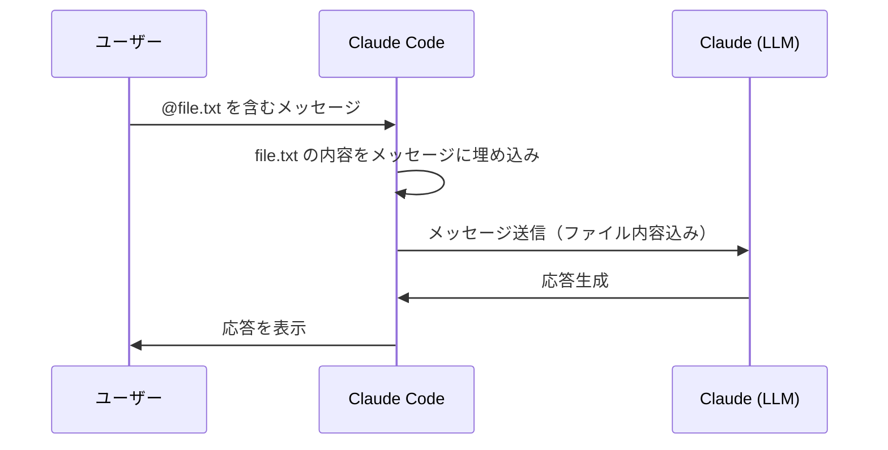
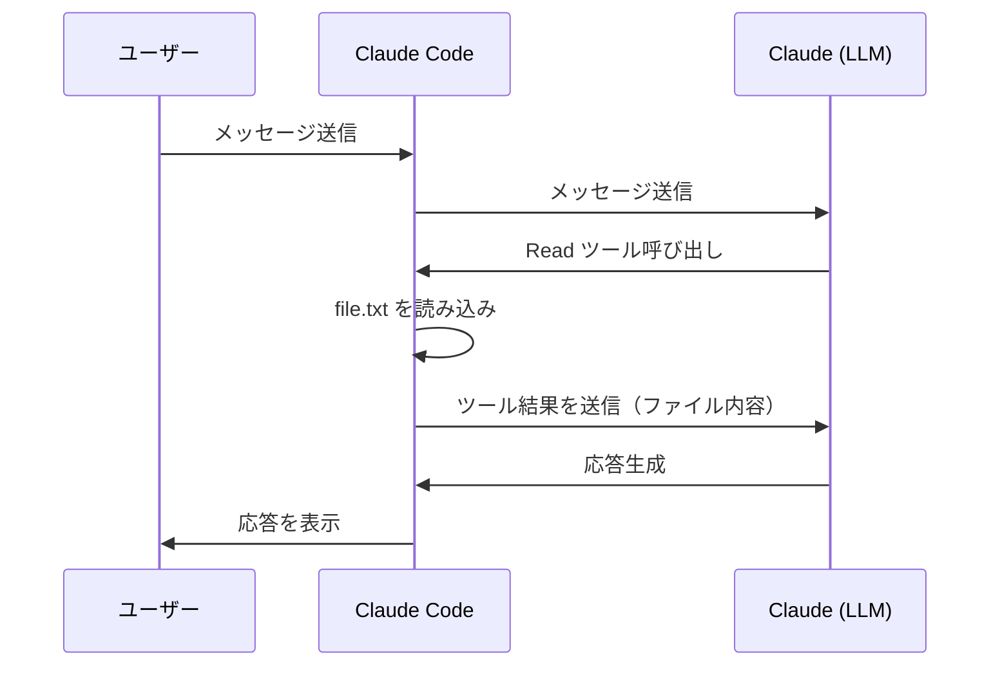
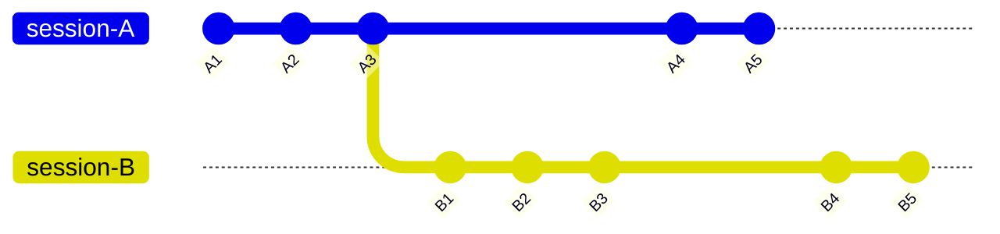

<!--
tags: Claude Code, CLAUDE.md, AI, LLM, コンテキストウィンドウ
-->

# (小ネタ) Claude Code のドキュメントを読んで気になったことを検証してみた

## はじめに

[Claude Code の公式ドキュメント](https://code.claude.com/docs/ja/) は結構頻繁に更新されているかなと思います。改めて読み直してみて、ドキュメントに書いてあることは分かるのですが「実際にはどのように動作するのだろう」と疑問に思ったことがいくつかありました。

それぞれのトピックを立てて、解説・検証した結果を記述しています。

なお、検証項目は公式ドキュメントを読んでいて「本当かな?」と思ったものだけをチョイスしているので、体系的な網羅性や一貫性はありません。あらかじめご了承ください。

:::note info
この記事の内容は本人が考えて決めてますが、文章は AI (Claude Code) が 100% 書いています。
:::

### 検証環境

- macOS（Apple Silicon）
- Claude Code v2.1.96（Opus 4.6、1M context）
- ターミナル: [Warp](https://www.warp.dev/) v0.2026.04.01

## 検証結果一覧

### 検証 1: `@import` はコンテキストを節約するか

[公式ドキュメント（日本語版）](https://code.claude.com/docs/ja/memory#%E5%8A%B9%E6%9E%9C%E7%9A%84%E3%81%AA%E6%8C%87%E7%A4%BA%E3%82%92%E6%9B%B8%E3%81%8F)には以下の記述があります。

> **サイズ**: CLAUDE.md ファイルあたり 200 行以下を目標にします。より長いファイルはより多くのコンテキストを消費し、遵守を減らします。指示が大きくなっている場合は、**インポート**または `.claude/rules/` ファイルを使用して分割します。

この記述を読むと「`@import` で分割すればコンテキストを節約できる」と解釈しがちですが、実際にはどうでしょうか。

#### セットアップ

CLAUDE.md に `@import_test.md` を記述し、import_test.md には Lorem ipsum（約 464 tokens 分）と識別用マーカー `UNIQUE_MARKER_12345_FOR_IMPORT_TEST` を配置しました。

#### 結果

`/context` の出力:

```
Memory files: 779 tokens (0.1%)
└ CLAUDE.md: 315 tokens
└ import_test.md: 464 tokens
```

**import_test.md は起動時にまるごと展開され、コンテキストに読み込まれています。** CLAUDE.md に直接書いた場合と同じだけトークンを消費します。

また同じドキュメント内に、以下のようにも記述されています。

> インポートされたファイルは展開され、それらを参照する CLAUDE.md と一緒に**起動時にコンテキストに読み込まれます。**

つまり `@import` は指示の**整理手段**であり、**コンテキスト節約手段ではありません**。

### 検証 2: `.claude/rules/` + `paths` はコンテキストを節約するか

`.claude/rules/` ディレクトリにルールファイルを置くと、`paths` frontmatter で特定のファイルタイプにスコープできます。これは本当にコンテキストを節約するのでしょうか。

#### セットアップ

2 つのルールファイルを作成しました。

**`.claude/rules/always-loaded.md`**（`paths` なし = 無条件読み込み）:
```markdown:.claude/rules/always-loaded.md
# 常に読み込まれるルール

UNIQUE_MARKER_ALWAYS_RULE_11111

- 認証情報など、秘匿情報がこのリポジトリに書き込まれないように注視してください
```

**`.claude/rules/shell-scripts.md`**（`paths` あり = 条件付き読み込み）:
```markdown:.claude/rules/shell-scripts.md
---
paths:
  - "**/*.sh"
---

# シェルスクリプトのルール

UNIQUE_MARKER_SHELL_RULE_67890

- シェルスクリプトを Read した際は、「SHELL SCRIPT LOADED!!」と毎回かならず言ってください
```

#### 結果

**起動直後**（`.sh` ファイル未読み込み）:

```
Memory files: 856 tokens (0.1%)
└ CLAUDE.md: 315 tokens
└ import_test.md: 464 tokens
└ .claude/rules/always-loaded.md: 77 tokens
```

- `always-loaded.md`（`paths` なし）: **読み込まれている**（77 tokens）
- `shell-scripts.md`（`paths: "**/*.sh"`）: **読み込まれていない**（0 tokens）

**`.sh` ファイルを読んだ後**:

Claude に `org_grep.sh`（.sh ファイル）を読ませた後、`/context` を再確認しました:

```
Memory files: 856 tokens (0.1%)
└ CLAUDE.md: 315 tokens
└ import_test.md: 464 tokens
└ .claude/rules/always-loaded.md: 77 tokens
```

Memory files のトークン数自体は変わりませんでしたが、**Claude は `shell-scripts.md` のルールに従った動作を示しました**。

```
  Read 1 file (ctrl+o to expand)

⏺ SHELL SCRIPT LOADED!!
```

つまり、パスマッチ時にルールがコンテキストに注入されていますが、`/context` の Memory files 集計には含まれない形で読み込まれています。

重要なのは、**`.sh` ファイルを読むまでは `shell-scripts.md` のルールは一切コンテキストに存在しなかった**という点です。`.claude/rules/` + `paths` は**本当にコンテキストを節約できる手段**です。

### 検証 3: CLAUDE.md を `.claude/` 配下に置くと `@import` のパスはどうなるか

[公式ドキュメント](https://code.claude.com/docs/ja/memory#claude-md-%E3%83%95%E3%82%A1%E3%82%A4%E3%83%AB%E3%82%92%E3%81%A9%E3%81%93%E3%81%AB%E9%85%8D%E7%BD%AE%E3%81%99%E3%82%8B%E3%81%8B%E3%82%92%E9%81%B8%E6%8A%9E%E3%81%99%E3%82%8B)には、プロジェクト指示の CLAUDE.md は `./CLAUDE.md` または `./.claude/CLAUDE.md` のどちらにも配置できると書かれています。

また、`@import` について以下の記述があります。

> 相対パスはワーキングディレクトリではなく、**インポートを含むファイルに相対的に解決**されます。

つまり CLAUDE.md の配置場所によって `@import` のパスが変わるはずです。実際に確認しました。

#### セットアップ

以下のディレクトリ構成でテストしました。

```
project/
├── .claude/
│   └── CLAUDE.md      ← ここに配置
└── files/
    └── 01/
        └── import_test.md
```

`.claude/CLAUDE.md` に `@files/01/import_test.md` と記述しました。

#### 結果

`/context` で確認すると、`import_test.md` は**読み込まれていませんでした**。

```
Memory files: 307 tokens (0.0%)
└ .claude/CLAUDE.md: 230 tokens
└ .claude/rules/always-loaded.md: 77 tokens
```

`@import` のパスは CLAUDE.md のある `.claude/` ディレクトリから解決されるため、`@files/01/import_test.md` は `.claude/files/01/import_test.md` を探しに行きます。正しく読み込むには `@../files/01/import_test.md` と書く必要がありました。

CLAUDE.md をプロジェクトルートに戻し、`@files/01/import_test.md` に修正したところ、正常に読み込まれました。

```
Memory files: 730 tokens (0.1%)
└ CLAUDE.md: 189 tokens
└ files/01/import_test.md: 464 tokens
└ .claude/rules/always-loaded.md: 77 tokens
```

#### 考察

CLAUDE.md は `.claude/` 配下に置くこともできますが、`@import` を使う場合はパスが `../` 始まりになり直感的ではありません。`@import` を多用するなら、**CLAUDE.md はプロジェクトルートに置く方が実用的**です。

### 検証 4: 画像の貼り付けは Cmd+V ではなく Ctrl+V?

[公式ドキュメント](https://code.claude.com/docs/ja/common-workflows#%E7%94%BB%E5%83%8F%E3%82%92%E4%BD%BF%E7%94%A8%E3%81%99%E3%82%8B)には、画像の貼り付け方法として以下の記述があります。

> 画像をコピーして、CLI に **ctrl+v** で貼り付ける（**cmd+v は使用しないでください**）

「cmd+v は使用しないでください」とありますが、本当に使えないのでしょうか。

#### 検証方法

同じ画像ファイルに対して、2 つのコピー方法 × 2 つのターミナルで貼り付けを試しました。

- **コピー方法 A**: Finder 上でファイルを選択してコピー（ファイルパスがクリップボードに入る）
- **コピー方法 B**: プレビュー等で画像を開き、画像データをコピー（画像バイナリがクリップボードに入る）

#### 結果

| コピー方法 | ターミナル | Cmd+V | Ctrl+V |
|---------|---------|:---:|:---:|
| A: Finder でファイルコピー | Warp | 可 | 可 |
| A: Finder でファイルコピー | macOS 標準ターミナル | 可 | 可 |
| B: 画像データをコピー | Warp | 可 | 可 |
| B: 画像データをコピー | macOS 標準ターミナル | **不可** | 可 |

#### 考察

Cmd+V はターミナルの標準的なテキストペーストです。Finder でファイルそのものを選択してコピーした場合はファイルパスがテキストとして貼り付けられ、Claude がそのパスから画像を読み込むため、どのターミナルでも動作します。

一方、プレビュー等から画像データ（バイナリ）をコピーした場合、macOS 標準ターミナルの Cmd+V ではテキストペーストしか行えないため、画像データを扱えません。Ctrl+V は Claude Code が独自にバインドしているショートカットで、クリップボードから画像データを直接取得できます。

Warp はモダンなターミナルで独自のクリップボード処理を持っているため、Cmd+V でも画像データの貼り付けが可能でした。

ドキュメントの注意書きは**正しい**ですが、ターミナルやコピー方法によっては Cmd+V でも動作するケースがあります。確実に動作させたい場合は、ドキュメント通り **Ctrl+V を使う**のが安全です。

### 検証 5: `@参照` はメッセージに直接埋め込まれるのか

[公式ドキュメント](https://code.claude.com/docs/ja/common-workflows#%E3%83%95%E3%82%A1%E3%82%A4%E3%83%AB%E3%81%A8%E3%83%87%E3%82%A3%E3%83%AC%E3%82%AF%E3%83%88%E3%83%AA%E3%82%92%E5%8F%82%E7%85%A7%E3%81%99%E3%82%8B)には、`@` を使用するとファイルやディレクトリをすばやく含められると書かれています。これは Claude が Read ツールで読むのとはどう異なるのでしょうか。

#### セットアップ

テストファイルを作成し、以下の 2 つの方法で読み込みを試しました。

- **方法 A**: `@files/05/at_reference_test.txt` でメッセージに含める
- **方法 B**: Claude に「ファイルを読んで」と指示し、Read ツールで読ませる

#### 結果

**方法 A（@参照）の場合**:

画面上にはユーザーのメッセージ側に以下が表示されました。

```
❯ @files/05/at_reference_test.txt
  ⎿  Read files/05/at_reference_test.txt (4 lines)
```

Claude は Read ツールを呼び出さずに、ファイル内容を即座に認識して応答しました。

**方法 B（Read ツール）の場合**:

ユーザーの指示に対して、Claude の応答側にツール呼び出しが表示されました。

```
> このファイルを読んでください files/05/at_reference_test.txt

⏺ Read(file_path: "files/05/at_reference_test.txt")
```

Claude がツールを実行し、その結果を受け取ってから応答を生成しました。

#### @参照と Read ツールの違い

この 2 つは見た目は似ていますが、動作が異なります。`@参照` はメッセージ送信時にファイル内容がプロンプトに埋め込まれるため、agentic loop が 1 回で済みます。Read ツールの場合は、Claude がツールを呼び出して結果を受け取る分、2 回のループが必要です。

**@参照の場合（1 ループ）**:



**Read ツールの場合（2 ループ）**:



`@参照` の方が 1 ループ分少ないため、レスポンスが速く、API コール数も少なくなります。読ませたいファイルが事前に分かっている場合は、`@参照` を使う方が効率的です。

### 検証 6: 2 つのセッションで同じディレクトリから `--continue` するとどうなるか

[公式ドキュメント](https://code.claude.com/docs/ja/how-claude-code-works#%E3%82%BB%E3%83%83%E3%82%B7%E3%83%A7%E3%83%B3%E3%82%92%E5%86%8D%E9%96%8B%E3%81%BE%E3%81%9F%E3%81%AF%E3%83%95%E3%82%A9%E3%83%BC%E3%82%AF%E3%81%99%E3%82%8B)には、同じセッションを複数のターミナルから再開した場合について以下のように書かれています。

> **複数のターミナルで同じセッション**：複数のターミナルで同じセッションを再開すると、両方のターミナルが同じセッションファイルに書き込みます。両方からのメッセージがインターリーブされます。同じノートブックに 2 人が書き込むようなものです。何も破損しませんが、会話がごちゃごちゃになります。セッション中、各ターミナルは独自のメッセージのみを見ますが、後でそのセッションを再開すると、すべてがインターリーブされた状態で表示されます。同じ開始点から並列作業する場合は、`--fork-session` を使用して各ターミナルに独自のクリーンなセッションを与えます。

これが本当なのか検証しました。

#### セットアップ

2 つのターミナルを開き、同じディレクトリで `claude --continue` を実行しました。それぞれに以下の指示を出しました。

- **セッション A**: agentic loop で「セッション A」と 10 回発言
- **セッション B**: agentic loop で「セッション B」と 10 回発言

両方をほぼ同時に実行しました。

#### 結果

**実行中**: 2 つのセッションはお互いの内容を認識せず、それぞれ独立して動作しました。エラーも発生しませんでした。

**`--resume` で確認**: セッション B の内容のみが表示され、セッション A の内容は見えませんでした。

**セッションファイルを直接確認**: セッションファイル（JSONL）を調べると、両方のデータが時系列で混在して保存されていました。以下は実際の JSONL から抜粋したデータです（関係ないフィールドは省略）。

```jsonl:~/.claude/projects/<project>/<session-id>.jsonl
{"uuid":"26163b14...","parentUuid":"a754eec6...","timestamp":"11:44:18","message":"セッションA: 1回目"}
{"uuid":"b759fb1e...","parentUuid":"46cc3a00...","timestamp":"11:44:24","message":"セッションA: 2回目"}
{"uuid":"11ad510f...","parentUuid":"19860c17...","timestamp":"11:44:27","message":"セッションB: 1回目"}
{"uuid":"b2eb8b0c...","parentUuid":"51f4b07f...","timestamp":"11:44:31","message":"セッションA: 3回目"}
{"uuid":"50cf9902...","parentUuid":"6360fbe6...","timestamp":"11:44:34","message":"セッションB: 2回目"}
{"uuid":"aa26ee33...","parentUuid":"ee1234de...","timestamp":"11:44:35","message":"セッションA: 4回目"}
{"uuid":"fcdcc7fd...","parentUuid":"c257a11f...","timestamp":"11:44:39","message":"セッションB: 3回目"}
{"uuid":"5c0c5691...","parentUuid":"94de99f5...","timestamp":"11:44:41","message":"セッションA: 5回目"}
{"uuid":"56cca8db...","parentUuid":"57acea8a...","timestamp":"11:44:43","message":"セッションB: 4回目"}
```

※ `uuid` は省略表記、`message` は分かりやすさのために簡略化しています。

上書きではなく、両方のデータがファイルに存在しています。注目すべきは `parentUuid` フィールドです。セッション A のメッセージの `parentUuid` はセッション A の前のメッセージを指し、セッション B も同様です。**2 つの独立したチェーンが同じファイルに混在**しています。

#### なぜ片方しか表示されないのか

JSONL の各メッセージには `parentUuid` フィールドがあり、「どのメッセージの次に来るか」という親子関係を記録しています。セッション B は `--continue` でセッション A の途中から接続するため、**同じルートから分岐した 2 つのチェーン**になります。



`--resume` や `--continue` はファイル末尾の最新メッセージから `parentUuid` チェーンを辿って会話を復元するようです。そのため、**最後に書き込みを終えた方のチェーンだけが表示**されます。

これを確認するため、セッション A を後に終わらせる実験も行いました。結果、`--resume` でも `--continue` でもセッション A が表示されました。**後から書き込みを終えた方が優先される**ようです。

#### まとめ

ドキュメントの記述は正確です。ただし「会話が混在する」のはセッションファイルレベルの話であり、`--resume`/`--continue` で再開した場合は最後に書き込んだ方のチェーンのみが復元されます。もう片方のデータはセッションファイルには残っていますが、UI 上は見えなくなります。

実運用では、**同じディレクトリで同時に `--continue` するのは避けるべき**です。片方の会話履歴が UI 上で見えなかったり、意図した通りに動作しない可能性があります。

### 検証 7: Plan Mode の Ctrl+G でプランファイルが開けない（Warp）

[公式ドキュメント](https://code.claude.com/docs/ja/common-workflows#plan-mode-%E3%82%92%E4%BD%BF%E7%94%A8%E3%81%97%E3%81%A6%E5%AE%89%E5%85%A8%E3%81%AA%E3%82%B3%E3%83%BC%E3%83%89%E5%88%86%E6%9E%90%E3%82%92%E8%A1%8C%E3%81%86)には、Plan Mode について以下の記述があります。

> `Ctrl+G` を押してデフォルトのテキストエディタで計画を開き、Claude が進める前に直接編集できます。

しかし、ターミナルに Warp を使用している場合、Ctrl+G を押しても何も起きませんでした。

#### 原因調査

macOS 標準ターミナルで同じ操作を試したところ、Ctrl+G でプランファイルが正常に開けました。Warp 固有の問題であることが確定したため、Warp のキーボードショートカット設定（Cmd+/）を調査しました。

Ctrl+G には以下の 3 つの Warp アクションが割り当てられていました。

| Warp アクション名 | YAML キー名 | 原因 |
|---------|---------|:---:|
| Add Selection for Next Occurrence | `editor_view:add_next_occurrence` | No |
| Go to Line | `editor_view:go_to_line` | No |
| Open CLI Agent Rich Input | `terminal:open_cli_agent_rich_input` | **Yes** |

1 つずつ無効化して検証した結果、**`terminal:open_cli_agent_rich_input`（Warp の AI Agent 入力）が Ctrl+G を横取りしていた**ことが原因でした。

#### 解決方法

`~/.warp/keybindings.yaml` に以下を追加します。

```yaml:~/.warp/keybindings.yaml
"terminal:open_cli_agent_rich_input": none
```

これにより Warp が Ctrl+G を処理しなくなり、Claude Code の Plan Mode で Ctrl+G が正常に動作するようになりました。

#### 補足

なお、Ctrl+G で開くエディタは `$EDITOR` 環境変数ではなく、Claude Code がインストール済みの IDE（VS Code など）を自動検出して決定します。`$EDITOR` が未設定でも Ctrl+G は動作することを確認しました（[関連 Issue #18990](https://github.com/anthropics/claude-code/issues/18990)、[関連 Issue #12546](https://github.com/anthropics/claude-code/issues/12546)）。

### 検証 8: スキルファイル内の `@-mention` はルールベースで処理されるか

[公式ドキュメント](https://code.claude.com/docs/ja/sub-agents#%E3%82%B5%E3%83%96%E3%82%A8%E3%83%BC%E3%82%B8%E3%82%A7%E3%83%B3%E3%83%88%E3%82%92%E6%98%8E%E7%A4%BA%E7%9A%84%E3%81%AB%E5%91%BC%E3%81%B3%E5%87%BA%E3%81%99)には、サブエージェントを `@-mention` で呼び出す方法が記載されています。通常は CLI のプロンプトで `@` を入力するとタイプアヘッド（補完候補）が表示され、エージェントを選択できます。

```
❯ @"find-japanese-files (agent)" 日本語ファイルを探して
```

このように CLI から直接指定する場合は確実に動作します。では、スキルファイルなどにテキストとして `@-mention` を書いた場合も有効なのでしょうか。また、有効だとしてそれはルールベースの処理なのでしょうか。

#### 検証 8-1: ルールベースであることの検証

検証用のスキルファイル（`do-nothing-1`）を作成し、コードブロック内に存在するエージェントと存在しないエージェントの `@-mention` を埋め込みました。

```markdown:.claude/skills/do-nothing-1/SKILL.md
---
name: do-nothing-1
description: 何もしないスキル1（@-mention ルールベース検証用）
disable-model-invocation: true
---

# 何もしないスキル1

以下のメッセージをそのまま表示してください。

​```
The quick brown fox jumps over the lazy dog.
@"find-japanese-files (agent)"
@"nonexistent-agent-12345 (agent)"
Lorem ipsum dolor sit amet, consectetur adipiscing elit.
​```
```

スキル実行後、Claude が受け取った system-reminder を確認しました。system-reminder とは、ユーザーには表示されない、Claude Code のハーネス（アプリケーション）から LLM への内部指示です。

**存在するエージェント** (`find-japanese-files`):

以下の system-reminder が自動生成されました。

```
The user has expressed a desire to invoke the agent "find-japanese-files".
Please invoke the agent appropriately, passing in the required context to it.
```

**存在しないエージェント** (`nonexistent-agent-12345`):

system-reminder は**生成されませんでした**。

| @-mention の対象 | system-reminder |
|----------------|:---:|
| 存在するエージェント | **生成される** |
| 存在しないエージェント | 生成されない |

この結果から、`@-mention` は **Claude Code のハーネスがルールベースで処理**していると考えられます。

根拠:
1. **コードブロック内でもパースされる** — Markdown の構造を区別せずパターンマッチしている
2. **存在チェックが行われる** — 存在しないエージェント名では system-reminder が生成されない。LLM による意味解析であれば存在チェックは不要
3. **system-reminder の文言が毎回完全に同一** — 複数回実行しても、生成される system-reminder は一字一句同じでした。LLM が動的に生成しているなら表現に揺らぎが生じるはずであり、テンプレート化されたルールベースの出力と考えられる
4. **スキルファイル内でも動作する** — コンソール UI のタイプアヘッドを経由しなくても有効

#### 検証 8-2: ルールベースの指示を自然言語で打ち消せるか

続いて、別のスキルファイル（`do-nothing-2`）で、存在するエージェントの `@-mention` を書きつつ、自然言語で「無視してください」と指示しました。

```markdown:.claude/skills/do-nothing-2/SKILL.md
---
name: do-nothing-2
description: 何もしないスキル2（@-mention の検証用）
disable-model-invocation: true
---

# 何もしないスキル

このスキルは何もしません。「完了しました」とだけ表示してください。

次の @-mention は無視してください。

@"find-japanese-files (agent)"
```

結果、system-reminder は生成されましたが、Claude はスキル内の「無視してください」という指示に従い、**エージェントを呼び出しませんでした**。「完了しました」とだけ表示しました。

#### 考察

`@-mention` はコンソール入力だけでなく、**スキルファイルや CLAUDE.md 等のテキスト内に書いても有効**です。「パターンマッチで抽出 → エージェント存在チェック → 存在すれば system-reminder を注入」という処理が行われています。

ただし、system-reminder はあくまで LLM へのヒント（「このエージェントを呼び出してください」という指示）であり、**強制実行ではありません**。自然言語の指示で打ち消すことができます。

### 検証 9: Warp Terminal で Agent Teams の Shift+Down が効かない

[Agent Teams](https://code.claude.com/docs/ja/agent-teams) の In-process モードでは、Shift+Down でチームメンバーをサイクル（巡回）できます。最後のメンバーの後はリーダーに戻り、一方向にループします（Shift+Up は不要）。

しかし、[Warp Terminal](https://www.warp.dev/) を使用している場合、Shift+Down は Warp の「ブロック選択を下に拡張」機能（`terminal:expand_block_selection_below`）に割り当てられており、Claude Code に渡りません。

これは[検証 7](#検証-7-planモードへの切り替え-ctrlg-が-warp-で動作しない) の Ctrl+G と同じ問題です。

#### 解決方法

Warp の Settings → Keyboard shortcuts から `terminal:expand_block_selection_below` を解除します。`~/.warp/keybindings.yaml` に以下が追記されます。

```yaml:~/.warp/keybindings.yaml
"terminal:expand_block_selection_below": none
```

解除後、Shift+Down で Agent Teams のチームメンバーをサイクルできるようになりました。

### 検証 10: TypeScript LSP プラグインは何をしているのか

[公式ドキュメント](https://code.claude.com/docs/ja/discover-plugins#%E3%82%B3%E3%83%BC%E3%83%89-%E3%82%A4%E3%83%B3%E3%83%86%E3%83%AA%E3%82%B8%E3%82%A7%E3%83%B3%E3%82%B9)には、LSP（Language Server Protocol）プラグインを導入すると Claude Code にコードインテリジェンス機能が追加されると書かれています。

> TypeScript/JavaScript language server for Claude Code, providing code intelligence features like go-to-definition, find references, and error checking.

しかし、プラグインをインストールしても **Claude Code の画面上には何も変化がありません**。LSP は裏で何をしていて、どこで使われ、何の効用があるのでしょうか。

#### セットアップ

`/plugins` コマンドから `typescript-lsp` プラグインを有効化し、README に記載されている通り `typescript-language-server` をグローバルインストールしました。

```bash
npm install -g typescript-language-server typescript
```

有効化後の `~/.claude/settings.json` には以下が追記されます。

```json:~/.claude/settings.json（抜粋）
{
  "enabledPlugins": {
    "typescript-lsp@claude-plugins-official": true
  }
}
```

#### LSP が追加するもの: LSP ツール

LSP プラグインが有効になると、Claude の利用可能なツールに **LSP ツール** が追加されます。このツールは以下の操作をサポートしています。

| 操作 | 説明 |
|------|------|
| `hover` | シンボルの型情報やドキュメントを取得 |
| `goToDefinition` | シンボルの定義元にジャンプ |
| `findReferences` | シンボルの全参照箇所を検索 |
| `documentSymbol` | ファイル内の全シンボル（関数・クラス・変数等）を一覧 |
| `workspaceSymbol` | ワークスペース全体でシンボルを検索 |
| `goToImplementation` | インターフェースの実装を検索 |
| `prepareCallHierarchy` | コール階層の取得 |
| `incomingCalls` | その関数を呼び出している箇所 |
| `outgoingCalls` | その関数が呼び出している関数 |

Claude は従来 Grep や Read で「テキストとして」コードを検索していましたが、LSP ツールにより**意味を理解した上で**コードをナビゲートできるようになります。

#### 実際の動作検証

以下の TypeScript ファイルを用意しました。

```typescript:files/10/sample.ts
interface User {
  id: number;
  name: string;
  email: string;
}

function greetUser(user: User): string {
  return `Hello, ${user.name}!`;
}

const alice: User = { id: 1, name: "Alice", email: "alice@example.com" };
const message = greetUser(alice);
console.log(message);
```

**hover（型情報の取得）**:

`greetUser` 関数（7 行目）にカーソルを合わせると、型シグネチャが返ります。

```
LSP hover at 7:10 → function greetUser(user: User): string
```

`message` 変数（12 行目）は明示的に型を書いていませんが、推論結果が返ります。

```
LSP hover at 12:7 → const message: string
```

Read ツールではファイルの内容がそのまま返るだけで、型推論の結果は得られません。

**goToDefinition（定義元ジャンプ）**:

関数シグネチャ内の `User`（7 行目）から定義元を辿ると、1 行目の `interface User` が返ります。

```
LSP goToDefinition at 7:28 → files/10/sample.ts:1:11
```

**findReferences（参照検索）**:

`User` インターフェース（1 行目）の全参照箇所を検索すると、正確に 3 箇所が返ります。

```
LSP findReferences at 1:11 → 3 references:
  Line 1:11   (定義)
  Line 7:26   (関数の引数の型)
  Line 11:14  (変数の型アノテーション)
```

ここで重要なのは、同じ検索を Grep で行った場合との違いです。

```
Grep "User" → 4 行がヒット:
  Line 1:  interface User {
  Line 7:  function greetUser(user: User): string {
  Line 11: const alice: User = { ...
  Line 12: const message = greetUser(alice);
```

Grep は「User」というテキストを含む全行を返すため、`greetUser` という関数名や `user` という変数名もヒットします。一方、LSP の `findReferences` は `User` **インターフェースの参照だけ**を正確に返します。

**documentSymbol（シンボル一覧）**:

ファイル内の構造を意味的に解析し、シンボルとその種類を返します。

```
LSP documentSymbol:
  User (Interface) - Line 1
    id (Property) - Line 2
    name (Property) - Line 3
    email (Property) - Line 4
  greetUser (Function) - Line 7
  alice (Constant) - Line 11
  message (Constant) - Line 12
```

インターフェースのプロパティが入れ子で表現されるなど、コードの構造が意味的にパースされています。

#### Claude はいつ LSP を使うのか

LSP ツールは Claude が**自律的に判断して**使います。ユーザーが明示的に「LSP を使え」と指示する必要はありません。たとえば以下のような場面で、Claude は Grep/Read の代わりに（または併用して）LSP ツールを選択します。

- 「この関数の定義元を探して」→ `goToDefinition`
- 「この型を使っている箇所を全部見つけて」→ `findReferences`
- 「このファイルの構造を教えて」→ `documentSymbol`
- リファクタリング時に影響範囲を調べる → `findReferences` + `incomingCalls`

画面上では、Claude が LSP ツールを呼び出すと以下のように表示されます。

```
⏺ LSP(operation: "findReferences", filePath: "src/index.ts", line: 5, character: 10)
  ⎿  Found 3 references across 1 files: ...
```

Read や Grep と同じように、ツール呼び出しとして表示されます。プラグイン導入前はこのツール自体が存在しないため、Claude はテキストベースの検索しかできません。

#### LSP と Grep/Read の使い分け

| 観点 | LSP | Grep / Read |
|------|-----|-------------|
| 検索の精度 | **意味ベース**（型・スコープを理解） | テキストベース（文字列一致） |
| 型情報 | 推論結果を含めて取得可能 | 取得不可 |
| セットアップ | プラグイン + 言語サーバーのインストールが必要 | 不要（組み込み） |
| 対応言語 | プラグインが提供する言語のみ | 全ファイル |
| 処理速度 | 言語サーバーの起動が必要（初回はやや遅い） | 即座に実行可能 |

LSP はより正確なコード理解を提供しますが、Grep/Read が不要になるわけではありません。LSP は対応言語のソースコードに限られますが、Grep はどんなテキストファイルでも検索できます。

#### まとめ

TypeScript LSP プラグインは、Claude Code に **「コードの意味を理解する目」** を与えるものです。導入しても画面上に目立つ変化はありませんが、Claude が利用できるツールが増え、テキスト検索では得られない型情報・定義ジャンプ・正確な参照検索が可能になります。

特に大規模な TypeScript プロジェクトでは、同名の変数や関数が多数存在するため、Grep では精度が落ちるケースがあります。LSP を導入しておくと、Claude がリファクタリングや影響範囲の調査をより正確に行えるようになります。

### 検証 11: SKILL.md から同じフォルダ内のファイルを参照できるか

[公式ドキュメント](https://code.claude.com/docs/ja/skills)には、SKILL.md からスキルフォルダ内の補助ファイルを参照できると書かれています。しかし、実際にどの構文が機能するのか、そしてファイルの内容が自動的にコンテキストに読み込まれるのかは明記されていません。

#### 検証方針

スキルフォルダ内に参照用ファイル `ref-data.md`（一意マーカー `UNIQUE_MARKER_SKILL_REF_99999` を含む）を配置し、SKILL.md から 3 つの方式で参照を試みます。

**テスト用スキルの構成:**

```
.claude/skills/file-ref-test/
├── SKILL.md        # 3 つの方式で ref-data.md を参照
└── ref-data.md     # 一意マーカーを含む参照用ファイル
```

**SKILL.md で試した 3 つの参照方式:**

```markdown
## 方式 A: マークダウンリンク構文
参照データは [ref-data.md](ref-data.md) にあります。

## 方式 B: @構文（CLAUDE.md と同じ形式）
@ref-data.md

## 方式 C: ${CLAUDE_SKILL_DIR} 変数
参照先: ${CLAUDE_SKILL_DIR}/ref-data.md
```

#### 結果

スキルを `/file-ref-test` で呼び出すと、ハーネスは SKILL.md の内容を展開してプロンプトとして Claude に渡します。その展開結果を分析しました。

| 方式 | 構文 | ファイル内容のロード | ハーネスの処理 |
|------|------|:---:|------|
| A | `[ref-data.md](ref-data.md)` | **されない** | マークダウンリンクのまま残る |
| B | `@ref-data.md` | **されない** | テキストのまま残る |
| C | `${CLAUDE_SKILL_DIR}/ref-data.md` | **されない** | **変数は実パスに展開される** |

マーカー `UNIQUE_MARKER_SKILL_REF_99999` はコンテキスト内に一切確認できませんでした。**どの方式でも、ハーネスによるファイル内容の自動ロードは行われません。**

**証跡: ハーネスが展開した SKILL.md の全文**

以下は `/file-ref-test` を実行した際に、ハーネスが Claude に渡したプロンプトの全文です。

```markdown
Base directory for this skill: /Users/{username}/src/claude-code-doc-verify/.claude/skills/file-ref-test

# ファイル参照テスト

このスキルは SKILL.md からのファイル参照が機能するかを検証します。
以下の 3 つの方式で同じフォルダ内の `ref-data.md` を参照しています。

## 方式 A: マークダウンリンク構文

参照データは [ref-data.md](ref-data.md) にあります。

## 方式 B: @構文（CLAUDE.md と同じ形式）

@ref-data.md

## 方式 C: /Users/{username}/src/claude-code-doc-verify/.claude/skills/file-ref-test 変数

参照先: /Users/{username}/src/claude-code-doc-verify/.claude/skills/file-ref-test/ref-data.md

## 実行指示

上記の参照方式のうち、どれが実際に `ref-data.md` の内容をコンテキストにロードしたかを報告してください。
特に `UNIQUE_MARKER_SKILL_REF_99999` というマーカーがシステムプロンプトに含まれているかどうかを確認してください。

以下のフォーマットで回答してください:

方式 A（マークダウンリンク）: ロードされた / ロードされていない
方式 B（@構文）: ロードされた / ロードされていない
方式 C（${CLAUDE_SKILL_DIR}）: ロードされた / ロードされていない
マーカー UNIQUE_MARKER_SKILL_REF_99999 の存在: 確認できた / 確認できない
```

`${CLAUDE_SKILL_DIR}` が実パスに展開されている一方、`@ref-data.md` とマークダウンリンクはそのまま残り、`ref-data.md` の内容（マーカー `UNIQUE_MARKER_SKILL_REF_99999`）はどこにも含まれていないことが確認できます。

#### CLAUDE.md の @import との違い

CLAUDE.md では `@files/01/import_test.md` と書くと、ハーネスがファイル内容を自動的にシステムプロンプトへ展開します（検証 1 で確認済み）。一方、SKILL.md では同じ `@` 構文を使ってもハーネスは何もしません。

| 機能 | CLAUDE.md | SKILL.md |
|------|:---------:|:--------:|
| `@ファイルパス` で自動ロード | **される** | されない |
| `${CLAUDE_SKILL_DIR}` 変数展開 | N/A | **される** |
| マークダウンリンクで自動ロード | N/A | されない |

#### ${CLAUDE_SKILL_DIR} の役割

唯一ハーネスが処理する機能は [`${CLAUDE_SKILL_DIR}` の変数展開](https://code.claude.com/docs/en/skills#available-string-substitutions)です。SKILL.md に `${CLAUDE_SKILL_DIR}` と書くと、スキルフォルダの絶対パスに置換されます。

```
# SKILL.md に書いた内容
参照先: ${CLAUDE_SKILL_DIR}/ref-data.md

# ハーネスが展開した結果
参照先: /Users/user/project/.claude/skills/file-ref-test/ref-data.md
```

これはファイルを読み込むのではなく、AI に「このパスにファイルがあるよ」と伝えるだけです。AI がそのパスを Read ツールで読むかどうかは AI の判断に委ねられます。

#### ハーネスが自動付与する情報

スキル呼び出し時、ハーネスは SKILL.md の内容の先頭に以下の行を自動付与します。

```
Base directory for this skill: /Users/user/project/.claude/skills/file-ref-test
```

これにより AI はスキルフォルダの場所を把握し、必要に応じてフォルダ内のファイルを Read ツールで読み込むことができます。

#### まとめ

SKILL.md からのファイル参照は **すべて AI 駆動** です。CLAUDE.md の `@import` のようなハーネスレベルの自動ロード機構は存在しません。ドキュメントに「supporting files を参照できる」と書かれているのは、AI がマークダウンリンクや `${CLAUDE_SKILL_DIR}` を手がかりにファイルを読みに行くことを意味しています。

スキルで補助ファイルを使いたい場合は、`${CLAUDE_SKILL_DIR}` を使ってパスを明示し、SKILL.md の指示文に「このファイルを Read ツールで読んでください」と明記するのが確実です。

### 検証 12: プラグイン版スキルでも SKILL.md のファイル参照は同じ挙動か

検証 11 ではプロジェクトレベルのスキル（`.claude/skills/`）で SKILL.md からのファイル参照を検証しました。ここでは、**プラグインに含まれるスキル**でも同じ挙動になるかを確認します。

#### セットアップ

カスタムプラグインを作成し、`--plugin-dir` フラグで読み込みます。

**プラグインの構成:**

```
files/11/skill-ref-test-plugin/
├── .claude-plugin/
│   └── plugin.json
└── skills/
    └── plugin-ref-test/
        ├── SKILL.md          # 検証 11 と同じ 3 方式で参照
        └── ref-data.md       # UNIQUE_MARKER_PLUGIN_SKILL_REF_88888
```

```bash
claude --plugin-dir ./files/11/skill-ref-test-plugin
```

プラグインのスキルはネームスペース付きで `/skill-ref-test-plugin:plugin-ref-test` として呼び出します。

#### 結果

**プロジェクト版スキル（検証 11）と完全に同じ挙動でした。**

| 方式 | 構文 | ファイル内容のロード | ハーネスの処理 |
|------|------|:---:|------|
| A | `[ref-data.md](ref-data.md)` | **されない** | マークダウンリンクのまま残る |
| B | `@ref-data.md` | **されない** | テキストのまま残る |
| C | `${CLAUDE_SKILL_DIR}/ref-data.md` | **されない** | **変数は実パスに展開される** |

**証跡: ハーネスが展開したプラグイン版 SKILL.md の全文**

```markdown
Base directory for this skill: /Users/{username}/src/claude-code-doc-verify/files/11/skill-ref-test-plugin/skills/plugin-ref-test

# プラグイン版ファイル参照テスト

このスキルはプラグイン内の SKILL.md からのファイル参照が機能するかを検証します。
以下の 3 つの方式で同じフォルダ内の `ref-data.md` を参照しています。

## 方式 A: マークダウンリンク構文

参照データは [ref-data.md](ref-data.md) にあります。

## 方式 B: @構文（CLAUDE.md と同じ形式）

@ref-data.md

## 方式 C: /Users/{username}/src/claude-code-doc-verify/files/11/skill-ref-test-plugin/skills/plugin-ref-test 変数

参照先: /Users/{username}/src/claude-code-doc-verify/files/11/skill-ref-test-plugin/skills/plugin-ref-test/ref-data.md

## 実行指示

（以下略）
```

`${CLAUDE_SKILL_DIR}` のみ実パスに展開され、`@ref-data.md` とマークダウンリンクはそのまま残り、マーカー `UNIQUE_MARKER_PLUGIN_SKILL_REF_88888` はどこにも含まれていませんでした。

#### まとめ

プラグイン版スキルでも、プロジェクト版スキル（検証 11）とファイル参照の挙動は完全に同一です。SKILL.md からのファイル自動ロードはどちらの配置方法でも行われず、`${CLAUDE_SKILL_DIR}` の変数展開のみがハーネスレベルで処理されます。

### 検証 13: フックで echo したら画面に表示されるか

フックのコマンドで `echo` を使えば画面に表示されそうだと直感的に思いますが、実際にはそうではありません。

[公式ドキュメント](https://code.claude.com/docs/ja/hooks)によると、フックコマンドの出力は以下のように処理されます。

| 出力先 | 終了コード 0 | 終了コード 2（ブロック） |
|--------|-------------|---------------------|
| stdout | Claude Code の制御構文として使用<br/>（JSON 形式で出力しなければならない） | 無視される |
| stderr | 無視される | Claude へのフィードバック |

stdout はユーザー画面に表示するためのものではなく、Claude Code がフックの結果を受け取るための制御チャネルです。画面に表示するには、JSON の `systemMessage` フィールドを使う必要があります。

#### セットアップ

`PreToolUse` フックで Bash ツールが呼ばれた際に、2 つの方法でメッセージを出力しました。

**方法 A: 標準出力（echo）**
```json
{
  "type": "command",
  "command": "echo 'Bash ツールが呼び出されました'"
}
```

**方法 B: systemMessage（JSON）**
```json
{
  "type": "command",
  "command": "echo '{\"systemMessage\":\"Bash ツールが呼び出されました\"}'"
}
```

#### 結果

**方法 A（標準出力）**: 画面に何も表示されませんでした。stdout は debug ログに保存されるのみです。`/debug` コマンドで debug ログを有効にすると、`tail -f ~/.claude/debug/latest` で確認できます。

実際のデバッグログには以下のように記録されていました:

```log:~/.claude/debug/<session-id>.txt
2026-04-11T01:04:12.609Z [DEBUG] Hooks: Parsed initial response: {"systemMessage":"Bash ツールが呼び出されました"}
2026-04-11T01:04:12.610Z [DEBUG] Successfully parsed and validated hook JSON output
2026-04-11T01:04:12.610Z [DEBUG] Hook PreToolUse:Bash (PreToolUse) success:
{"systemMessage":"Bash ツールが呼び出されました"}
```

**方法 B（systemMessage）**: 画面に表示されました。

```
⏺ Bash(echo "test")
  ⎿  PreToolUse:Bash says: Bash ツールが呼び出されました
  ⎿  test
```

#### 補足: SubagentStart / SubagentStop では systemMessage が表示されない

同じ `systemMessage` を `SubagentStart` と `SubagentStop` フックで試しましたが、**ユーザー画面には表示されませんでした**。フック自体は発火しています（ファイル書き出しで確認済み）。

サブエージェント関連のイベントでユーザーに通知したい場合は、macOS の `osascript` 通知など、別の手段を用いる必要があります。

```json
{
  "type": "command",
  "command": "osascript -e 'display notification \"サブエージェントが開始しました\" with title \"Claude Code\"'"
}
```

| フックイベント | systemMessage |
|-------------|:---:|
| PreToolUse | **表示される** |
| SubagentStart | 表示されない |
| SubagentStop | 表示されない |

## 参考

- [Claude があなたのプロジェクトを記憶する方法（日本語版）](https://code.claude.com/docs/ja/memory)
- [一般的なワークフロー（日本語版）](https://code.claude.com/docs/ja/common-workflows)
- [Claude Code の仕組み（日本語版）](https://code.claude.com/docs/ja/how-claude-code-works)
- [キーボードショートカットをカスタマイズする（日本語版）](https://code.claude.com/docs/ja/keybindings)
- [Warp Keyboard shortcuts](https://docs.warp.dev/getting-started/keyboard-shortcuts)
- [LSP の設定](https://code.claude.com/docs/ja/lsp)
- [スキル（日本語版）](https://code.claude.com/docs/ja/skills)
- [Hooks リファレンス（日本語版）](https://code.claude.com/docs/ja/hooks)
- [カスタムサブエージェントの作成（日本語版）](https://code.claude.com/docs/ja/sub-agents)
- [エージェントチーム（日本語版）](https://code.claude.com/docs/ja/agent-teams)
