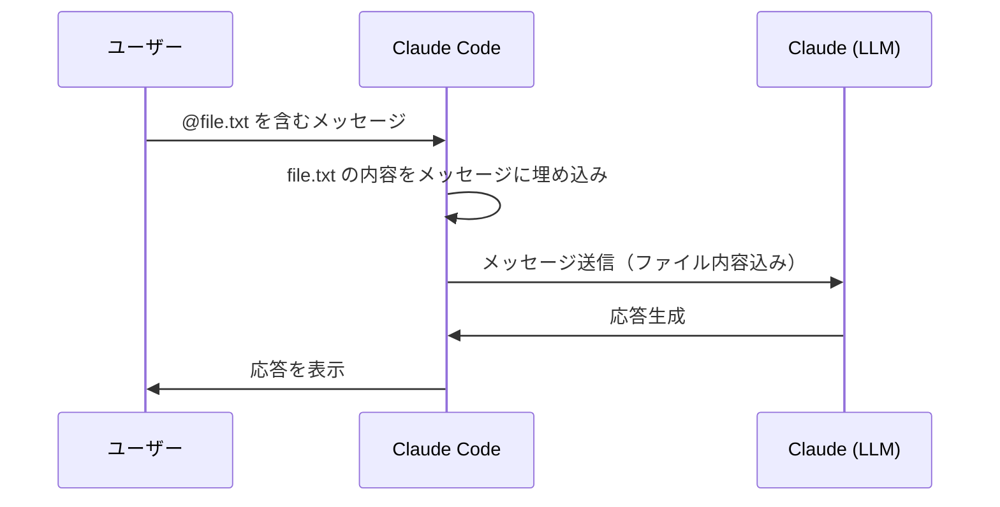
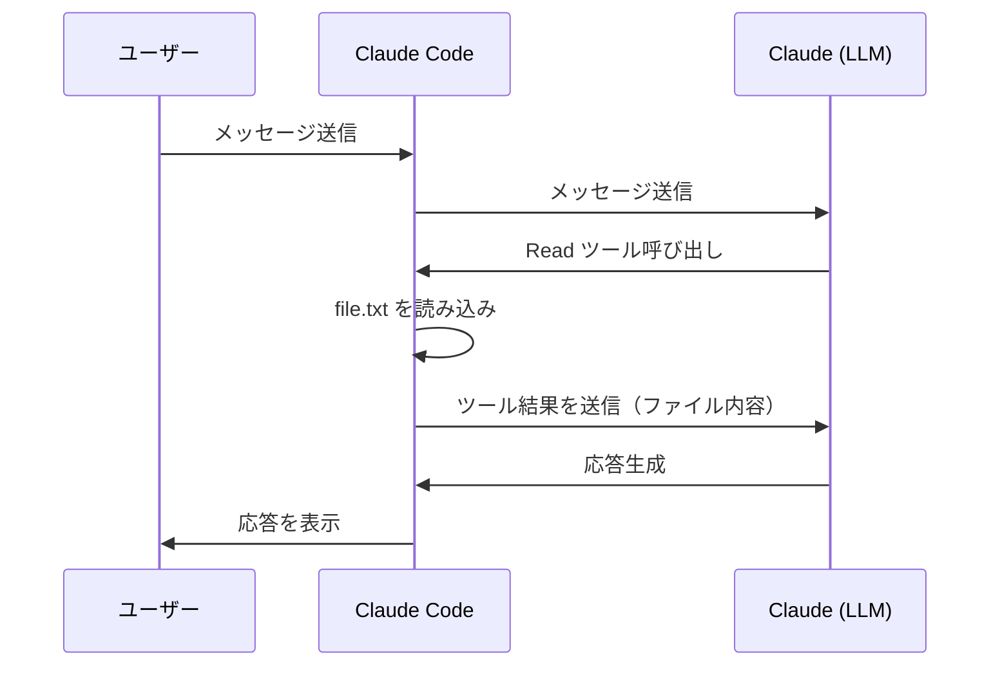
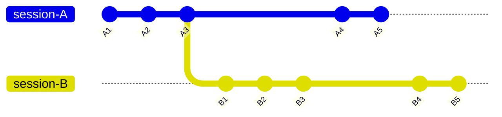

<!--
tags: Claude Code, CLAUDE.md, AI, LLM, コンテキストウィンドウ
-->

# (小ネタ) Claude Code のドキュメントを読んで気になったことを検証してみた

## はじめに

[Claude Code の公式ドキュメント](https://code.claude.com/docs/ja/) は結構頻繁に更新されているかなと思います。改めて読み直してみて、ドキュメントに書いてあることは分かるのですが「実際にはどのように動作するのだろう」と疑問に思ったことがいくつかありました。

それぞれのトピックを立てて、解説・検証した結果を記述しています。

なお、検証項目は公式ドキュメントを読んでいて「本当かな?」と思ったものだけをチョイスしているので、体系的な網羅性や一貫性はありません。あらかじめご了承ください。

:::note info
この記事の内容は本人が考えて決めてますが、文章は AI (Claude Code) が 100% 書いています。
:::

### 検証環境

- macOS（Apple Silicon）
- Claude Code v2.1.96（Opus 4.6、1M context）
- ターミナル: [Warp](https://www.warp.dev/) v0.2026.04.01

## 検証結果一覧

### 検証 1: `@import` はコンテキストを節約するか

[公式ドキュメント（日本語版）](https://code.claude.com/docs/ja/memory#%E5%8A%B9%E6%9E%9C%E7%9A%84%E3%81%AA%E6%8C%87%E7%A4%BA%E3%82%92%E6%9B%B8%E3%81%8F)には以下の記述があります。

> **サイズ**: CLAUDE.md ファイルあたり 200 行以下を目標にします。より長いファイルはより多くのコンテキストを消費し、遵守を減らします。指示が大きくなっている場合は、**インポート**または `.claude/rules/` ファイルを使用して分割します。

この記述を読むと「`@import` で分割すればコンテキストを節約できる」と解釈しがちですが、実際にはどうでしょうか。

#### セットアップ

CLAUDE.md に `@import_test.md` を記述し、import_test.md には Lorem ipsum（約 464 tokens 分）と識別用マーカー `UNIQUE_MARKER_12345_FOR_IMPORT_TEST` を配置しました。

#### 結果

`/context` の出力:

```
Memory files: 779 tokens (0.1%)
└ CLAUDE.md: 315 tokens
└ import_test.md: 464 tokens
```

**import_test.md は起動時にまるごと展開され、コンテキストに読み込まれています。** CLAUDE.md に直接書いた場合と同じだけトークンを消費します。

また同じドキュメント内に、以下のようにも記述されています。

> インポートされたファイルは展開され、それらを参照する CLAUDE.md と一緒に**起動時にコンテキストに読み込まれます。**

つまり `@import` は指示の**整理手段**であり、**コンテキスト節約手段ではありません**。

### 検証 2: `.claude/rules/` + `paths` はコンテキストを節約するか

`.claude/rules/` ディレクトリにルールファイルを置くと、`paths` frontmatter で特定のファイルタイプにスコープできます。これは本当にコンテキストを節約するのでしょうか。

#### セットアップ

2 つのルールファイルを作成しました。

**`.claude/rules/always-loaded.md`**（`paths` なし = 無条件読み込み）:
```markdown
# 常に読み込まれるルール

UNIQUE_MARKER_ALWAYS_RULE_11111

- 認証情報など、秘匿情報がこのリポジトリに書き込まれないように注視してください
```

**`.claude/rules/shell-scripts.md`**（`paths` あり = 条件付き読み込み）:
```markdown
---
paths:
  - "**/*.sh"
---

# シェルスクリプトのルール

UNIQUE_MARKER_SHELL_RULE_67890

- シェルスクリプトを Read した際は、「SHELL SCRIPT LOADED!!」と毎回かならず言ってください
```

#### 結果

**起動直後**（`.sh` ファイル未読み込み）:

```
Memory files: 856 tokens (0.1%)
└ CLAUDE.md: 315 tokens
└ import_test.md: 464 tokens
└ .claude/rules/always-loaded.md: 77 tokens
```

- `always-loaded.md`（`paths` なし）: **読み込まれている**（77 tokens）
- `shell-scripts.md`（`paths: "**/*.sh"`）: **読み込まれていない**（0 tokens）

**`.sh` ファイルを読んだ後**:

Claude に `org_grep.sh`（.sh ファイル）を読ませた後、`/context` を再確認しました:

```
Memory files: 856 tokens (0.1%)
└ CLAUDE.md: 315 tokens
└ import_test.md: 464 tokens
└ .claude/rules/always-loaded.md: 77 tokens
```

Memory files のトークン数自体は変わりませんでしたが、**Claude は `shell-scripts.md` のルールに従った動作を示しました**。

```
  Read 1 file (ctrl+o to expand)

⏺ SHELL SCRIPT LOADED!!
```

つまり、パスマッチ時にルールがコンテキストに注入されていますが、`/context` の Memory files 集計には含まれない形で読み込まれています。

重要なのは、**`.sh` ファイルを読むまでは `shell-scripts.md` のルールは一切コンテキストに存在しなかった**という点です。`.claude/rules/` + `paths` は**本当にコンテキストを節約できる手段**です。

### 検証 3: CLAUDE.md を `.claude/` 配下に置くと `@import` のパスはどうなるか

[公式ドキュメント](https://code.claude.com/docs/ja/memory#claude-md-%E3%83%95%E3%82%A1%E3%82%A4%E3%83%AB%E3%82%92%E3%81%A9%E3%81%93%E3%81%AB%E9%85%8D%E7%BD%AE%E3%81%99%E3%82%8B%E3%81%8B%E3%82%92%E9%81%B8%E6%8A%9E%E3%81%99%E3%82%8B)には、プロジェクト指示の CLAUDE.md は `./CLAUDE.md` または `./.claude/CLAUDE.md` のどちらにも配置できると書かれています。

また、`@import` について以下の記述があります。

> 相対パスはワーキングディレクトリではなく、**インポートを含むファイルに相対的に解決**されます。

つまり CLAUDE.md の配置場所によって `@import` のパスが変わるはずです。実際に確認しました。

#### セットアップ

以下のディレクトリ構成でテストしました。

```
project/
├── .claude/
│   └── CLAUDE.md      ← ここに配置
└── files/
    └── 01/
        └── import_test.md
```

`.claude/CLAUDE.md` に `@files/01/import_test.md` と記述しました。

#### 結果

`/context` で確認すると、`import_test.md` は**読み込まれていませんでした**。

```
Memory files: 307 tokens (0.0%)
└ .claude/CLAUDE.md: 230 tokens
└ .claude/rules/always-loaded.md: 77 tokens
```

`@import` のパスは CLAUDE.md のある `.claude/` ディレクトリから解決されるため、`@files/01/import_test.md` は `.claude/files/01/import_test.md` を探しに行きます。正しく読み込むには `@../files/01/import_test.md` と書く必要がありました。

CLAUDE.md をプロジェクトルートに戻し、`@files/01/import_test.md` に修正したところ、正常に読み込まれました。

```
Memory files: 730 tokens (0.1%)
└ CLAUDE.md: 189 tokens
└ files/01/import_test.md: 464 tokens
└ .claude/rules/always-loaded.md: 77 tokens
```

#### 考察

CLAUDE.md は `.claude/` 配下に置くこともできますが、`@import` を使う場合はパスが `../` 始まりになり直感的ではありません。`@import` を多用するなら、**CLAUDE.md はプロジェクトルートに置く方が実用的**です。

### 検証 4: 画像の貼り付けは Cmd+V ではなく Ctrl+V?

[公式ドキュメント](https://code.claude.com/docs/ja/common-workflows#%E7%94%BB%E5%83%8F%E3%82%92%E4%BD%BF%E7%94%A8%E3%81%99%E3%82%8B)には、画像の貼り付け方法として以下の記述があります。

> 画像をコピーして、CLI に **ctrl+v** で貼り付ける（**cmd+v は使用しないでください**）

「cmd+v は使用しないでください」とありますが、本当に使えないのでしょうか。

#### 検証方法

同じ画像ファイルに対して、2 つのコピー方法 × 2 つのターミナルで貼り付けを試しました。

- **コピー方法 A**: Finder 上でファイルを選択してコピー（ファイルパスがクリップボードに入る）
- **コピー方法 B**: プレビュー等で画像を開き、画像データをコピー（画像バイナリがクリップボードに入る）

#### 結果

| コピー方法 | ターミナル | Cmd+V | Ctrl+V |
|---------|---------|:---:|:---:|
| A: Finder でファイルコピー | Warp | 可 | 可 |
| A: Finder でファイルコピー | macOS 標準ターミナル | 可 | 可 |
| B: 画像データをコピー | Warp | 可 | 可 |
| B: 画像データをコピー | macOS 標準ターミナル | **不可** | 可 |

#### 考察

Cmd+V はターミナルの標準的なテキストペーストです。Finder でファイルそのものを選択してコピーした場合はファイルパスがテキストとして貼り付けられ、Claude がそのパスから画像を読み込むため、どのターミナルでも動作します。

一方、プレビュー等から画像データ（バイナリ）をコピーした場合、macOS 標準ターミナルの Cmd+V ではテキストペーストしか行えないため、画像データを扱えません。Ctrl+V は Claude Code が独自にバインドしているショートカットで、クリップボードから画像データを直接取得できます。

Warp はモダンなターミナルで独自のクリップボード処理を持っているため、Cmd+V でも画像データの貼り付けが可能でした。

ドキュメントの注意書きは**正しい**ですが、ターミナルやコピー方法によっては Cmd+V でも動作するケースがあります。確実に動作させたい場合は、ドキュメント通り **Ctrl+V を使う**のが安全です。

### 検証 5: `@参照` はメッセージに直接埋め込まれるのか

[公式ドキュメント](https://code.claude.com/docs/ja/common-workflows#%E3%83%95%E3%82%A1%E3%82%A4%E3%83%AB%E3%81%A8%E3%83%87%E3%82%A3%E3%83%AC%E3%82%AF%E3%83%88%E3%83%AA%E3%82%92%E5%8F%82%E7%85%A7%E3%81%99%E3%82%8B)には、`@` を使用するとファイルやディレクトリをすばやく含められると書かれています。これは Claude が Read ツールで読むのとはどう異なるのでしょうか。

#### セットアップ

テストファイルを作成し、以下の 2 つの方法で読み込みを試しました。

- **方法 A**: `@files/05/at_reference_test.txt` でメッセージに含める
- **方法 B**: Claude に「ファイルを読んで」と指示し、Read ツールで読ませる

#### 結果

**方法 A（@参照）の場合**:

画面上にはユーザーのメッセージ側に以下が表示されました。

```
❯ @files/05/at_reference_test.txt
  ⎿  Read files/05/at_reference_test.txt (4 lines)
```

Claude は Read ツールを呼び出さずに、ファイル内容を即座に認識して応答しました。

**方法 B（Read ツール）の場合**:

ユーザーの指示に対して、Claude の応答側にツール呼び出しが表示されました。

```
> このファイルを読んでください files/05/at_reference_test.txt

⏺ Read(file_path: "files/05/at_reference_test.txt")
```

Claude がツールを実行し、その結果を受け取ってから応答を生成しました。

#### @参照と Read ツールの違い

この 2 つは見た目は似ていますが、動作が異なります。`@参照` はメッセージ送信時にファイル内容がプロンプトに埋め込まれるため、agentic loop が 1 回で済みます。Read ツールの場合は、Claude がツールを呼び出して結果を受け取る分、2 回のループが必要です。

**@参照の場合（1 ループ）**:



**Read ツールの場合（2 ループ）**:



`@参照` の方が 1 ループ分少ないため、レスポンスが速く、API コール数も少なくなります。読ませたいファイルが事前に分かっている場合は、`@参照` を使う方が効率的です。

### 検証 6: 2 つのセッションで同じディレクトリから `--continue` するとどうなるか

[公式ドキュメント](https://code.claude.com/docs/ja/how-claude-code-works#%E3%82%BB%E3%83%83%E3%82%B7%E3%83%A7%E3%83%B3%E3%82%92%E5%86%8D%E9%96%8B%E3%81%BE%E3%81%9F%E3%81%AF%E3%83%95%E3%82%A9%E3%83%BC%E3%82%AF%E3%81%99%E3%82%8B)には、同じセッションを複数のターミナルから再開した場合について以下のように書かれています。

> **複数のターミナルで同じセッション**：複数のターミナルで同じセッションを再開すると、両方のターミナルが同じセッションファイルに書き込みます。両方からのメッセージがインターリーブされます。同じノートブックに 2 人が書き込むようなものです。何も破損しませんが、会話がごちゃごちゃになります。セッション中、各ターミナルは独自のメッセージのみを見ますが、後でそのセッションを再開すると、すべてがインターリーブされた状態で表示されます。同じ開始点から並列作業する場合は、`--fork-session` を使用して各ターミナルに独自のクリーンなセッションを与えます。

これが本当なのか検証しました。

#### セットアップ

2 つのターミナルを開き、同じディレクトリで `claude --continue` を実行しました。それぞれに以下の指示を出しました。

- **セッション A**: agentic loop で「セッション A」と 10 回発言
- **セッション B**: agentic loop で「セッション B」と 10 回発言

両方をほぼ同時に実行しました。

#### 結果

**実行中**: 2 つのセッションはお互いの内容を認識せず、それぞれ独立して動作しました。エラーも発生しませんでした。

**`--resume` で確認**: セッション B の内容のみが表示され、セッション A の内容は見えませんでした。

**セッションファイルを直接確認**: セッションファイル（JSONL）を調べると、両方のデータが時系列で混在して保存されていました。以下は実際の JSONL から抜粋したデータです（関係ないフィールドは省略）。

```jsonl:~/.claude/projects/<project>/<session-id>.jsonl
{"uuid":"26163b14...","parentUuid":"a754eec6...","timestamp":"11:44:18","message":"セッションA: 1回目"}
{"uuid":"b759fb1e...","parentUuid":"46cc3a00...","timestamp":"11:44:24","message":"セッションA: 2回目"}
{"uuid":"11ad510f...","parentUuid":"19860c17...","timestamp":"11:44:27","message":"セッションB: 1回目"}
{"uuid":"b2eb8b0c...","parentUuid":"51f4b07f...","timestamp":"11:44:31","message":"セッションA: 3回目"}
{"uuid":"50cf9902...","parentUuid":"6360fbe6...","timestamp":"11:44:34","message":"セッションB: 2回目"}
{"uuid":"aa26ee33...","parentUuid":"ee1234de...","timestamp":"11:44:35","message":"セッションA: 4回目"}
{"uuid":"fcdcc7fd...","parentUuid":"c257a11f...","timestamp":"11:44:39","message":"セッションB: 3回目"}
{"uuid":"5c0c5691...","parentUuid":"94de99f5...","timestamp":"11:44:41","message":"セッションA: 5回目"}
{"uuid":"56cca8db...","parentUuid":"57acea8a...","timestamp":"11:44:43","message":"セッションB: 4回目"}
```

※ `uuid` は省略表記、`message` は分かりやすさのために簡略化しています。

上書きではなく、両方のデータがファイルに存在しています。注目すべきは `parentUuid` フィールドです。セッション A のメッセージの `parentUuid` はセッション A の前のメッセージを指し、セッション B も同様です。**2 つの独立したチェーンが同じファイルに混在**しています。

#### なぜ片方しか表示されないのか

JSONL の各メッセージには `parentUuid` フィールドがあり、「どのメッセージの次に来るか」という親子関係を記録しています。セッション B は `--continue` でセッション A の途中から接続するため、**同じルートから分岐した 2 つのチェーン**になります。



`--resume` や `--continue` はファイル末尾の最新メッセージから `parentUuid` チェーンを辿って会話を復元するようです。そのため、**最後に書き込みを終えた方のチェーンだけが表示**されます。

これを確認するため、セッション A を後に終わらせる実験も行いました。結果、`--resume` でも `--continue` でもセッション A が表示されました。**後から書き込みを終えた方が優先される**ようです。

#### まとめ

ドキュメントの記述は正確です。ただし「会話が混在する」のはセッションファイルレベルの話であり、`--resume`/`--continue` で再開した場合は最後に書き込んだ方のチェーンのみが復元されます。もう片方のデータはセッションファイルには残っていますが、UI 上は見えなくなります。

実運用では、**同じディレクトリで同時に `--continue` するのは避けるべき**です。片方の会話履歴が UI 上で見えなかったり、意図した通りに動作しない可能性があります。

### 検証 7: Plan Mode の Ctrl+G でプランファイルが開けない（Warp）

[公式ドキュメント](https://code.claude.com/docs/ja/common-workflows#plan-mode-%E3%82%92%E4%BD%BF%E7%94%A8%E3%81%97%E3%81%A6%E5%AE%89%E5%85%A8%E3%81%AA%E3%82%B3%E3%83%BC%E3%83%89%E5%88%86%E6%9E%90%E3%82%92%E8%A1%8C%E3%81%86)には、Plan Mode について以下の記述があります。

> `Ctrl+G` を押してデフォルトのテキストエディタで計画を開き、Claude が進める前に直接編集できます。

しかし、ターミナルに Warp を使用している場合、Ctrl+G を押しても何も起きませんでした。

#### 原因調査

macOS 標準ターミナルで同じ操作を試したところ、Ctrl+G でプランファイルが正常に開けました。Warp 固有の問題であることが確定したため、Warp のキーボードショートカット設定（Cmd+/）を調査しました。

Ctrl+G には以下の 3 つの Warp アクションが割り当てられていました。

| Warp アクション名 | YAML キー名 | 原因 |
|---------|---------|:---:|
| Add Selection for Next Occurrence | `editor_view:add_next_occurrence` | No |
| Go to Line | `editor_view:go_to_line` | No |
| Open CLI Agent Rich Input | `terminal:open_cli_agent_rich_input` | **Yes** |

1 つずつ無効化して検証した結果、**`terminal:open_cli_agent_rich_input`（Warp の AI Agent 入力）が Ctrl+G を横取りしていた**ことが原因でした。

#### 解決方法

`~/.warp/keybindings.yaml` に以下を追加します。

```yaml
"terminal:open_cli_agent_rich_input": none
```

これにより Warp が Ctrl+G を処理しなくなり、Claude Code の Plan Mode で Ctrl+G が正常に動作するようになりました。

#### 補足

なお、Ctrl+G で開くエディタは `$EDITOR` 環境変数ではなく、Claude Code がインストール済みの IDE（VS Code など）を自動検出して決定します。`$EDITOR` が未設定でも Ctrl+G は動作することを確認しました（[関連 Issue #18990](https://github.com/anthropics/claude-code/issues/18990)、[関連 Issue #12546](https://github.com/anthropics/claude-code/issues/12546)）。

## 参考

- [Claude があなたのプロジェクトを記憶する方法（日本語版）](https://code.claude.com/docs/ja/memory)
- [一般的なワークフロー（日本語版）](https://code.claude.com/docs/ja/common-workflows)
- [Claude Code の仕組み（日本語版）](https://code.claude.com/docs/ja/how-claude-code-works)
- [キーボードショートカットをカスタマイズする（日本語版）](https://code.claude.com/docs/ja/keybindings)
- [Warp Keyboard shortcuts](https://docs.warp.dev/getting-started/keyboard-shortcuts)
