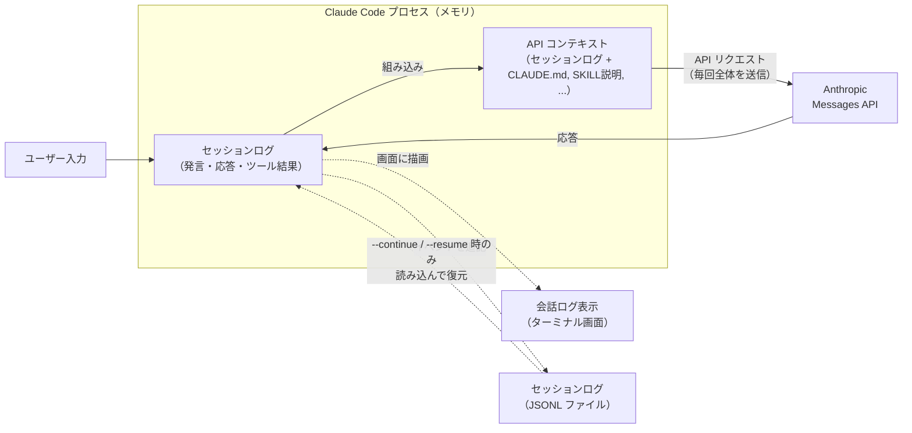
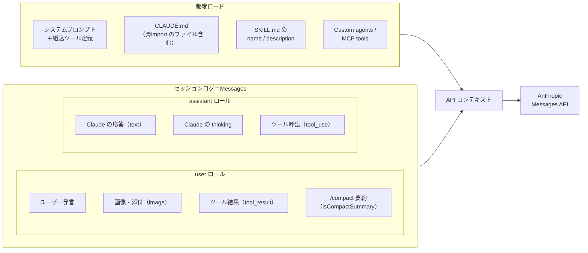
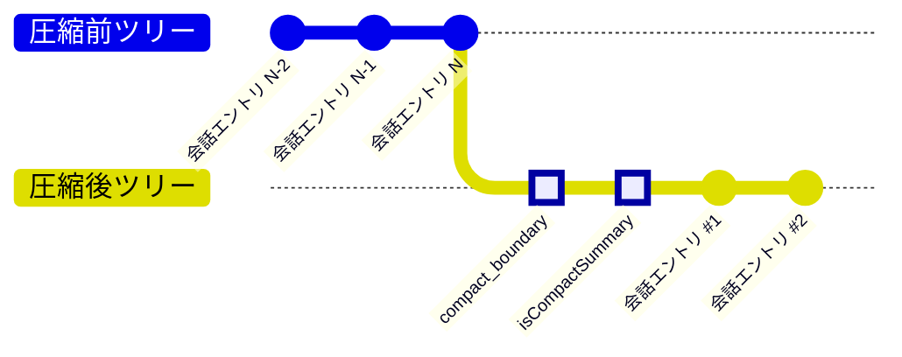

<!--
tags: Claude Code, AI, LLM, トークン消費, コンテキストウィンドウ
-->

# Claude Code のコンテキストサイズとトークン消費量について

## はじめに

Claude Code を使っていると「利用上限に達しました」という制限に遭遇することがあります。この制限に早く到達してしまう最大の原因は何でしょうか？

本記事では、Claude Code が内部に記録しているセッションログ（発言・応答・ツール結果など）とコンテキストとの関係について調査した結果を説明をします。
また、コンテキストサイズがトークン消費量（5時間リミット）にどう影響を及ぼすのか検証をします。

:::note info
この記事の内容は本人が考えて決めていますが、文章は AI（Claude Code）が 100% 書いています。
:::

### 検証環境

- macOS（Apple Silicon）
- Claude Code v2.1.96（Opus 4.6、1M context）
- プラン: Team plan（premium seats）
- ターミナル: [Warp](https://www.warp.dev/) v0.2026.04.01

---

## セッションログとコンテキスト

「はじめに」で触れた「セッションログ」と「コンテキスト」は、同じものではありません。両者を正しく区別できないと本記事の議論が成立しないため、最初にはっきりさせておきます。

| # | 概念 | 実体 | 確認方法 |
|---|------|------|---------|
| 1 | **セッションログ（JSONL ファイル）** | セッションのイベント（発言・応答・ツール結果など）が順に追記される、メモリ上の `messages` リストとディスク上のファイル（両者は同期）。ターミナル画面の会話ログ表示もこれが元。 | `~/.claude/projects/{project}/{session-id}.jsonl` |
| 2 | **API コンテキスト** | API 呼び出しのたびに構築される、API リクエスト全体。セッションログに `CLAUDE.md`・SKILL 説明・システムプロンプト・ツール定義などを組み合わせたもの。 | `/context` コマンド |

この 2 つの関係を、図と比較表で順に見ていきます。

### 関係図



図中の関係性について補足しておくと:

- **API コンテキスト**は、LLM (Claude API) に送られるリクエストボディの全文です。毎回の API 呼び出しに全体が含まれて送信されます。
- **セッションログ（JSONL ファイル）** には `file-history-snapshot`（編集前ファイルの checkpoint）や `permission-mode` 切替などのローカル用メタエントリも混ざるため、API コンテキストそのものではありません。
- なお、ターミナル画面に出る**会話ログ表示**はセッションログを人間向けに整形したビューで、`CLAUDE.md` やシステムプロンプトなどの API コンテキストの情報は画面に出ません。そのため**画面に見えるものと API コンテキストは完全一致しない**点には注意してください。

| 観点 | セッションログ（JSONL ファイル） | API コンテキスト |
|------|-----------|---------------|
| 存在場所 | ディスク上のファイル | Claude Code プロセスのメモリ |
| 役割 | 過去の送受信の記録 | 次に LLM へ送信する内容 |
| `CLAUDE.md`・システムプロンプト等 | 記録されない | 毎回組み込まれる |
| `/compact` 実行後 | 過去エントリは残り、要約エントリが**追記**される | 要約に置き換わる |
| サイズの変動 | 単調増加（減らない） | `/compact` で縮小可能 |
| 計測値 | ファイルサイズ（bytes） | トークン数（`/context` で確認可能） |

**この記事で「コンテキスト」「コンテキストサイズ」と呼ぶのは、API コンテキストのことです。** セッションログ（JSONL ファイル）のファイルサイズではありません。

### コンテキストの構造

API コンテキストは、**API 呼び出しのたびにその場で組み立て直される**データです。どこかに永続化された固定のオブジェクトがあるわけではありません。

`/context` コマンドで見ると、組み立て結果がカテゴリ別に表示されます。


| カテゴリ | 内容 |
|---------|------|
| System prompt | Claude Code 本体のシステムプロンプト |
| System tools | 組み込みツールのスキーマ定義 |
| MCP tools | 接続中の MCP サーバーのツール |
| Custom agents | プロジェクトで定義されたサブエージェント |
| Memory files | `CLAUDE.md`、`@import` で取り込まれたファイル等 |
| Skills | `SKILL.md` の `name` と `description` |
| Messages | 会話ストリーム本体（ユーザー発言・Claude 応答・ツール結果） |
| Autocompact buffer | 圧縮処理用に予約される余剰枠 |
| Free space | 未使用領域 |

セッションが進むにつれて膨らみ、かつ中身のバリエーションが豊富なのは **Messages** カテゴリです。この記事でコンテキストが膨らむと言っているのは、主に Messages の増加を指します。

これらの材料は、由来で大きく 2 系統に分けられます。



この組み立てかたには、3 つの特徴があります。

- **Messages 以外の要素は毎回フレッシュに構築される**: `CLAUDE.md` などディスク上のファイルをセッション中に書き換えれば、次の API 呼び出しから新しい内容が取り込まれます（途中編集が即反映）。
- **Messages だけがセッションログから積み上がる**: 会話を重ねるほどこの部分だけが単調増加していきます。「コンテキストが膨らむ」とは主にこの増加を指します。
- **コンテキストは毎回全文が API 送信される**: Messages API はステートレスで、毎回すべての材料を詰め直して送信します。そのため「コンテキストサイズ = 1 回の API 呼び出しで送信されるトークン数」に直結します。

### セッションログの構造

セッションログは `~/.claude/projects/{project}/{session-id}.jsonl` の JSONL ファイルとして記録されます。セッションで発生した全イベントが 1 行 1 エントリで追記されていきます。

#### エントリの種類

| `type` | 役割 |
|--------|------|
| `user` | ユーザー発言、ツール結果の履歴 |
| `assistant` | Claude の応答（`usage` フィールド付き） |
| `system` | セッション内部イベント（`/compact` の境界など） |
| `file-history-snapshot` | 編集前のファイル内容（checkpoint 用） |
| `permission-mode` | Plan/Auto mode などの切替 |
| その他 | `attachment`, `custom-title`, `agent-name` 等 |

#### 1 往復（3 エントリ）の全文例

1 回のやり取り（ユーザー発言 → Claude 応答）が実際のセッションログにどう記録されるかを見てみます。ここでは筆者が「これはサンプルメッセージ」と送信し、Claude が返答した 1 往復を抜き出しました（見やすさのため整形済み）。

実は 1 往復の応答は JSONL 上では **3 エントリ**に分かれて記録されていました。Claude Opus 4.6 のような Extended Thinking 対応モデルでは、**1 回の API 呼び出しのレスポンスに `thinking` ブロックと `text` ブロックが含まれ、JSONL ではそれぞれ別エントリとして追記される**ためです。

**エントリ 1: ユーザー発言（`type: "user"`）**

```json
{
  "parentUuid": "99b943a5-4906-45b0-a533-e488ac18a70b",
  "isSidechain": false,
  "promptId": "14ed5b7f-885b-41a1-a573-69c571b0fb1d",
  "type": "user",
  "message": {
    "role": "user",
    "content": "これはサンプルメッセージ"
  },
  "uuid": "129e39c5-fd71-4eb1-a844-abfb41ed1807",
  "timestamp": "2026-04-15T09:47:51.737Z",
  "permissionMode": "auto",
  "sessionId": "431f03bc-95f1-41bd-903a-8cbc8ab569ff",
  "version": "2.1.96"
}
```

**エントリ 2: Claude の思考プロセス（`type: "assistant"`、`content` は `thinking` ブロック）**

```json
{
  "parentUuid": "129e39c5-fd71-4eb1-a844-abfb41ed1807",
  "isSidechain": false,
  "message": {
    "model": "claude-opus-4-6",
    "id": "msg_01SKE6ubRJTFibofdXS84cEi",
    "type": "message",
    "role": "assistant",
    "content": [
      {
        "type": "thinking",
        "thinking": "",
        "signature": "EroECmwIDBgCKkAOrMSvW1cGOuBlfn60gejimsKI3ikqm9eG..."
      }
    ],
    "stop_reason": null,
    "usage": {
      "input_tokens": 6,
      "cache_creation_input_tokens": 588,
      "cache_read_input_tokens": 94634,
      "output_tokens": 8,
      "cache_creation": {
        "ephemeral_5m_input_tokens": 0,
        "ephemeral_1h_input_tokens": 588
      },
      "service_tier": "standard"
    }
  },
  "requestId": "req_011Ca5M1RUXHkW3tshiKQzJ2",
  "type": "assistant",
  "uuid": "56e00cb7-5525-4a67-8149-46697345aa42",
  "timestamp": "2026-04-15T09:47:55.726Z"
}
```

**エントリ 3: Claude の本文応答（`type: "assistant"`、`content` は `text` ブロック）**

```json
{
  "parentUuid": "56e00cb7-5525-4a67-8149-46697345aa42",
  "isSidechain": false,
  "message": {
    "model": "claude-opus-4-6",
    "id": "msg_01SKE6ubRJTFibofdXS84cEi",
    "type": "message",
    "role": "assistant",
    "content": [
      {
        "type": "text",
        "text": "ご指示の意図を確認させてください。以下のどれに近いでしょうか？\n\n1. README_03.md の何らかの箇所にサンプルメッセージを追記したい（→ どの箇所に、どんな内容を？）\n2. 直前の `usage` 実測表のサンプルデータとして何か追加したい\n3. テスト送信で特に操作不要\n4. その他"
      }
    ],
    "stop_reason": "end_turn",
    "usage": {
      "input_tokens": 6,
      "cache_creation_input_tokens": 588,
      "cache_read_input_tokens": 94634,
      "output_tokens": 255,
      "cache_creation": {
        "ephemeral_1h_input_tokens": 588,
        "ephemeral_5m_input_tokens": 0
      },
      "service_tier": "standard"
    }
  },
  "requestId": "req_011Ca5M1RUXHkW3tshiKQzJ2",
  "type": "assistant",
  "uuid": "09f04447-5540-4e55-ac32-30d7bc02fe3a",
  "timestamp": "2026-04-15T09:47:58.627Z"
}
```

この 3 エントリで押さえておきたいポイントは 4 つです。

- **ツリー構造は `user → thinking → text`**: エントリ 2 の `parentUuid` がエントリ 1 の `uuid`（`129e39c5...`）を、エントリ 3 の `parentUuid` がエントリ 2 の `uuid`（`56e00cb7...`）を指しています。
- **`type: "user"` エントリには `usage` がない**: `usage` は API からの応答に付属するフィールドなので、`type: "assistant"` 側にのみ記録されます。
- **エントリ 2 とエントリ 3 は `requestId` が同一**（`req_011Ca5M1RUXHkW3tshiKQzJ2`）: これが**同一の 1 回の API 呼び出し**から生成されたことを示しています。**JSONL 上は別行でも、API 呼び出しの回数としては 1 回**です。
- **`usage` の扱いに注意**: `input_tokens`、`cache_creation_input_tokens`、`cache_read_input_tokens` はエントリ 2・3 で完全に同じ値（6 / 588 / 94,634）、`output_tokens` のみ分かれています（thinking 部分 8 tokens + text 部分 255 tokens）。`requestId` でグルーピングして**入力分は 1 回だけカウント**しないと、二重計上してしまいます。

#### `message.usage` の読み方（重要）

`usage` が示しているのは「このメッセージ（`content`）単体のトークン数」ではなく、「**このメッセージを生成するために行われた 1 回の API 呼び出しで、API に送信された/返ってきたトークンの総量**」です。

Messages API はステートレスで、毎回の呼び出しで**その時点の API コンテキスト全体**（セッションログ + `CLAUDE.md`, SKILL 説明, ...）を送信します。そのため `usage` の各フィールドは次の意味になります。

| フィールド | 意味 |
|-----------|------|
| `input_tokens` | 今回の呼び出しで新規に送信した入力トークン数（うちキャッシュに乗らなかった分） |
| `cache_creation_input_tokens` | 今回の呼び出しで新規に送信した入力トークン数（うち新しくキャッシュに書き込んだ分） |
| `cache_read_input_tokens` | 今回の呼び出しで送信した入力トークン数（うち既存のキャッシュからヒットした分） |
| `output_tokens` | Claude が生成した応答のトークン数 |

:::note warn
3 つの入力系フィールドはキャッシュ命中状況で分かれているだけで、合計すれば**今回の API 呼び出しで送信された入力トークンの総量**になります。これらが利用制限（5 時間リミット）にどう反映されるかは、本記事末尾の検証章で扱います。
:::

**入力合計 = `input_tokens` + `cache_creation_input_tokens` + `cache_read_input_tokens` が、この 1 回の API 呼び出しでコンテキストとして送信された総トークン数**です。上の例では:

```
6 + 588 + 94,634 = 95,228 tokens
```

つまり、ユーザーはわずか 12 文字の「これはサンプルメッセージ」を送信しただけなのに、**その時点の API コンテキスト全体（95k tokens 分）が API に送信されていた**ことを意味します。

---

## Claude API へコンテキスト送信

API コンテキストがどう LLM に届き、なぜトークン消費に直結するのかを詳しく見ていきます。

### Messages API はステートレス

Claude Code は Anthropic の Messages API を使って LLM と通信しています。この API は**ステートレス**です。つまり、毎回の API 呼び出しで**コンテキスト全体**をリクエストに含めて送信します。

```
1 回目の呼び出し: [システムプロンプト + ユーザー発言 1]                → ~20k tokens
2 回目の呼び出し: [システムプロンプト + 発言 1 + 応答 1 + 発言 2]      → ~25k tokens
3 回目の呼び出し: [全履歴 + 発言 3]                                  → ~30k tokens
  :
N 回目の呼び出し: [全履歴]                                          → ~500k tokens
```

コンテキストが膨らむほど、たった 1 回の API 呼び出しで送信されるトークン数も増えていきます。

:::note warn
後の検証で後述しますが、Claude API は既に送信された同一のコンテキストをサーバーサイドでキャッシュしています。
その為、キャッシュヒットした部分のコンテキストは5時間枠などの利用上限に対し、実際の消費トークン数に対する傾斜（0 ≦ m < 1) が掛かると推測されます。
:::

### エージェントループで API は複数回呼ばれる

Claude Code はエージェントループで動作します。ユーザーの 1 プロンプトに対して、Claude がツールを使うたびに API が呼び出されます。

```
ユーザー 1 プロンプト
  ├─ API call 1 → 入力 60k tokens, 出力 475 tokens
  │   └─ tool_use: Bash
  ├─ API call 2 → 入力 61k tokens, 出力 300 tokens
  │   └─ tool_use: Edit
  └─ API call 3 → 入力 62k tokens, 出力 200 tokens
      └─ text response（最終回答）
```

つまり、ユーザーから見た「1 回の問い合わせ」でも、裏では**複数回の API 呼び出しが発生し、そのたびにコンテキスト全体が送信されています**。

---

## `/compact` と `/clear` の動作

API コンテキスト（特に Messages）を縮小する手段として、`/compact` と `/clear` があります。

### `/compact`: セッションログを要約で置き換える

`/compact` は、これまでのセッションログを LLM に要約させ、**要約文で Messages を置き換え**ます。画面上の会話ログ表示はリセットされ、API コンテキストも縮小します。

セッションログ（JSONL ファイル）には以下の 2 種類のエントリが追記されます。以降の JSON サンプルは見やすさのため一部フィールド（`sessionId`、`version`、`cwd` など）を省略していますが、**`uuid` と `parentUuid` はツリー構造の把握に欠かせないため省略せず記載**しています。

#### 1. `compact_boundary` エントリ（圧縮境界）

`subtype: "compact_boundary"` を持つ system エントリが、圧縮の境界を示すために追記されます。`compactMetadata` に圧縮**前**のコンテキストサイズ（`preTokens`）が記録されます。

```json
{
  "parentUuid": null,
  "type": "system",
  "subtype": "compact_boundary",
  "content": "Conversation compacted",
  "compactMetadata": {
    "trigger": "manual",
    "preTokens": 363115,
    "preCompactDiscoveredTools": [
      "AskUserQuestion", "ExitPlanMode", "TaskCreate", ...
    ]
  },
  "timestamp": "2026-04-14T05:09:37.820Z",
  "uuid": "cfcc9992-e9ae-42f0-896d-7ef17924381a"
}
```

ポイントは 2 つです。

- `preTokens: 363115` — 圧縮**前**のコンテキストは 363k tokens ありました。
- `parentUuid: null` — 本流ツリーとの**接続が切れている**ことが明示されています。このエントリが新ツリーのルートです（後述の「ツリーの切り離し」参照）。

#### 2. `isCompactSummary` エントリ（要約本体）

`compact_boundary` の直後に、`isCompactSummary: true` フラグを持つ user エントリが追加されます。これが「前回までの会話の要約」で、これ以降の API コンテキストはこの要約を起点に構築されます。

```json
{
  "parentUuid": "cfcc9992-e9ae-42f0-896d-7ef17924381a",
  "type": "user",
  "message": {
    "role": "user",
    "content": "This session is being continued from a previous conversation that ran out of context. The summary below covers the earlier portion of the conversation.\n\n（以下、要約本文が続く）"
  },
  "isVisibleInTranscriptOnly": true,
  "isCompactSummary": true,
  "uuid": "3d8e39f7-fa02-4eac-9cce-a7dd8cb7344b"
}
```

ポイント:

- `parentUuid` は**直前の `compact_boundary` の uuid**（`cfcc9992...`）を指しており、圧縮後ツリーの内部にぶら下がっています（`null` ではない点に注意）。
- `message.content` の冒頭は全 14 件で同一の定型文（「This session is being continued...」）ですが、その後ろに続く**要約本文が `/compact` の本体**です。筆者のセッションでは要約本文は約 11,896 文字（~3k tokens 程度）でした。**363k tokens が 3k tokens の要約に圧縮された**ことになります。

#### ツリーの切り離し

実データを `parentUuid` で辿ると、`/compact` 実行前後でツリーが**切り離されている**ことが確認できます。筆者のセッションから該当箇所の `parentUuid` 関係を抜粋すると以下の通りです。

```
line 12671  system     compact_boundary       uuid=cfcc9992...  parentUuid=null ← 新ルート
line 12672  user       isCompactSummary=true  uuid=3d8e39f7...  parentUuid=cfcc9992...
line 12673  user       （圧縮後ツリーの次のエントリ） uuid=31b42f85...  parentUuid=3d8e39f7...
```

**`compact_boundary` の `parentUuid` が `null`** になっているのがポイントです。圧縮前の最後のエントリ（line 12670 以前）を親としては持たず、まったく新しいツリーのルートになっています。これを gitGraph で表現すると以下のようになります。



`--continue` / `--resume` はファイル末尾の最新エントリから `parentUuid` チェーンを逆方向に辿って会話を復元するため、**圧縮後ツリー側しか復元されない**ことになります。これが「`--continue` で復元されるのは最新の compact summary 以降のみ」という挙動の正体です（詳細は次章）。

### `/clear`: セッションログを完全に破棄する

`/clear` は、画面の会話ログ表示と API コンテキストの Messages を**完全にリセット**します。`/compact` とは違い、要約すら残りません。

JSONL ファイルに対する挙動は `/compact` と大きく異なります。`/compact` が同じファイルに `compact_boundary` と `isCompactSummary` を追記していたのに対し、**`/clear` は既存ファイルには一切手を加えず、新しい JSONL ファイル（＝新しいセッション）を作成**します。

実際に `/clear` を実行して挙動を観察した例：

```
実行前のセッション（55 エントリ）:
  /Users/{username}/.claude/projects/{project}/a180b663-...jsonl
    last timestamp: 2026-04-15T11:10:50.200Z   ← このファイルは以降一切書き換わらない

/clear 実行

実行後の新セッション（/clear 直後は 4 エントリ）:
  /Users/{username}/.claude/projects/{project}/a4c4eae8-...jsonl   ← 新ファイル
```

新セッションファイルの先頭は以下のような構造になっています。

```json
// line 2: 新セッションのルートエントリ（自動注入されるメタ情報）
{
  "parentUuid": null,
  "type": "user",
  "message": { "role": "user", "content": "<local-command-caveat>..." },
  "isMeta": true,
  "uuid": "72423dc7-161a-4562-9d69-0fb1e8af2011"
}

// line 3: /clear コマンド自体の記録
{
  "parentUuid": "72423dc7-161a-4562-9d69-0fb1e8af2011",
  "type": "user",
  "message": { "role": "user", "content": "<command-name>/clear</command-name>..." },
  "uuid": "0a5aec8e-4b08-4eaf-a08e-ee7bfe4f8725"
}
```

ポイント:

- 新ファイルには `compact_boundary` のような専用の境界エントリは存在しません。代わりに、**新しい `sessionId` を持つファイルそのもの**が境界の役割を果たします。
- 新ファイル内の最初のエントリは `parentUuid: null`（新ツリーのルート）で、これに `/clear` コマンドエントリがぶら下がります。以降の会話はこの新ルートから連なります。
- 旧ファイル（`a180b663...`）は一切書き換わらず、`claude --resume a180b663...` で明示的に指定すれば復元できます。`/clear` は「過去を消す」のではなく、「新しいセッションに切り替える」動作です。

### 2 つの違い

| 観点 | `/compact` | `/clear` |
|------|-----------|---------|
| API コンテキスト Messages | 要約に置き換わる（縮小） | 空になる（リセット） |
| 過去の会話の記憶 | 要約形式で保持 | 破棄（ただし旧 JSONL ファイルは残る） |
| 画面の会話ログ表示 | リセット | リセット |
| JSONL ファイル | 同一ファイルに `compact_boundary` + `isCompactSummary` を追記 | 新ファイルを作成（旧ファイルは手つかず） |
| セッション ID | 変わらない | 新しい ID に切り替わる |

---

## `--continue` / `--resume` による復元

`--continue` や `--resume` で Claude Code を再起動すると、API コンテキストが再構築されます。前章 [/compact: セッションログを要約で置き換える](#compact-セッションログを要約で置き換える) で見たとおり、Messages はセッションログ末尾から `parentUuid` を逆方向に辿って復元されるため、**最新の `compact_boundary` 以降のエントリだけが復元対象**になります。


`--continue` はセッションログ末尾（上図では `会話エントリ #2`）から `parentUuid` を逆方向に辿るため、**圧縮後ツリー**のみが到達可能です。圧縮前ツリー側は JSONL ファイルには残っていますが、`compact_boundary` の `parentUuid` が `null` で接続が切れているため、復元経路上たどり着けません。

ただし再構築されるのは Messages だけではなく、他のカテゴリは**セッションログに依存せず現在のディスク状態から再初期化**されます。

### カテゴリ別の復元挙動

| カテゴリ | 再開時の挙動 | 注意点 |
|---------|------------|-------|
| System prompt | 現在の状態から再生成 | Claude Code のバージョン更新や環境変化が反映される |
| Tool 定義 | 現在のツールセットを再ロード | 前回以降に追加/削除されたツールは変化する |
| Memory files | 現在のディスク内容を再ロード | `CLAUDE.md` が書き換わっていれば新しい内容が入る |
| Skills | 現在のディスクから再スキャン | 新しく追加された Skill は一覧に出る |
| Messages | セッションログから復元 | 最新の `compact_boundary` 以降のみ（前章参照） |

つまり `--continue` で復元されるのは「**前回と等価なコンテキスト**」であって、**バイト単位で同一ではない**点に注意が必要です。Messages 部分だけがセッションログ由来で、それ以外は**現在のディスク状態**から再初期化されます。

---

## 検証: コンテキストサイズ (送受信トークン数) が利用上限 (usage%) にどう影響するのか？

論点: 次のうち、どのtoken消費区分が、 `/status --> Usage --> Current session (x% used)` に影響しているのか明らかにしたい。

- input_tokens
- cache_creation_input_tokens
- cache_read_input_tokens
- output_tokens

前提条件:

- Claude Code (Team plan, premium seats) のトークン利用上限（および、それに相当する利用額）は、公式には公開されておらず分からない

仮説:

1. 全ての消費トークン種別が等価に (x% used) にカウントされている
2. cache_read_input_tokens は (x% used) にカウントされているが、係数 (> 0, ≦ 1) がかけられている
3. cache_read_input_tokens は (x% used) にカウントされていない (係数 = 0)

## トークン消費量と usage (%) の計測

### 計測条件

- ウィンドウ: 14:00〜19:00 JST（05:00〜10:00 UTC）、リセット直後から開始
- 集計対象: メインセッション JSONL + `subagents/` 配下の全サブエージェント JSONL
- 重複排除: `requestId` 単位（入力系は 1 回、`output_tokens` は全エントリ合算）
- `/status` は手動確認し、確認直後に JSONL を集計

### 計測プロトコル

3 つの独立変数（`cache_creation`, `cache_read`, `output`）の係数を分離するために、**各変数を個別に大きく動かすフェーズ**を設けます。各フェーズ間で `/compact` を実行してコンテキストをリセットし、変数間の共変動を抑制します。

:::note info
`input_tokens` は Claude Code のプロンプトキャッシュにより、キャッシュに乗らなかった端数のみです。W1 の寄与は丸め誤差（±0.5%）に完全に埋もれるため、以降の分析では W1 の寄与を無視し、W2, W3, W4 の 3 係数に集中します。
:::

なお、消費率のモデルは以下の通りですが:

```
消費率(%) = (W2 × cache_creation + W3 × cache_read + W4 × output) / B × 100
```

ここで r2 = W2/B、r3 = W3/B、r4 = W4/B と置くと、B を消去できます。

```
消費率(%) = (r2 × cache_creation + r3 × cache_read + r4 × output) × 100
```

推定すべき未知数は **r2, r3, r4 の 3 つだけ**です。10 データポイントに対して 3 未知数なので、最小二乗法で推定できます。ただし求まるのは W/B の比率であって、W と B を個別に求めることはできません。「`cache_read` の係数は `cache_creation` の何倍か」は分かりますが、「予算は何トークンか」は分かりません。

| 変数 | 大きくする操作 | 小さくする操作 |
|------|-------------|-------------|
| `cache_creation` | `/compact` 直後に大きなファイルを読ませる（新コンテキスト＝全て新規キャッシュ書き込み） | `/compact` せず既存コンテキストのまま操作する |
| `cache_read` | `/compact` せずコンテキストを大きく育ててから何度も API を呼ばせる | `/compact` でコンテキストをリセットしてから操作する |
| `output` | 長い応答を要求する（長文生成、大きなコード生成） | 短い応答のみ要求する（`echo 1`、「はい/いいえで答えて」） |

#### フェーズ 0: ベースライン（S1）

ウィンドウ開始直後、最初の操作前に `/status` を確認し基準値を記録します。

#### フェーズ 1: output 優位（S2〜S3）

`/compact` 直後でコンテキストが最小の状態で、Claude に長い応答を繰り返し生成させます。`cache_read` の寄与が最小なため、`output` の影響を最も純粋に観測できます。

#### フェーズ 2: cache_creation 優位（S4〜S5）

`/compact` 実行後、大きなファイルを複数 Read させつつ、応答は「1行で要約して」と短く指示します。新規コンテキスト投入により `cache_creation` が急増する一方、`output` の増加は抑えられます。

#### フェーズ 3: cache_read 優位（S6〜S8）

フェーズ 2 で育てたコンテキストを **`/compact` せずに維持**し、`echo 1` のような極小コマンドを繰り返します。毎回コンテキスト全体がキャッシュから読み込まれるため、`cache_read` のみが大きく伸びます。

#### フェーズ 4: 混合検証（S9〜S10）

推定した係数の妥当性を確認するため、混合的な操作パターンで予測精度を検証します。

### 注意事項

- `/status` は整数表示（±0.5% の丸め誤差）なので、各スナップショット間で **2〜3% 以上の変化** が出るよう十分な操作量を確保する
- `/compact` 自体も API 呼び出しを発生させる。スナップショットは `/compact` 実行後に取ること
- auto-compact を避けるため、コンテキストを閾値以下に保つ
- 計測セッション中はサブエージェント（Agent ツール）を使用しない
- 計測前に `/context` でコンテキスト構成を確認し、予期しない要素の混入を排除する

### JSONL 集計時の注意

セッション JSONL（`~/.claude/projects/<project>/<session-id>.jsonl`）からトークン消費量を集計する際、以下の 2 点に注意が必要です。

#### 1. `output_tokens` は最終チャンクのみ完全な値を持つ

同一 `requestId` のエントリが複数記録されますが、これらは**同一 API 呼び出しのストリーミングチャンク**です。実データを調べたところ、途中チャンク（`stop_reason=null`）の `output_tokens` は**全て同一の値で固定**されており、**最終チャンク（`stop_reason` が `tool_use` や `end_turn`）のみが完全な出力トークン数を持つ**ことが分かりました。

```
同一 requestId のエントリ例（11 エントリ）:
  line 1019: thinking  stop=null     out=8     ← thinking の出力トークン数
  line 1020: text      stop=null     out=8     ← 同じ値で固定
  line 1021: tool_use  stop=null     out=8     ←   〃
      :         :         :            :
  line 1037: tool_use  stop=null     out=8     ←   〃
  line 1039: tool_use  stop=tool_use out=1469  ← 最終チャンクのみ完全な値
```

途中チャンクの値は thinking ブロックの出力トークン数と一致しています（thinking ブロックを含む 275 件中 275 件で一致）。**段階的に増加する累積値ではない**点に注意してください。

このため、`requestId` ごとに **`MAX` を取る**のが正しい集計方法です。`SUM` を取ると約 1.6 倍の過大計上になります。

なお、`input_tokens`・`cache_read_input_tokens` は同一 `requestId` 内で常に同一値でした。`cache_creation_input_tokens` は 792 件中 1 件だけ途中チャンクで `0`・最終チャンクのみ正しい値を持つケースがあったため、全フィールド `MAX` で集計するのが安全です。

#### 2. サブエージェント JSONL との重複

`<session-id>/subagents/*.jsonl` に記録されるサブエージェントのエントリは、**大部分が**メインの `<session-id>.jsonl` にも同一 `requestId` で重複記録されています。ただし、**メインに記録されない `requestId` も存在する**ため（本セッションでは 768 件中 79 件）、サブエージェント JSONL も読み込む必要があります。`requestId` ベースの重複排除を行えば、両方読み込んでも二重計上にはなりません。

#### 3. `/compact` の要約生成はセッション JSONL に記録されない

`/compact` を実行すると、それまでのコンテキストを要約するための API 呼び出しが発生します。しかし、この要約生成に関する情報はセッション JSONL にほとんど記録されません。

JSONL に記録されるのは以下の 2 エントリだけです。

- **`compact_boundary`**（`type: "system"`）: 圧縮前のコンテキストサイズ（`preTokens`）のみ記録。要約生成の `usage` や `requestId` はなし
- **`isCompactSummary`**（`type: "user"`）: 要約テキスト本体。しかし `usage` フィールドはなし

特に以下の情報が欠落しています。

| 欠落情報 | 影響 |
|---------|------|
| 使用モデル | Haiku なのか Opus なのか不明。JSONL 全体を検索しても `/compact` 前後に Haiku エントリは一切なく、「`/compact` は Haiku を使う」という通説を確認できなかった |
| `usage`（トークン消費量） | 要約生成で消費した input/output トークン数が不明 |
| `requestId` | 通常の API 呼び出しとは別経路で処理されている |

これは回帰分析にとって重要な制約です。`/compact` のたびに **JSONL には記録されないが `/status` の usage(%) にはカウントされるかもしれない「隠れたトークン消費」**が発生している可能性があります。本記事の計測では `/compact` 実行後にスナップショットを取得しているため、この隠れた消費は回帰分析の結果に織り込まれますが、その内訳（cc / cr / out の配分）は不明です。

#### 正しい集計スクリプト（抜粋）

```python
rid_data = {}
for entry in all_jsonl_entries:
    rid = entry["requestId"]
    usage = entry["message"]["usage"]
    vals = {
        "input": usage["input_tokens"],
        "cache_creation": usage["cache_creation_input_tokens"],
        "cache_read": usage["cache_read_input_tokens"],
        "output": usage["output_tokens"],
    }
    if rid not in rid_data:
        rid_data[rid] = vals
    else:
        for k in rid_data[rid]:
            rid_data[rid][k] = max(rid_data[rid][k], vals[k])  # 全フィールド MAX
```

### 計測結果（第 2 回）

> ※１回目の計測結果は測定方法に誤りがあり破棄した。本書の記述からも削除

| 時点 | フェーズ | `/status` | API 呼出 | `input` | `cache_creation` | `cache_read` | `output` |
|------|---------|----------:|---------:|--------:|-----------------:|-------------:|---------:|
| S1 | 0: ベースライン | **23%** | 83 | 13,322 | 434,495 | 7,741,558 | 54,550 |
| S2 | 1: output 優位 | **27%** | 88 | 14,629 | 447,144 | 8,482,395 | 61,049 |
| S3 | 1: output 優位 | **28%** | 93 | 14,636 | 457,974 | 8,619,846 | 71,208 |
| S4 | 2: cc 優位 | **38%** | 128 | 15,979 | 571,590 | 10,525,020 | 113,596 |
| S5 | 2: cc 優位 | **39%** | 135 | 16,521 | 591,289 | 11,112,845 | 116,046 |
| S6 | 3: cr 優位 | **40%** | 143 | 16,533 | 596,525 | 11,891,641 | 119,613 |
| S7 | 3: cr 優位 | **41%** | 151 | 16,574 | 602,454 | 12,715,082 | 123,492 |
| S8 | 3: cr 優位 | **44%** | 172 | 16,663 | 620,141 | 15,119,856 | 134,962 |
| S9 | 4: 混合検証 | **54%** | 184 | 17,983 | 953,077 | 16,238,727 | 147,039 |
| S10 | 4: 混合検証 | **57%** | 190 | 17,993 | 1,062,971 | 17,383,187 | 150,045 |

:::note warn
初回集計時に `window_start` を誤って前のウィンドウの開始時刻に設定していたため、前ウィンドウの 138 API コール分のトークンが混入していました。上記は正しいウィンドウ（19:00〜00:00 JST / 10:00〜15:00 UTC）で再集計した値です。差分（Δ）は変わらないため、差分ベースの分析結果には影響しません。
:::

### 第 2 回の計測結果に対する考察

10 データポイントに対して最小二乗法で回帰分析を試みましたが、**多重共線性（multicollinearity）により、係数を正しく推定できませんでした**。

根本原因は、Claude Code の API 呼び出しでは **1 回のコールで `cache_creation`・`cache_read`・`output` の 3 変数がすべて同時に増加する**ため、変数間の独立した変動を確保しにくいことです。フェーズ分離（`/compact` でのリセット、echo 1 の繰り返し等）により累積値の相関は緩和できましたが、特に `cache_read` について以下の問題が残りました。

- **`cache_read` の信号がノイズ以下**: `cache_read` のトークン単価は `cache_creation` の約 1/80 と推定され、1 計測区間あたりの寄与は最大 0.64% にとどまりました。`/status` の表示が整数%（±0.5% の丸め誤差）であるため、`cache_read` の信号が測定ノイズに埋もれています。
- **`cache_creation` と `output` は推定可能**: これらの 1 区間あたりの寄与はノイズの 14〜15 倍あり、信号として十分検出できています。

この問題を解決するには、`cache_read` のみが大きく変動する追加データが必要です。

### 計測プロトコル（第 3 回）

第 2 回の 10 データポイント（S1〜S10）はそのまま残し、**新しい 5 時間ウィンドウで `cache_read` 優位の追加 10 データポイント（S11〜S20）を計測**します。第 2 回データと結合して回帰分析を行うことで、`cache_read` の係数推定精度を改善します。

#### 方針

- `cache_creation` と `output` の増加を抑え、**`cache_read` のみを大きく増加させる**
- 1 計測区間あたり Δ`cache_read` ≧ 8M tokens を目標とする（`cache_read` の寄与が測定ノイズの 4 倍以上になる水準）
- 第 2 回と同じセッション JSONL 集計方法（`requestId` ベースの重複排除、`output_tokens` は MAX）を使用する

#### 前提

第 2 回の計測セッション終了時点で、コンテキストサイズが約 324k tokens まで育っています。このセッションを `claude --continue` で再開すればコンテキストがそのまま引き継がれるため、コンテキストを育てる手順を省略でき、`cache_creation` の余計な増加も抑えられます。

1 回の API コールで約 324k tokens の `cache_read` が発生するため、100 API コール（echo 1 × 1000 回 ÷ 10 並列）で Δ`cache_read` ≈ 32M tokens が見込めます。

#### 手順

1. **5 時間ウィンドウのリセットを待つ**
2. **`claude --continue` で第 2 回の計測セッションを再開する**（コンテキスト 324k tokens を引き継ぐ）
3. **ウィンドウ開始時刻を特定する**: `/status` で 0% 付近を確認した時点の UTC 時刻を `date -u '+%Y-%m-%dT%H:%M:%S'` で取得し、**直近の 5 時間境界に切り下げた値**を `window_start` とする。同時に `window_end = window_start + 5 時間` も記録する。第 2 回では `window_start` を 1 ウィンドウ分誤って設定したため、前ウィンドウのデータが混入した。この手順で同じ間違いを防ぐ
4. **`/compact` はこの後一切実行しない**（コンテキストを維持して `cache_read` を蓄積するため）
5. **JSONL を集計して S11 のベースラインとして記録する**。集計スクリプトには手順 3 で特定した `window_start` と `window_end` の**両方**を指定する
6. **echo 1 を 1000 回実行させる**: 「echo 1 を 1000 回実行して」と指示する。Claude Code は echo 1 を約 10 個ずつ並列実行するため、1000 回 ÷ 10 並列 ≈ 100 API コールとなる
7. **`/status` を確認**し、usage の伸びが 2〜3% 以上あれば JSONL を集計して記録する。不足していれば echo 1 の追加実行で補う
8. **手順 6〜7 を繰り返し**、S12〜S20 を記録する

#### JSONL 集計スクリプト（第 3 回用）

第 2 回からの変更点: **`window_end` フィルタを追加**。`window_start` と `window_end` は手順 3 で特定した値に置き換えること。

```python
import json, os, glob

window_start = '20XX-XX-XXT??:00:00'  # ← 手順 3 で特定した値に置換
window_end   = '20XX-XX-XXT??:00:00'  # ← window_start + 5 時間
session      = 'XXXXXXXX-XXXX-XXXX-XXXX-XXXXXXXXXXXX'  # ← セッション ID

base = os.path.expanduser('~/.claude/projects/-Users-yuusuke-kawatsu-src-claude-code-doc-verify')
files = [os.path.join(base, f'{session}.jsonl')]
sub_dir = os.path.join(base, session, 'subagents')
if os.path.isdir(sub_dir):
    files += glob.glob(os.path.join(sub_dir, '*.jsonl'))

rid_data = {}
for f in files:
    if not os.path.exists(f): continue
    with open(f) as fh:
        for line in fh:
            line = line.strip()
            if not line: continue
            try: entry = json.loads(line)
            except: continue
            if entry.get('type') != 'assistant': continue
            msg = entry.get('message', {})
            usage = msg.get('usage')
            if not usage: continue
            ts = entry.get('timestamp', '')
            if ts < window_start or ts >= window_end: continue
            rid = entry.get('requestId', '')
            if not rid: continue
            vals = {
                'input': usage.get('input_tokens', 0),
                'cache_creation': usage.get('cache_creation_input_tokens', 0),
                'cache_read': usage.get('cache_read_input_tokens', 0),
                'output': usage.get('output_tokens', 0),
            }
            if rid not in rid_data:
                rid_data[rid] = vals
            else:
                for k in rid_data[rid]:
                    rid_data[rid][k] = max(rid_data[rid][k], vals[k])  # 全フィールド MAX

api_calls = len(rid_data)
totals = {'input': 0, 'cache_creation': 0, 'cache_read': 0, 'output': 0}
for vals in rid_data.values():
    for k in totals:
        totals[k] += vals[k]
print(f'API calls: {api_calls}')
for k, v in totals.items():
    print(f'{k}: {v:,}')
```

#### 注意事項

- echo 1 の回数（1000 回）は目安であり、`/status` の変化量を見て臨機応変に増減する
- auto-compact が発動しないよう、コンテキストが閾値に近づいていないか `/context` で適宜確認する
- 計測セッション中はサブエージェント（Agent ツール）を使用しない
- **`window_start` / `window_end` は計測開始時に必ず確認・記録する**（第 2 回の教訓）

### 計測結果（第 3 回）

- **window_start**: `2026-04-17T00:00:00` UTC（09:00 JST）
- **window_end**: `2026-04-17T05:00:00` UTC（14:00 JST）
- **セッション ID**: `4e68c636-716a-4da7-bd7d-f8a0450321a2`（第 2 回から `--continue` で継続）
- **計測開始時コンテキスト**: 387k tokens（`/compact` なしで第 2 回から引き継ぎ）

| 時点 | `/status` | API 呼出 | `input` | `cache_creation` | `cache_read` | `output` |
|------|----------:|---------:|--------:|-----------------:|-------------:|---------:|
| S11 | **3%** | 2 | 4 | 100,846 | 99,871 | 1,729 |
| S12 | **5%** | 19 | 23 | 199,608 | 1,769,447 | 4,954 |
| S13 | **7%** | 23 | 29 | 202,444 | 2,196,784 | 5,735 |
| S14 | **8%** | 27 | 35 | 204,860 | 2,634,294 | 6,625 |
| S15 | **9%** | 35 | 47 | 212,507 | 3,545,786 | 11,830 |
| S16 | **10%** | 42 | 56 | 218,859 | 4,393,793 | 15,784 |
| S17 | **12%** | 49 | 65 | 225,189 | 5,286,102 | 19,753 |
| S18 | **14%** | 56 | 74 | 231,505 | 6,222,697 | 23,708 |
| S19 | **16%** | 63 | 83 | 237,827 | 7,203,528 | 27,033 |
| S20 | **18%** | 70 | 92 | 244,149 | 8,228,613 | 30,064 |
| S21 | **20%** | 83 | 109 | 256,034 | 10,242,494 | 35,898 |
| S22 | **22%** | 90 | 118 | 262,220 | 11,394,664 | 39,068 |
| S23 | **24%** | 97 | 127 | 268,414 | 12,590,168 | 42,901 |
| S24 | **26%** | 104 | 136 | 274,640 | 13,829,232 | 46,730 |
| S25 | **28%** | 111 | 145 | 280,843 | 15,111,596 | 49,889 |

### 回帰分析

#### 手法

モデルは `usage(%) = r2 × cc + r3 × cr + r4 × out`（切片なし）です。切片を入れると「トークン消費 0 でも usage > 0%」という物理的に無意味なモデルになるため、切片なしが正しいです。

第 2 回（S1〜S10）と第 3 回（S11〜S25）はウィンドウが異なりますが、各ウィンドウ内の累積値に対して同じ係数が成り立つため、25 ポイントを統合して回帰できます。

手法は OLS（最小二乗法）と NNLS（非負制約付き最小二乗法）の 2 つを試しましたが、OLS の係数が全て正だったため、結果は完全に一致しました。

#### 結果（25 ポイント統合）

```
a(cc)  = 1.774e-07
a(cr)  = 1.060e-08
a(out) = 1.375e-06
R²     = 0.9976
max|resid| = 1.7%
```

cc : cr : out の比率（cc = 1 に正規化）:

| | cc | cr | out |
|--|---:|---:|----:|
| **測定値（25 点統合）** | **1.0** | **0.060** | **7.8** |
| API 価格（Opus 4.6） | 1.0 | 0.05 | 2.5 |

- **cr/cc = 0.060** — API 価格（0.05）の 120%
- **out/cc = 7.8** — API 価格（2.5）の約 3.1 倍

#### 誤った回帰分析の例（第 2 回で犯したミス）

1. **切片ありモデルを使った**: `usage = a*cr + b` で R² = 0.995 を得たが、b = 0.031（3.1%）は「何も消費していなくても 3.1% 使用済み」を意味し、物理的に無意味。切片が高い R² を水増ししていた
2. **差分モデル（Δusage = a*Δcc + b*Δcr + c*Δout）**: 第 3 回のデータは cache_read 優位で、各区間の Δcc:Δcr:Δout の比率がほぼ一定。変数間の独立な変動がないため、差分モデルは R² = -0.93 と完全に崩壊した。差分モデルが機能するには、各区間で変数の増加パターンが異なることが必要
3. **データ不足の変数は推定が不安定**: 第 2 回のみ（10 点）では cr/cc = 0.023（API の 29%）だったが、cr 優位の第 3 回を加えた 25 点では 0.060（75%）に改善。逆に out は第 3 回でほとんど変動しないため、out/cc の推定精度は低い

#### 分析精度を上げるために必要なこと

現在の 25 ポイントでは **output の独立な変動が不足**しています。cc と out は相関が高く（API 呼び出しごとに両方増える）、分離が難しい状態です。

第 4 回の計測では **output 優位** のデータを追加すべきです。具体的には:

1. **`/compact` でコンテキストを最小化**してから開始する（cache_read を抑える）
2. **Claude に長文生成を繰り返し指示**する（「5000 語の解説を書いて」など）
3. **ファイル Read は極力避ける**（cache_creation を抑える）
4. 1〜2 回の長文生成ごとにスナップショットを記録し、S26〜S35 とする

これにより out が大きく変動し cc/cr が小さい区間が得られ、out/cc の推定精度が改善する見込みです。

### 計測プロトコル（第 4 回）— output 優位

#### 目的

第 2 回・第 3 回で不足している **output 優位のデータ**を追加し、out/cc の推定精度を改善する。

#### 背景: ウィンドウリセットとコンテキストの違い

- **ウィンドウリセット**: 5 時間経過で usage(%) が 0% にリセットされるが、**コンテキストはリセットされない**。`--continue` で再開するとコンテキストがそのまま残り、毎回の API 呼び出しで cache_read が大きくなる
- **`/compact`**: コンテキストを 30k 程度に圧縮する。会話の経緯・計測手順は要約として残るため、計測を継続できる
- **新規セッション**: コンテキスト ≈ 17k（system prompt のみ）。最小だが、計測の経緯を失う

output 優位にするには cache_read を抑える必要がある。`/compact`（30k）と新規セッション（17k）の差は 13k 程度で実用上十分なので、**`/compact` で継続する方が安全**。

#### 手順

1. **5 時間ウィンドウのリセットを待つ**
2. **`/compact` を実行する**（コンテキストを最小化しつつ、計測の経緯を保持）
3. **ウィンドウ開始時刻を特定する**: `/status` で 0% 付近を確認した時点の UTC 時刻を `date -u '+%Y-%m-%dT%H:%M:%S'` で取得し、5 時間境界に切り下げた値を `window_start` とする
4. **JSONL を集計して S26 のベースラインを記録する**
5. **Claude に長文生成を指示する**: 「以下のテーマについて 5000 語の解説を書いてください: ○○」のように output を最大化する。ファイル Read は避ける
6. **`/status` を確認**し、usage の伸びが 2〜3% 以上あれば JSONL を集計して記録する
7. **手順 5〜6 を繰り返し**、S27〜S35 を記録する

#### 注意事項

- セッション ID は同一（`--continue` + `/compact`）。JSONL パスは変わらない
- ファイル Read や Agent ツールは使わない（cache_creation / cache_read を抑えるため）
- **計測中に `/compact` を追加実行しない**（コンテキストが育つと cache_read が増えてしまう）
- 長文生成の指示は具体的なテーマを与えること（Claude が tool_use に逃げないように）

### 計測結果（第 4 回）

- **window_start**: `2026-04-17T05:00:00` UTC（14:00 JST）
- **window_end**: `2026-04-17T10:00:00` UTC（19:00 JST）
- **セッション ID**: `4e68c636-716a-4da7-bd7d-f8a0450321a2`（第 3 回から `/compact` で継続）
- **計測開始時コンテキスト**: 23k tokens（`/compact` 後）
- **方法**: Claude に学術的な長文（5000〜10000 語）を繰り返し生成させ、output_tokens を大きく増加させた。ファイル Read やサブエージェントは使用せず、cache_creation / cache_read の増加を抑制

| 時点 | `/status` | API 呼出 | `input` | `cache_creation` | `cache_read` | `output` |
|------|----------:|---------:|--------:|-----------------:|-------------:|---------:|
| S26 | **1%** | 2 | 47 | 46,382 | 26,145 | 1,398 |
| S27 | **3%** | 4 | 51 | 54,669 | 120,170 | 8,942 |
| S28 | **5%** | 6 | 55 | 61,283 | 230,298 | 15,400 |
| S29 | **6%** | 8 | 59 | 67,953 | 353,604 | 21,964 |
| S30 | **7%** | 10 | 63 | 73,846 | 490,250 | 27,751 |
| S31 | **9%** | 13 | 70 | 80,888 | 718,686 | 34,530 |
| S32 | **10%** | 15 | 74 | 86,268 | 881,202 | 39,804 |
| S33 | **11%** | 17 | 78 | 92,520 | 1,054,478 | 45,950 |
| S34 | **12%** | 19 | 82 | 98,173 | 1,240,260 | 51,684 |
| S35 | **14%** | 21 | 86 | 108,565 | 1,437,561 | 61,755 |
| S36 | **16%** | 23 | 90 | 115,688 | 1,655,433 | 68,626 |
| S37 | **17%** | 25 | 94 | 122,286 | 1,887,588 | 75,079 |
| S38 | **19%** | 27 | 98 | 128,257 | 2,132,902 | 80,942 |
| S39 | **20%** | 29 | 102 | 134,634 | 2,390,158 | 87,211 |
| S40 | **21%** | 31 | 106 | 140,746 | 2,660,168 | 93,161 |
| S41 | **23%** | 33 | 110 | 146,713 | 2,942,402 | 98,909 |
| S42 | **24%** | 35 | 114 | 153,363 | 3,236,607 | 105,414 |
| S43 | **25%** | 37 | 118 | 159,137 | 3,544,075 | 111,080 |
| S44 | **26%** | 39 | 122 | 164,482 | 3,863,091 | 116,317 |
| S45 | **27%** | 41 | 126 | 169,821 | 4,192,797 | 121,548 |
| S46 | **28%** | 43 | 130 | 344,793 | 4,362,618 | 125,738 |
| S47 | **34%** | 45 | 134 | 349,739 | 4,711,857 | 130,532 |

:::note warn
S45→S46 で `cache_creation` が急増（169,821 → 344,793、Δ=174,972）し、S46→S47 で usage が 28%→34% と 6 ポイント跳ね上がっています。これは **auto-compact の発動** が原因と推測されます。auto-compact はコンテキストを圧縮して再構築するため、それまで cache_read（低コスト）として送られていたコンテキストの大部分が cache_creation（高コスト）として再送信されたと考えられます。
:::

### 回帰分析（47 ポイント統合）

#### 手法

前回（25 ポイント）と同じモデル `usage(%) = r2 × cc + r3 × cr + r4 × out`（切片なし）を使用します。第 2 回（S1〜S10）・第 3 回（S11〜S25）・第 4 回（S26〜S47）はそれぞれ異なるウィンドウですが、各ウィンドウ内の累積値に対して同じ係数が成り立つため、47 ポイントを統合して回帰できます。

OLS の係数がすべて正のため、NNLS と結果は一致しました。

#### 結果

```
a(cc)  = 1.311e-07
a(cr)  = 1.006e-08
a(out) = 1.742e-06
R²     = 0.9983
max|resid| = 2.9%
```

cc : cr : out の比率（cc = 1 に正規化）:

| | cc | cr | out |
|--|---:|---:|----:|
| **測定値（47 点統合）** | **1.0** | **0.077** | **13.3** |
| 測定値（25 点統合、前回） | 1.0 | 0.060 | 7.8 |
| API 価格（Opus 4.6） | 1.0 | 0.05 | 2.5 |

#### auto-compact 影響ポイント（S46〜S47）の扱い

S46〜S47 を除外した 45 ポイントでも分析を行いましたが、結果はほぼ同一でした。

| | 45 点（S46-S47 除外） | 47 点（全データ） |
|--|---:|---:|
| cc : cr : out | 1.0 : 0.076 : 13.3 | 1.0 : 0.077 : 13.3 |
| R² | 0.9987 | 0.9983 |
| max\|resid\| | 2.9% | 2.9% |

45 点モデルで S46・S47 を予測すると残差は −2.9%・+1.8% で、他のポイントと同程度です。auto-compact の影響は `cache_creation` の急増として正しくモデルに取り込まれており、**S46〜S47 を外れ値として除外する必要はない**と判断しました。以降の分析は 47 点統合の結果を採用します。

#### 25 ポイント → 47 ポイントで変わったこと

1. **cr/cc が API 価格に近い水準**: 0.060 → 0.077（API 価格 0.05 の 154%）。第 4 回で cache_read の追加データが入り、推定が安定しました
2. **out/cc が大幅に上昇**: 7.8 → 13.3（API 価格 2.5 の 5.3 倍）。第 4 回の output 優位データにより、output の寄与が cache_creation よりも遥かに大きいことが明確になりました
3. **R² は維持**: 0.9976 → 0.9983。データ追加で精度は維持されています

#### 考察

出力トークン（output）は、cache_creation の **13.3 倍**のコストで usage に計上されています。API 価格比（2.5 倍）と比較すると約 5.3 倍の乖離があり、**出力トークンは API 価格比以上に利用上限を消費する**ことが分かりました。

一方、cache_read は cache_creation の **0.077 倍**で、API 価格比（0.05 倍）の 154% です。API 価格比よりやや高いですが、同じオーダーにあります。

これらの結果から、Claude Code の usage(%) を効率的に使うためには:

- **出力トークンの抑制が最も効果的**: 不要な長文生成を避け、簡潔な応答を求めることが usage 節約に直結します
- **コンテキスト（cache_read）は比較的低コスト**: 大きなコンテキストを維持しても、cache_read としてヒットする限り usage への影響は小さいです
- **auto-compact に注意**: auto-compact が発動すると、cache_read だった部分が cache_creation として再送信され、usage が急増します（S45→S47 で 6 ポイント急騰）

---

## 付録: 計測データの収集方法

本検証で使用したトークン消費量データの収集方法を、検証可能な形で記述します。

### 2 種類のデータソース

計測テーブルの各行（S1〜S47）は、以下の 2 つのデータソースから構成されています。

| データ | 取得方法 | 性質 |
|--------|---------|------|
| `/status` 列（usage %） | Claude Code の `/status` コマンドを手動実行し、`Current session (x% used)` の整数値を目視で読み取り | Anthropic サーバー側が算出した値。整数表示のため ±0.5% の丸め誤差あり |
| `API 呼出`・`input`・`cache_creation`・`cache_read`・`output` 列 | セッション JSONL ファイルを Python スクリプトで集計 | クライアント側（Claude Code プロセス）が記録した値 |

つまり、**`/status` の usage(%) はサーバーが報告した「正解値」であり、JSONL から集計した 4 種のトークン数はクライアントが記録した「説明変数」**です。回帰分析はこの 2 つの独立したソースを突き合わせて行っています。

### 集計対象となる JSONL エントリの実例

以下は、計測セッション（`4e68c636-...`）から抜粋した `type: "assistant"` エントリの実物です（整形済み）。集計スクリプトはこの形式のエントリを処理しています。

```json
{
  "parentUuid": "43b619da-8229-4e1b-bf9d-cdd59649e128",
  "isSidechain": false,
  "message": {
    "model": "claude-opus-4-6",
    "id": "msg_0192r3jFnYdaTgTdZ9vPxdGd",
    "type": "message",
    "role": "assistant",
    "content": [
      {
        "type": "tool_use",
        "id": "toolu_01JE3B7YAFvSh6Wm21BVF3YT",
        "name": "Read",
        "input": {
          "file_path": "/Users/yuusuke-kawatsu/src/claude-code-doc-verify/README_03.md"
        }
      }
    ],
    "stop_reason": "tool_use",
    "usage": {
      "input_tokens": 6,
      "cache_creation_input_tokens": 9673,
      "cache_read_input_tokens": 16302,
      "output_tokens": 129,
      "server_tool_use": {
        "web_search_requests": 0,
        "web_fetch_requests": 0
      },
      "service_tier": "standard",
      "cache_creation": {
        "ephemeral_1h_input_tokens": 9673,
        "ephemeral_5m_input_tokens": 0
      }
    }
  },
  "requestId": "req_011Ca5fLwXupnZAzJVrsbPBF",
  "type": "assistant",
  "uuid": "303624fb-f4ce-47f9-8116-687862cad3a7",
  "timestamp": "2026-04-15T13:48:22.047Z",
  "sessionId": "4e68c636-716a-4da7-bd7d-f8a0450321a2",
  "version": "2.1.96"
}
```

集計スクリプトがこのエントリから抽出する値は以下の通りです。

| 抽出項目 | JSON パス | 値 |
|---------|-----------|---:|
| requestId（グルーピングキー） | `requestId` | `req_011Ca5fLwXupnZAzJVrsbPBF` |
| input_tokens | `message.usage.input_tokens` | 6 |
| cache_creation_input_tokens | `message.usage.cache_creation_input_tokens` | 9,673 |
| cache_read_input_tokens | `message.usage.cache_read_input_tokens` | 16,302 |
| output_tokens | `message.usage.output_tokens` | 129 |

なお、`usage` 内の `server_tool_use`、`cache_creation`（ephemeral の内訳）、`service_tier` などのフィールドは集計では使用していません。

### JSONL からのトークン数集計手順

#### ステップ 1: 集計対象ファイルの特定

集計対象は以下の JSONL ファイルです。

```
~/.claude/projects/-Users-yuusuke-kawatsu-src-claude-code-doc-verify/<session-id>.jsonl     ← メインセッション
~/.claude/projects/-Users-yuusuke-kawatsu-src-claude-code-doc-verify/<session-id>/subagents/*.jsonl  ← サブエージェント（存在する場合）
```

全計測（第 2 回〜第 4 回）で同一のセッション ID `4e68c636-716a-4da7-bd7d-f8a0450321a2` を使用しました（`--continue` や `/compact` で継続したため）。

#### ステップ 2: エントリのフィルタリング

JSONL ファイルの各行（1 行 = 1 JSON エントリ）に対して、以下の条件を**すべて**満たすエントリだけを集計対象とします。

1. **`type` が `"assistant"` である**: `usage` フィールドは API レスポンスに付属するため、`type: "assistant"` のエントリにのみ存在します。`type: "user"` や `type: "system"` には `usage` がないため除外します
2. **`message.usage` が存在する**: `type: "assistant"` でも `usage` が欠落しているエントリがあれば除外します
3. **`timestamp` が計測ウィンドウ内である**: `window_start <= timestamp < window_end` の範囲にあるエントリのみ対象とします。ウィンドウは各計測回で異なります:
   - 第 2 回: `2026-04-16T10:00:00` 〜 `2026-04-16T15:00:00` UTC
   - 第 3 回: `2026-04-17T00:00:00` 〜 `2026-04-17T05:00:00` UTC
   - 第 4 回: `2026-04-17T05:00:00` 〜 `2026-04-17T10:00:00` UTC
4. **`requestId` が存在する**: `requestId` が空や未定義のエントリは除外します

#### ステップ 3: `requestId` による重複排除とトークン数の抽出

フィルタを通過したエントリを `requestId` でグルーピングします。**1 つの `requestId` = 1 回の API 呼び出し**です。

同一 `requestId` のエントリが複数存在する理由は 2 つあります。

1. **ストリーミングチャンク**: Extended Thinking モデルでは、1 回の API レスポンスが `thinking` ブロックと `text` ブロックに分かれ、それぞれ別の JSONL エントリとして記録されます
2. **サブエージェント JSONL との重複**: サブエージェントのエントリはメイン JSONL とサブエージェント JSONL の両方に同一 `requestId` で記録されます

各 `requestId` に対して、以下のようにトークン数を抽出します。

| フィールド | 抽出方法 | 理由 |
|-----------|---------|------|
| `input_tokens` | 同一 `requestId` 内の **最大値（MAX）** を取る | ほぼ全件で同一値だが、MAX で統一することで安全に処理 |
| `cache_creation_input_tokens` | 同上 | ストリーミング途中のチャンクで `0` が記録され、最終チャンクのみ正しい値を持つケースが 792 件中 1 件確認されたため |
| `cache_read_input_tokens` | 同上 | `input_tokens` と同様、MAX で統一 |
| `output_tokens` | 同上 | ストリーミングチャンクの `output_tokens` は増分ではなく**累積値**のため。途中チャンクは生成途中のスナップショットであり、最終チャンクの値が完成した出力トークン数 |

#### ステップ 4: 集計

すべてのユニークな `requestId` に対して、ステップ 3 で抽出した値を合算します。

- **API 呼出数** = ユニークな `requestId` の数
- **`input`** = 全 `requestId` の `input_tokens` の合計
- **`cache_creation`** = 全 `requestId` の `cache_creation_input_tokens` の合計
- **`cache_read`** = 全 `requestId` の `cache_read_input_tokens` の合計
- **`output`** = 全 `requestId` の `output_tokens`（MAX 値）の合計

これが計測テーブルの 1 行分のデータになります。

---

## 未解決: JSONL の最終ストリーミングチャンク欠落問題

### 発見の経緯

回帰分析の結果、out/cc の比率が API 価格（2.5）に対して約 4〜5 倍（11.4）に推定されました。この乖離の原因を追究する過程で、JSONL の `output_tokens` 記録に欠落があることを発見しました。

### 問題の概要

Claude Code の JSONL には、同一 `requestId` のストリーミングチャンクが複数エントリとして記録されます。通常、最終チャンク（`stop_reason` が `end_turn` や `tool_use`）に完全な `output_tokens` が記録されますが、**最終チャンクが JSONL に書き込まれないケースが存在します**。

この場合、途中チャンク（`stop_reason=null`）の `output_tokens` しか残らず、thinking トークンを含まない不完全な値（多くの場合 `8`）が MAX 値として採用されてしまいます。

### 実験による確認

Claude Code に thinking を伴う短い回答（数値のみ）を繰り返し生成させ、JSONL の記録を確認しました。

| 回答 | end_turn エントリ | output_tokens (MAX) | 備考 |
|------|:-:|---:|------|
| 東京 | **あり** | **58** | thinking 52 + text 6 程度 |
| 1060 | なし | **8** | 最終チャンク欠落 |
| 1593 | **あり** | **457** | thinking 453 + text 4 程度 |
| 80189 | なし | **8** | 最終チャンク欠落 |
| 4227 | **あり** | **398** | thinking 394 + text 4 程度 |
| 13887 | なし | **8** | 最終チャンク欠落 |
| 14697 | **あり** | **99** | thinking 95 + text 4 程度 |
| 19580 | **あり** | **216** | thinking 212 + text 4 程度 |
| 47393 | **あり** | **861** | thinking 857 + text 4 程度 |

9 回中 3 回（33%）で最終チャンクが欠落しました。欠落するかどうかの法則性は不明です。

### 欠落の構造

正常なケース（「1593」の応答）:

```
line 528: type=assistant  ct=[thinking]  stop=null      output_tokens=8
line 529: type=assistant  ct=[text]      stop=end_turn  output_tokens=457  ← 最終チャンク
line 530: type=system     subtype=stop_hook_summary
```

欠落するケース（「80189」の応答）:

```
line 539: type=assistant  ct=[thinking]  stop=null      output_tokens=8
line 540: type=assistant  ct=[text]      stop=null      output_tokens=8   ← stop=null のまま
line 541: type=system     subtype=stop_hook_summary                       ← ターン自体は完了
```

どちらもターンは正常に完了（`stop_hook_summary` が記録される）していますが、欠落するケースでは `stop_reason=end_turn` を持つ最終 assistant エントリが書き込まれません。

### thinking トークンと output_tokens の関係

Extended Thinking の公式ドキュメントには以下の記載があります。

> You're charged for the full thinking tokens generated by the original request, not the summary tokens.
> The billed output token count will not match the count of tokens you see in the response.

実験でも、thinking ありの「東京」（`output_tokens=58`）と thinking なしの「東京」（`output_tokens=6`）を比較し、**thinking トークンが `output_tokens` に含まれている**ことを確認しました。また、JSONL に記録される thinking 本文は空文字列（`display: "omitted"` モード）ですが、`output_tokens` にはフル思考トークン分が計上されています。

ただし、上記は**最終チャンクが正常に記録された場合**の話です。欠落した場合、途中チャンクの `output_tokens=8` には thinking 分が含まれておらず、大幅な過小計上になります。

### 計測データへの影響

この欠落が計測セッション（S1〜S47）でも同じ頻度（約 33%）で発生していた場合、`output` の合計値が過小計上され、回帰分析の out/cc が API 価格比に対して過大に推定された可能性があります。

### 今後の調査項目

1. **計測セッションでの欠落率の定量化**: 計測セッションの JSONL で、`stop_reason` が `null` のまま終わっている `requestId`（= 最終チャンクが欠落している）の割合を調べる
2. **欠落した `output_tokens` の復元可能性**: 最終チャンクがなくても、API 側のログや `/status` の usage(%) から正しい `output_tokens` を逆算できるか検討する
3. **欠落の発生条件の特定**: thinking + 短いテキスト応答（tool_use なし）で発生しやすい傾向があるが、法則性を特定するにはサンプルが不足
4. **out/cc 比率の再推定**: 欠落を補正した場合の回帰分析結果がどう変わるか

---

## 検証（続き）: 新しいセッションデータによるモデル検証

### 検証の動機

47 ポイントで構築した回帰モデルが、新しいセッションのデータに対しても正しく予測できるか検証します。

### 計測結果（第 5 回）

- **window_start**: `2026-04-17T15:00:00` UTC（00:00 JST）
- **window_end**: `2026-04-17T20:00:00` UTC（05:00 JST）
- **セッション ID**: `bddad483-7404-4227-81cd-9c5444c28af8`（新規セッション）
- **方法**: 通常の会話セッション（記事の検証作業）

| 時点 | `/status` | API 呼出 | `input` | `cache_creation` | `cache_read` | `output` |
|------|----------:|---------:|--------:|-----------------:|-------------:|---------:|
| S48 | **15%** | 90 | 158 | 88,675 | 20,315,231 | 54,910 |
| S49 | **16%** | 102 | 202 | 100,237 | 23,694,708 | 60,802 |
| S50 | **19%** | 106 | 239 | 102,878 | 24,846,209 | 62,592 |
| S51 | **25%** | 114 | 251 | 129,002 | 25,325,764 | 74,758 |
| S52 | **26%** | 115 | 252 | 129,722 | 25,363,190 | 80,754 |
| S53 | **29%** | 119 | 260 | 141,689 | 25,539,572 | 93,012 |
| S54 | **30%** | 121 | 264 | 148,682 | 25,646,575 | 99,105 |
| S55 | **31%** | 124 | 271 | 165,723 | 25,778,720 | 100,256 |
| S56 | **34%** | 133 | 280 | 267,103 | 26,378,606 | 102,963 |
| S57 | **35%** | 136 | 285 | 291,517 | 26,753,066 | 104,374 |
| S58 | **36%** | 143 | 294 | 300,700 | 27,812,162 | 106,376 |

### 回帰分析（58 ポイント統合）

第 2 回〜第 5 回の全データ（S1〜S58、58 ポイント）を統合して、前回と同じモデル `usage(%) = r2 × cc + r3 × cr + r4 × out`（切片なし）で回帰分析を行いました。

#### 結果

```
a(cc)  = 2.747e-07
a(cr)  = 3.578e-09
a(out) = 1.668e-06
R²     = 0.9714
max|resid| = 6.6%
```

| | cc | cr | out |
|--|---:|---:|----:|
| **測定値（58 点統合）** | **1.0** | **0.013** | **6.1** |
| 測定値（47 点統合、前回） | 1.0 | 0.077 | 13.3 |
| API 価格（Opus 4.6） | 1.0 | 0.05 | 2.5 |

47 点統合（R² = 0.9983）と比べて **R² が 0.9714 に低下**し、cr/cc も 0.077 → 0.013 に急落しました。W5 データが W2-W4 モデルと整合していません。

#### ウィンドウ別の回帰分析

統合モデルの精度低下の原因を探るため、各ウィンドウ単独で回帰分析を行いました（NNLS）。

| Window | 時間帯 (JST) | N | a(cc) | cr/cc | out/cc | R² |
|--------|-------------|--:|------:|------:|-------:|---:|
| W2 | 19:00-24:00 | 10 | 2.005e-07 | 0.039 | 7.7 | 0.9921 |
| W3 | 09:00-14:00 | 15 | 1.745e-07 | 0.053 | 10.2 | 0.9954 |
| W4 | 14:00-19:00 | 22 | 1.474e-07 | 0.000 | 13.9 | 0.9910 |
| **W3+W4** | **オフピーク統合** | **37** | **1.687e-07** | **0.057** | **10.2** | **0.9903** |
| W5 | 00:00-05:00 | 11 | 2.473e-07 | 0.000 | 10.8 | 0.9707 |

**各ウィンドウ内の R² は 0.97〜0.99 と高い**のに、統合すると低下します。これは**ウィンドウ間で係数（特に a(cc)）が異なる**ことを意味しています。a(cc) は W4 の 1.474e-07 から W5 の 2.473e-07 まで **1.7 倍の差**があります。

#### 原因: ピーク時間帯による usage 消費速度の変動

ウィンドウ間の係数差の原因を調査したところ、**Anthropic がピーク時間帯に usage の消費速度を変えている**ことが判明しました。

[公式のヘルプ記事](https://support.claude.com/en/articles/14063676-claude-march-2026-usage-promotion)や[報道記事](https://www.theregister.com/2026/03/26/anthropic_tweaks_usage_limits/)によると:

- **ピーク時間帯**: 平日 13:00〜19:00 UTC（日本時間 22:00〜04:00）
- **ピーク時は usage の消費が速い** — 同じトークン数でも usage(%) がより多く進む
- **対象プラン**: Free / Pro / Max / Team（Enterprise は対象外）

各計測ウィンドウのピーク該当状況を確認すると:

| Window | 日付 | 曜日 | UTC | ピーク該当 | ピーク中の API コール比率 |
|--------|------|------|-----|----------|---------------------|
| W2 | 4/16 | 木 | 10:00-15:00 | 13:00-15:00 | **58%**（532/924） |
| W3 | 4/17 | 金 | 00:00-05:00 | なし | 0% |
| W4 | 4/17 | 金 | 05:00-10:00 | なし | 0% |
| W5 | 4/17-18 | 金→土 | 15:00-20:00 | 15:00-19:00 | 大部分 |

W5 の a(cc) が最大（2.473e-07）なのはピーク時間帯にほぼ全区間が入っているためで、W2 も 58% がピークに被っており a(cc) が 2 番目に高いことと整合します。W3・W4 は完全にオフピークで a(cc) が低くなっています。

つまり、**回帰モデルの係数はピーク/オフピークで異なり、ウィンドウをまたいだ統合分析には「時間帯」を変数として組み込む必要がある**ことが分かりました。47 点統合（W2-W4）で R² が高かったのは、W3・W4 がともにオフピークで係数が近かったためと考えられます。

### 計測プロトコル（第 6 回）— オフピーク単一ウィンドウ・全自動計測

#### 目的

これまでの計測で判明した以下の問題を解消し、より正確な回帰分析を行います。

| 問題 | 第 6 回での対策 |
|------|---------------|
| ピーク/オフピークで係数が変わる | **オフピークの単一 5h ウィンドウ**に限定 |
| `/compact` の隠れたトークン消費 | **`/compact` を一切実行しない** |
| `/status` の整数丸め（±0.5%） | サンプル間で **Δutilization ≥ 3%** を確保し丸め誤差を相対的に縮小 |
| 変数間の多重共線性 | **3 フェーズ**で各変数を個別に伸長 |
| JSONL に記録されない消費 | **mitmproxy** で API 通信を記録し、ヘッダの `5h-utilization` で補完 |

#### 前提条件

- **オフピーク時間帯**であること（平日 13:00〜19:00 UTC 以外、または休日）
- 新規 5h ウィンドウの開始直後（utilization ≈ 0%）
- mitmproxy 経由で Claude Code を起動済み

#### セットアップ

**ターミナル 1**（mitmdump）:

```bash
mitmdump --listen-port 8080 --set flow_detail=2 "~d api.anthropic.com" > /tmp/mitmdump.log 2>&1
```

**ターミナル 2**（Claude Code）:

```bash
HTTPS_PROXY=http://127.0.0.1:8080 NODE_EXTRA_CA_CERTS=~/.mitmproxy/mitmproxy-ca-cert.pem claude -r
```

#### utilization 取得方法

mitmdump ログから最新の `5h-utilization` を読み取ります。このヘッダは `/v1/messages` レスポンスに毎回付与されます。

```bash
grep "5h-utilization" /tmp/mitmdump.log | tail -1 | awk '{print $2}'
```

なお、utilization の精度は小数 2 桁（= 整数%と同等）であることが mitmproxy で確認済みです。

#### ウィンドウ境界の特定

mitmdump ログの `5h-reset` ヘッダから正確なリセット時刻（Unix epoch）を取得できます。

```bash
grep "5h-reset" /tmp/mitmdump.log | tail -1 | awk '{print $2}'
# → 例: 1776456000（= 2026-04-17T20:00:00 UTC）
```

`window_end` = この値、`window_start` = この値 − 5 時間。

#### フェーズ設計

`/compact` を使わず、フェーズ順序でコンテキストの自然な成長を利用して各変数を分離します。

| フェーズ | 操作 | 伸びる変数 | 抑える変数 | 目標 utilization | 最低サンプル数 |
|---------|------|-----------|-----------|-----------------|-------------|
| **1: out 優位** | Claude に長文を繰り返し生成させる（テーマを指定して 5000 語以上） | out | cc, cr（コンテキストがまだ小さい） | **0% → 20%** | 6 |
| **2: cr 優位** | `echo 1` を大量実行（Bash ツールで 10 並列 × 100 回 = 1000 回） | cr | cc, out（echo 1 は cc/out がほぼゼロ） | **20% → 45%** | 8 |
| **3: cc 優位** | 大きなファイルを Read し、応答は「1 行で要約して」と最小化 | cc | out（短い応答のみ） | **45% → 70%** | 8 |

フェーズ設計の意図:

- **Phase 1（out）を最初に行う理由**: セッション冒頭はコンテキスト ~20k で cr/call が最小。output のみが大きく伸びる
- **Phase 2（cr）に最大の配分（25%）**: cr のトークン単価は cc の約 1/20 と安いため、大量の API コールが必要。Phase 1 で育ったコンテキストを `/compact` せず維持し、毎回全量が cache_read される
- **Phase 3（cc）を最後にする理由**: ファイル Read でコンテキストが急成長するため、auto-compact リスクが最も高いフェーズを最後に置く

#### サンプル取得手順

各サンプルで以下を記録します。

1. mitmdump ログから `5h-utilization` を取得
2. JSONL 集計スクリプトを実行（requestId ベース重複排除、Haiku 除外）
3. テーブルに記録: `サンプル番号, utilization, API呼出数, input, cc, cr, out`

**サンプル取得条件**: 前回サンプルから **Δutilization ≥ 0.03**（3 ポイント以上）

#### スナップショット取得スクリプト

1 つのスクリプトで「mitmdump から utilization 取得」と「JSONL からトークン集計」を同時に行います。セッション JSONL パスとウィンドウ境界は自動検出します。

```python
import json, os, re
from datetime import datetime, timezone, timedelta

# --- 1. mitmdump ログから utilization とウィンドウ境界を取得 ---
mitm_log = '/tmp/mitmdump.log'
utilization_5h = None
utilization_7d = None
reset_5h = None

with open(mitm_log) as f:
    for line in f:
        m = re.search(r'5h-utilization:\s+(\S+)', line)
        if m:
            utilization_5h = m.group(1)
        m = re.search(r'7d-utilization:\s+(\S+)', line)
        if m:
            utilization_7d = m.group(1)
        m = re.search(r'5h-reset:\s+(\d+)', line)
        if m:
            reset_5h = int(m.group(1))

if reset_5h:
    we_dt = datetime.fromtimestamp(reset_5h, tz=timezone.utc)
    ws_dt = we_dt - timedelta(hours=5)
    ws = ws_dt.strftime('%Y-%m-%dT%H:%M:%S')
    we = we_dt.strftime('%Y-%m-%dT%H:%M:%S')
else:
    print('ERROR: 5h-reset not found in mitmdump log')
    exit(1)

# --- 2. mitmdump ログからセッション ID を取得し JSONL パスを構築 ---
session_id = None
with open(mitm_log) as f:
    for line in f:
        m = re.search(r'X-Claude-Code-Session-Id:\s+(\S+)', line)
        if m:
            session_id = m.group(1)

if not session_id:
    print('ERROR: Session ID not found in mitmdump log')
    exit(1)

base = os.path.expanduser(
    '~/.claude/projects/-Users-yuusuke-kawatsu-src-claude-code-doc-verify'
)
path = os.path.join(base, f'{session_id}.jsonl')

# --- 3. JSONL 集計（requestId ベース重複排除、Haiku 除外） ---
rid_data = {}
with open(path) as f:
    for line in f:
        entry = json.loads(line)
        ts = entry.get('timestamp', '')
        if ts < ws or ts >= we:
            continue
        if entry.get('type') != 'assistant':
            continue
        msg = entry.get('message', {})
        usage = msg.get('usage')
        if not usage:
            continue
        rid = entry.get('requestId')
        if not rid:
            continue
        model = msg.get('model', '')
        if 'haiku' in model:
            continue
        vals = {
            'input': usage.get('input_tokens', 0),
            'cache_creation': usage.get('cache_creation_input_tokens', 0),
            'cache_read': usage.get('cache_read_input_tokens', 0),
            'output': usage.get('output_tokens', 0),
        }
        if rid not in rid_data:
            rid_data[rid] = vals
        else:
            for k in rid_data[rid]:
                rid_data[rid][k] = max(rid_data[rid][k], vals[k])

# --- 4. 出力 ---
totals = {k: sum(v[k] for v in rid_data.values())
          for k in ['input', 'cache_creation', 'cache_read', 'output']}

print(f'utilization_5h: {utilization_5h}')
print(f'utilization_7d: {utilization_7d}')
print(f'window: {ws} ~ {we} UTC')
print(f'session: {os.path.basename(path)}')
print(f'API calls: {len(rid_data)}')
for k, v in totals.items():
    print(f'{k}: {v:,}')
```

#### 終了条件

- **utilization ≥ 0.70**（70%）に到達したら計測終了
- 計測結果を `README_03.md` に書き込む

#### 注意事項

- **`/compact` は一切実行しない**（隠れたトークン消費を排除するため）
- auto-compact を回避するため、`/context` でコンテキストサイズを適宜確認する。閾値に近づいた場合はフェーズを切り替える
- サブエージェント（Agent ツール）は使用しない
- 計測は全自動で Claude が実行する。ユーザーの介入は不要

### 計測結果（第 6 回）

- **window**: `2026-04-17T23:00:00` 〜 `2026-04-18T04:00:00` UTC
- **セッション ID**: `bddad483-7404-4227-81cd-9c5444c28af8`
- **mitmproxy**: `mitmdump --listen-port 8080 --set flow_detail=2 "~d api.anthropic.com"` 経由
- **utilization 取得**: mitmproxy の `anthropic-ratelimit-unified-5h-utilization` ヘッダから取得（精度: 小数 2 桁 = 整数%と同等）
- **`/compact` 実行回数**: 0（一切実行していない）
- **オフピーク確認**: 2026-04-18（土曜日）、全区間がオフピーク

| 時点 | Phase | utilization | API 呼出 | `input` | `cache_creation` | `cache_read` | `output` |
|------|-------|----------:|--------:|------:|---------------:|-----------:|-------:|
| S0 | 初期 | **2%** | 5 | 74 | 35,438 | 123,341 | 2,890 |
| S1 | 1: out 優位 | **5%** | 7 | 76 | 43,541 | 194,539 | 17,888 |
| S2 | 1: out 優位 | **8%** | 9 | 78 | 57,886 | 289,097 | 31,014 |
| S3 | 1: out 優位 | **11%** | 12 | 81 | 75,142 | 481,236 | 44,839 |
| S4 | 1: out 優位 | **14%** | 16 | 85 | 93,026 | 806,348 | 62,077 |
| S5 | 1: out 優位 | **17%** | 20 | 89 | 107,456 | 1,201,043 | 76,305 |
| S6 | 1: out 優位 | **20%** | 24 | 93 | 121,945 | 1,653,396 | 89,828 |
| S7 | 2: cr 優位 | **24%** | 31 | 855 | 250,486 | 2,425,973 | 94,266 |
| S8 | 2: cr 優位 | **28%** | 35 | 1,518 | 381,500 | 3,375,769 | 98,236 |
| S9 | 2: cr 優位 | **32%** | 39 | 1,940 | 512,980 | 3,803,895 | 100,066 |
| S10 | 2: cr 優位 | **37%** | 47 | 2,362 | 658,297 | 5,260,603 | 105,062 |
| S11 | 2: cr 優位 | **41%** | 54 | 2,818 | 800,056 | 5,724,185 | 106,895 |
| S12 | 2: cr 優位 | **48%** | 62 | 3,656 | 1,088,403 | 6,053,818 | 108,741 |
| S13 | 3: cc+cr 混合 | **51%** | 76 | 3,670 | 1,179,198 | 8,660,943 | 111,995 |
| S14 | 3: cc+cr 混合 | **54%** | 86 | 3,680 | 1,272,270 | 11,492,919 | 115,085 |
| S15 | 3: cc+cr 混合 | **55%** | 91 | 3,872 | 1,295,576 | 13,249,713 | 116,664 |

:::note info
Phase 3 は当初「cc 優位」を意図していましたが、大きなコンテキスト（〜150k tokens/call）が毎回 cache_read されるため、ファイル読み込みで追加される cache_creation（〜20k tokens/call）よりも cache_read の成長が大きくなりました。Phase 名を「cc+cr 混合」に変更しています。ただし Phase 1・2 とは cc/cr/out の比率が異なるため、回帰分析のデータとしては有用です。
:::

:::note warn
utilization は 70% の目標に到達せず 55% で中断しています。これは計測セッションのコンテキストが 1M 制限に接近しつつあったためです。追加計測は別セッションで実施予定です。
:::

### 計測結果（第 7 回）

第７回の計測指示です。

- 第６回と同じ手順で計測しましょう
- ただし、第６回の結果を踏まえて、多重共線性を防ぐ目的で 1: out 優位、2: cr 優位、3: cc+cr 混合 の実施比率を変更しましょう

| 時点 | Phase | utilization | API 呼出 | `input` | `cache_creation` | `cache_read` | `output` |
|------|-------|----------:|--------:|------:|---------------:|-----------:|-------:|
| S16 |
