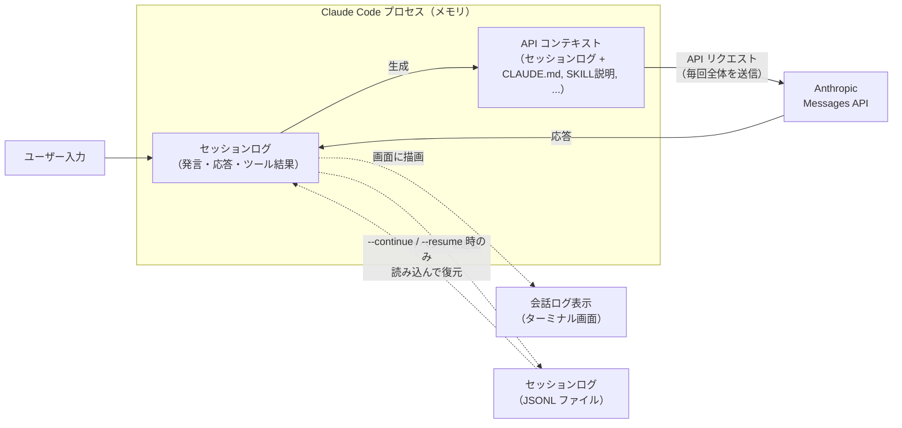
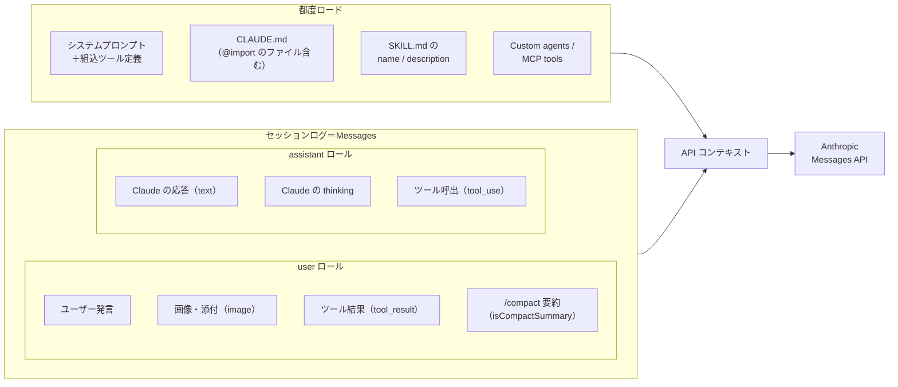
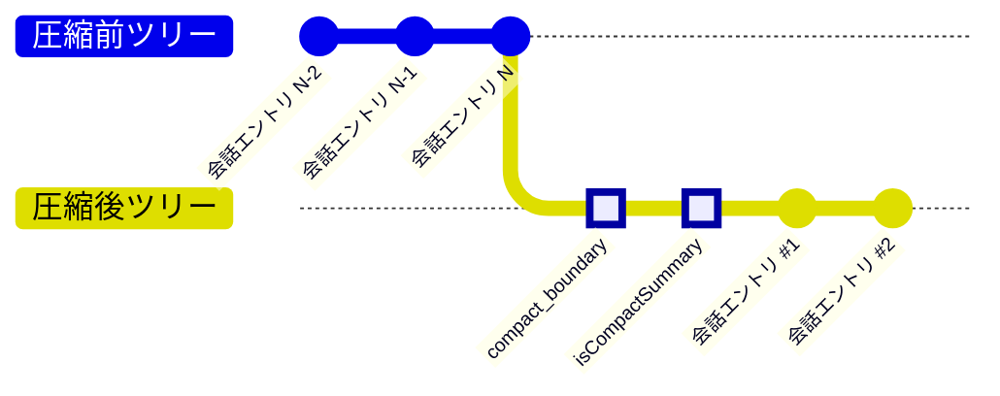

<!--
tags: Claude Code, AI, LLM, トークン消費, コンテキストウィンドウ
-->

# Claude Code のコンテキストサイズとトークン消費量について

## はじめに

Claude Code を使っていると「利用上限に達しました」という制限に遭遇することがあります。この制限に早く到達してしまう最大の原因は何でしょうか？

本記事では、Claude Code が内部に記録しているセッションログ（発言・応答・ツール結果など）とコンテキストとの関係について調査した結果を説明をします。
また、コンテキストサイズがトークン消費量（5時間リミット）にどう影響を及ぼすのか検証をします。

:::note info
この記事の内容は本人が考えて決めていますが、文章は AI（Claude Code）が 100% 書いています。
:::

### 検証環境

- macOS（Apple Silicon）
- Claude Code v2.1.96（Opus 4.6、1M context）
- プラン: Team plan（premium seats）
- ターミナル: [Warp](https://www.warp.dev/) v0.2026.04.01

---

## セッションログとコンテキスト

「はじめに」で触れた「セッションログ」と「コンテキスト」は、同じものではありません。両者を正しく区別できないと本記事の議論が成立しないため、最初に説明します。

| # | 概念 | 実体 | 確認方法 |
|---|------|------|---------|
| 1 | **セッションログ（JSONL ファイル）** | セッションのイベント（発言・応答・ツール結果など）が順に追記される、メモリ上の `messages` リストとディスク上のファイル（両者は同期）。ターミナル画面の会話ログ表示もこれが元。 | `~/.claude/projects/{project}/{session-id}.jsonl` |
| 2 | **API コンテキスト** | API 呼び出しのたびに構築される、API リクエスト全体。セッションログに `CLAUDE.md`・SKILL 説明・システムプロンプト・ツール定義などを組み合わせたもの。 | `/context` コマンド |

この 2 つの関係を、図と比較表で順に見ていきます。

### 関係図



図中の関係性について補足しておくと:

- **API コンテキスト**は、LLM (Claude API) に送られるリクエストボディの全文です。毎回の API 呼び出しに全体が含まれて送信されます。
- **セッションログ（JSONL ファイル）** には `file-history-snapshot`（編集前ファイルの checkpoint）や `permission-mode` 切替などのローカル用メタエントリも混ざるため、API コンテキストそのものではありません。
- なお、ターミナル画面に出る**会話ログ表示**はセッションログを人間向けに整形したビューです

| 観点 | セッションログ（JSONL ファイル） | API コンテキスト |
|------|-----------|---------------|
| 存在場所 | ディスク上のファイル | Claude Code プロセスのメモリ |
| 役割 | 過去の送受信の記録 | 次に LLM へ送信する内容 |
| `CLAUDE.md`・システムプロンプト等 | 記録されない | 毎回組み込まれる |
| `/compact` 実行後 | 過去エントリは残り、要約エントリが**追記**される | 要約に置き換わる |
| サイズの変動 | 単調増加（減らない） | `/compact` で縮小可能 |
| 計測値 | ファイルサイズ（bytes） | トークン数（`/context` で確認可能） |

**この記事で「コンテキスト」「コンテキストサイズ」と呼ぶのは、API コンテキストのことです。** セッションログ（JSONL ファイル）のファイルサイズではありません。

### コンテキストの構造

API コンテキストは、**API 呼び出しのたびにその場で組み立て直される**データです。毎回コンテキスト全体がAPI送信されます。

`/context` コマンドで見ると、組み立て結果がカテゴリ別に表示されます。


| カテゴリ | 内容 |
|---------|------|
| System prompt | Claude Code 本体のシステムプロンプト |
| System tools | 組み込みツールのスキーマ定義 |
| MCP tools | 接続中の MCP サーバーのツール |
| Custom agents | プロジェクトで定義されたサブエージェント |
| Memory files | `CLAUDE.md`、`@import` で取り込まれたファイル等 |
| Skills | `SKILL.md` の `name` と `description` |
| Messages | 会話ストリーム本体（ユーザー発言・Claude 応答・ツール結果） |
| Autocompact buffer | 圧縮処理用に予約される余剰枠 |
| Free space | 未使用領域 |

セッションが進むにつれて膨らみ、かつ中身のバリエーションが豊富なのは **Messages** カテゴリです。この記事でコンテキストが膨らむと言っているのは、主に Messages の増加を指します。



システムプロンプトやファイルからの静的なロードと、これまでのユーザーとのやり取りを記録したセッションログからのロードの２種類です。

- **Messages 以外の要素は毎回フレッシュに構築される**: `CLAUDE.md` などディスク上のファイルをセッション中に書き換えれば、次の API 呼び出しから新しい内容が取り込まれます（途中編集が即反映）。
- **Messages だけがセッションログから積み上がる**: 会話を重ねるほどこの部分だけが単調増加していきます。「コンテキストが膨らむ」とは主にこの増加を指します。

### セッションログの構造

セッションログは `~/.claude/projects/{project}/{session-id}.jsonl` の JSONL ファイルとして記録されます。セッションで発生した全イベントが 1 行 1 エントリで追記されていきます。

#### エントリの種類

| `type` | 役割 |
|--------|------|
| `user` | ユーザー発言、ツール結果の履歴 |
| `assistant` | Claude の応答（`usage` フィールド付き） |
| `system` | セッション内部イベント（`/compact` の境界など） |
| `file-history-snapshot` | 編集前のファイル内容（checkpoint 用） |
| `permission-mode` | Plan/Auto mode などの切替 |
| その他 | `attachment`, `custom-title`, `agent-name` 等 |

#### 1 往復（3 エントリ）の全文例

1 回のやり取り（ユーザー発言 → Claude 応答）が実際のセッションログにどう記録されるかを見てみます。ここでは筆者が「これはサンプルメッセージ」と送信し、Claude が返答した 1 往復を抜き出しました（見やすさのため整形済み）。

実は 1 往復の応答は JSONL 上では **3 エントリ**に分かれて記録されていました。Claude Opus 4.6 のような Extended Thinking 対応モデルでは、**1 回の API 呼び出しのレスポンスに `thinking` ブロックと `text` ブロックが含まれ、JSONL ではそれぞれ別エントリとして追記される**ためです。

**エントリ 1: ユーザー発言（`type: "user"`）**

```json
{
  "parentUuid": "99b943a5-4906-45b0-a533-e488ac18a70b",
  "isSidechain": false,
  "promptId": "14ed5b7f-885b-41a1-a573-69c571b0fb1d",
  "type": "user",
  "message": {
    "role": "user",
    "content": "これはサンプルメッセージ"
  },
  "uuid": "129e39c5-fd71-4eb1-a844-abfb41ed1807",
  "timestamp": "2026-04-15T09:47:51.737Z",
  "permissionMode": "auto",
  "sessionId": "431f03bc-95f1-41bd-903a-8cbc8ab569ff",
  "version": "2.1.96"
}
```

**エントリ 2: Claude の思考プロセス（`type: "assistant"`、`content` は `thinking` ブロック）**

```json
{
  "parentUuid": "129e39c5-fd71-4eb1-a844-abfb41ed1807",
  "isSidechain": false,
  "message": {
    "model": "claude-opus-4-6",
    "id": "msg_01SKE6ubRJTFibofdXS84cEi",
    "type": "message",
    "role": "assistant",
    "content": [
      {
        "type": "thinking",
        "thinking": "",
        "signature": "EroECmwIDBgCKkAOrMSvW1cGOuBlfn60gejimsKI3ikqm9eG..."
      }
    ],
    "stop_reason": null,
    "usage": {
      "input_tokens": 6,
      "cache_creation_input_tokens": 588,
      "cache_read_input_tokens": 94634,
      "output_tokens": 8,
      "cache_creation": {
        "ephemeral_5m_input_tokens": 0,
        "ephemeral_1h_input_tokens": 588
      },
      "service_tier": "standard"
    }
  },
  "requestId": "req_011Ca5M1RUXHkW3tshiKQzJ2",
  "type": "assistant",
  "uuid": "56e00cb7-5525-4a67-8149-46697345aa42",
  "timestamp": "2026-04-15T09:47:55.726Z"
}
```

**エントリ 3: Claude の本文応答（`type: "assistant"`、`content` は `text` ブロック）**

```json
{
  "parentUuid": "56e00cb7-5525-4a67-8149-46697345aa42",
  "isSidechain": false,
  "message": {
    "model": "claude-opus-4-6",
    "id": "msg_01SKE6ubRJTFibofdXS84cEi",
    "type": "message",
    "role": "assistant",
    "content": [
      {
        "type": "text",
        "text": "ご指示の意図を確認させてください。以下のどれに近いでしょうか？\n\n1. README_03.md の何らかの箇所にサンプルメッセージを追記したい（→ どの箇所に、どんな内容を？）\n2. 直前の `usage` 実測表のサンプルデータとして何か追加したい\n3. テスト送信で特に操作不要\n4. その他"
      }
    ],
    "stop_reason": "end_turn",
    "usage": {
      "input_tokens": 6,
      "cache_creation_input_tokens": 588,
      "cache_read_input_tokens": 94634,
      "output_tokens": 255,
      "cache_creation": {
        "ephemeral_1h_input_tokens": 588,
        "ephemeral_5m_input_tokens": 0
      },
      "service_tier": "standard"
    }
  },
  "requestId": "req_011Ca5M1RUXHkW3tshiKQzJ2",
  "type": "assistant",
  "uuid": "09f04447-5540-4e55-ac32-30d7bc02fe3a",
  "timestamp": "2026-04-15T09:47:58.627Z"
}
```

この 3 エントリで押さえておきたいポイントは３つです。

**ツリー構造は `user → thinking → text`**:
- エントリ 2 の `parentUuid` がエントリ 1 の `uuid`（`129e39c5...`）を、エントリ 3 の `parentUuid` がエントリ 2 の `uuid`（`56e00cb7...`）を指しています。

**`type: "user"` エントリには `usage` がない**:
- `usage` は API からの応答に付属するフィールドなので、`type: "assistant"` 側にのみ記録されます。

**エントリ 2 とエントリ 3 は `requestId` が同一**（`req_011Ca5M1RUXHkW3tshiKQzJ2`）:
- これが**同一の 1 回の API 呼び出し**から生成されたことを示しています。**JSONL 上は別行でも、API 呼び出しの回数としては 1 回**です。

#### `message.usage` の読み方（重要）

`usage` が示しているのは「このメッセージ（`content`）単体のトークン数」ではなく、「**このメッセージを生成するために行われた 1 回の API 呼び出しで、API に送信された/返ってきたトークンの総量**」です。

Messages API はステートレスで、毎回の呼び出しで**その時点の API コンテキスト全体**（セッションログ + `CLAUDE.md`, SKILL 説明, ...）を送信します。そのため `usage` の各フィールドは次の意味になります。

| フィールド | 意味 |
|-----------|------|
| `input_tokens` | 今回の呼び出しで新規に送信した入力トークン数（うちキャッシュに乗らなかった分） |
| `cache_creation_input_tokens` | 今回の呼び出しで新規に送信した入力トークン数（うち新しくキャッシュに書き込んだ分） |
| `cache_read_input_tokens` | 今回の呼び出しで送信した入力トークン数（うち既存のキャッシュからヒットした分） |
| `output_tokens` | Claude が生成した応答のトークン数 |

:::note
3 つの入力系フィールドはキャッシュ命中状況で分かれているだけで、合計すれば**今回の API 呼び出しで送信された入力トークンの総量**になります。これらが利用制限（5 時間リミット）にどう反映されるかは、本記事末尾の検証章で扱います。
:::

:::note warn
`input_tokens`、`cache_creation_input_tokens`、`cache_read_input_tokens` はエントリ 2・3 で完全に同じ値（6 / 588 / 94,634）です。
`output_tokens` のみ分かれています（thinking 部分 8 tokens + text 部分 255 tokens）。

`requestId` でグルーピングして**入力分は 1 回だけカウント**しないと、二重計上してしまいます。
:::

**入力合計 = `input_tokens` + `cache_creation_input_tokens` + `cache_read_input_tokens` が、この 1 回の API 呼び出しでコンテキストとして送信された総トークン数**です。

上の例では:

```
6 + 588 + 94,634 = 95,228 tokens
```

つまり、ユーザーはわずか 12 文字の「これはサンプルメッセージ」を送信しただけなのに、**その時点の API コンテキスト全体（95k tokens 分）が API に送信されていた**ことを意味します。

---

## Claude API へコンテキスト送信

API コンテキストがどう LLM に届き、どうトークン消費に関わるのかを詳しく見ていきます。

### Messages API はステートレス

Claude Code は Anthropic の Messages API を使って LLM と通信しています。この API は**ステートレス**です。つまり、毎回の API 呼び出しで**コンテキスト全体**をリクエストに含めて送信します。

```
1 回目の呼び出し: [システムプロンプト + ユーザー発言 1]                → ~20k tokens
2 回目の呼び出し: [システムプロンプト + 発言 1 + 応答 1 + 発言 2]      → ~25k tokens
3 回目の呼び出し: [全履歴 + 発言 3]                                  → ~30k tokens
  :
N 回目の呼び出し: [全履歴]                                          → ~500k tokens
```

コンテキストが膨らむほど、たった 1 回の API 呼び出しで送信されるトークン数も増えていきます。

:::note warn
後の検証で後述しますが、Claude API は既に送信された同一のコンテキストをサーバーサイドでキャッシュしています。

その為、キャッシュヒットした部分のコンテキストは5時間枠などの利用上限に対し、実際の消費トークン数に対する傾斜（0 ≦ m < 1) が掛かると推測されます。
:::

### エージェントループで API は複数回呼ばれる

Claude Code はエージェントループで動作します。ユーザーの 1 プロンプトに対して、Claude がツールを使うたびに API が呼び出されます。

```
ユーザー 1 プロンプト
  ├─ API call 1 → 入力 60k tokens, 出力 475 tokens
  │   └─ tool_use: Bash
  ├─ API call 2 → 入力 61k tokens, 出力 300 tokens
  │   └─ tool_use: Edit
  └─ API call 3 → 入力 62k tokens, 出力 200 tokens
      └─ text response（最終回答）
```

つまり、ユーザーから見た「1 回の問い合わせ」でも、裏では**複数回の API 呼び出しが発生し、そのたびにコンテキスト全体が送信されています**。

---

## `/compact` と `/clear` の動作

API コンテキスト（特に Messages）を縮小する手段として、`/compact` と `/clear` があります。

### `/compact`: セッションログを要約で置き換える

`/compact` は、これまでのセッションログを LLM に要約させ、**要約文で Messages を置き換え**ます。画面上の会話ログ表示はリセットされ、API コンテキストも縮小します。

セッションログ（JSONL ファイル）には以下の 2 種類のエントリが追記されます。以降の JSON サンプルは見やすさのため一部フィールド（`sessionId`、`version`、`cwd` など）を省略していますが、**`uuid` と `parentUuid` はツリー構造の把握に欠かせないため省略せず記載**しています。

#### 1. `compact_boundary` エントリ（圧縮境界）

`subtype: "compact_boundary"` を持つ system エントリが、圧縮の境界を示すために追記されます。`compactMetadata` に圧縮**前**のコンテキストサイズ（`preTokens`）が記録されます。

```json
{
  "parentUuid": null,
  "type": "system",
  "subtype": "compact_boundary",
  "content": "Conversation compacted",
  "compactMetadata": {
    "trigger": "manual",
    "preTokens": 363115,
    "preCompactDiscoveredTools": [
      "AskUserQuestion", "ExitPlanMode", "TaskCreate", ...
    ]
  },
  "timestamp": "2026-04-14T05:09:37.820Z",
  "uuid": "cfcc9992-e9ae-42f0-896d-7ef17924381a"
}
```

ポイントは 2 つです。

- `preTokens: 363115` — 圧縮**前**のコンテキストは 363k tokens ありました。
- `parentUuid: null` — 本流ツリーとの**接続が切れている**ことが明示されています。このエントリが新ツリーのルートです（後述の「ツリーの切り離し」参照）。

#### 2. `isCompactSummary` エントリ（要約本体）

`compact_boundary` の直後に、`isCompactSummary: true` フラグを持つ user エントリが追加されます。これが「前回までの会話の要約」で、これ以降の API コンテキストはこの要約を起点に構築されます。

```json
{
  "parentUuid": "cfcc9992-e9ae-42f0-896d-7ef17924381a",
  "type": "user",
  "message": {
    "role": "user",
    "content": "This session is being continued from a previous conversation that ran out of context. The summary below covers the earlier portion of the conversation.\n\n（以下、要約本文が続く）"
  },
  "isVisibleInTranscriptOnly": true,
  "isCompactSummary": true,
  "uuid": "3d8e39f7-fa02-4eac-9cce-a7dd8cb7344b"
}
```

ポイント:

- `parentUuid` は**直前の `compact_boundary` の uuid**（`cfcc9992...`）を指しており、圧縮後ツリーの内部にぶら下がっています（`null` ではない点に注意）。
- `message.content` の冒頭は全 14 件で同一の定型文（「This session is being continued...」）ですが、その後ろに続く**要約本文が `/compact` の本体**です。筆者のセッションでは要約本文は約 11,896 文字（~3k tokens 程度）でした。**363k tokens が 3k tokens の要約に圧縮された**ことになります。

#### ツリーの切り離し

実データを `parentUuid` で辿ると、`/compact` 実行前後でツリーが**切り離されている**ことが確認できます。筆者のセッションから該当箇所の `parentUuid` 関係を抜粋すると以下の通りです。

```
line 12671  system     compact_boundary       uuid=cfcc9992...  parentUuid=null ← 新ルート
line 12672  user       isCompactSummary=true  uuid=3d8e39f7...  parentUuid=cfcc9992...
line 12673  user       （圧縮後ツリーの次のエントリ） uuid=31b42f85...  parentUuid=3d8e39f7...
```

**`compact_boundary` の `parentUuid` が `null`** になっているのがポイントです。圧縮前の最後のエントリ（line 12670 以前）を親としては持たず、まったく新しいツリーのルートになっています。これを gitGraph で表現すると以下のようになります。



`--continue` / `--resume` はファイル末尾の最新エントリから `parentUuid` チェーンを逆方向に辿って会話を復元するため、**圧縮後ツリー側しか復元されない**ことになります。これが「`--continue` で復元されるのは最新の compact summary 以降のみ」という挙動の正体です（詳細は次章）。

### `/clear`: セッションログを完全に破棄する

`/clear` は、画面の会話ログ表示と API コンテキストの Messages を**完全にリセット**します。`/compact` とは違い、要約すら残りません。

JSONL ファイルに対する挙動は `/compact` と大きく異なります。`/compact` が同じファイルに `compact_boundary` と `isCompactSummary` を追記していたのに対し、**`/clear` は既存ファイルには一切手を加えず、新しい JSONL ファイル（＝新しいセッション）を作成**します。

実際に `/clear` を実行して挙動を観察した例：

```
実行前のセッション（55 エントリ）:
  /Users/{username}/.claude/projects/{project}/a180b663-...jsonl
    last timestamp: 2026-04-15T11:10:50.200Z   ← このファイルは以降一切書き換わらない

/clear 実行

実行後の新セッション（/clear 直後は 4 エントリ）:
  /Users/{username}/.claude/projects/{project}/a4c4eae8-...jsonl   ← 新ファイル
```

新セッションファイルの先頭は以下のような構造になっています。

```json
// line 2: 新セッションのルートエントリ（自動注入されるメタ情報）
{
  "parentUuid": null,
  "type": "user",
  "message": { "role": "user", "content": "<local-command-caveat>..." },
  "isMeta": true,
  "uuid": "72423dc7-161a-4562-9d69-0fb1e8af2011"
}

// line 3: /clear コマンド自体の記録
{
  "parentUuid": "72423dc7-161a-4562-9d69-0fb1e8af2011",
  "type": "user",
  "message": { "role": "user", "content": "<command-name>/clear</command-name>..." },
  "uuid": "0a5aec8e-4b08-4eaf-a08e-ee7bfe4f8725"
}
```

ポイント:

- 新ファイルには `compact_boundary` のような専用の境界エントリは存在しません。代わりに、**新しい `sessionId` を持つファイルそのもの**が境界の役割を果たします。
- 新ファイル内の最初のエントリは `parentUuid: null`（新ツリーのルート）で、これに `/clear` コマンドエントリがぶら下がります。以降の会話はこの新ルートから連なります。
- 旧ファイル（`a180b663...`）は一切書き換わらず、`claude --resume a180b663...` で明示的に指定すれば復元できます。`/clear` は「過去を消す」のではなく、「新しいセッションに切り替える」動作です。

### 2 つの違い

| 観点 | `/compact` | `/clear` |
|------|-----------|---------|
| API コンテキスト Messages | 要約に置き換わる（縮小） | 空になる（リセット） |
| 過去の会話の記憶 | 要約形式で保持 | 破棄（ただし旧 JSONL ファイルは残る） |
| 画面の会話ログ表示 | リセット | リセット |
| JSONL ファイル | 同一ファイルに `compact_boundary` + `isCompactSummary` を追記 | 新ファイルを作成（旧ファイルは手つかず） |
| セッション ID | 変わらない | 新しい ID に切り替わる |

---

## `--continue` / `--resume` による復元

`--continue` や `--resume` で Claude Code を再起動すると、API コンテキストが再構築されます。前章 [/compact: セッションログを要約で置き換える](#compact-セッションログを要約で置き換える) で見たとおり、Messages はセッションログ末尾から `parentUuid` を逆方向に辿って復元されるため、**最新の `compact_boundary` 以降のエントリだけが復元対象**になります。


`--continue` はセッションログ末尾（上図では `会話エントリ #2`）から `parentUuid` を逆方向に辿るため、**圧縮後ツリー**のみが到達可能です。圧縮前ツリー側は JSONL ファイルには残っていますが、`compact_boundary` の `parentUuid` が `null` で接続が切れているため、復元経路上たどり着けません。

ただし再構築されるのは Messages だけではなく、他のカテゴリは**セッションログに依存せず現在のディスク状態から再初期化**されます。

### カテゴリ別の復元挙動

| カテゴリ | 再開時の挙動 | 注意点 |
|---------|------------|-------|
| System prompt | 現在の状態から再生成 | Claude Code のバージョン更新や環境変化が反映される |
| Tool 定義 | 現在のツールセットを再ロード | 前回以降に追加/削除されたツールは変化する |
| Memory files | 現在のディスク内容を再ロード | `CLAUDE.md` が書き換わっていれば新しい内容が入る |
| Skills | 現在のディスクから再スキャン | 新しく追加された Skill は一覧に出る |
| Messages | セッションログから復元 | 最新の `compact_boundary` 以降のみ（前章参照） |

つまり `--continue` で復元されるのは「**前回と等価なコンテキスト**」であって、**バイト単位で同一ではない**点に注意が必要です。Messages 部分だけがセッションログ由来で、それ以外は**現在のディスク状態**から再初期化されます。

---

## コンテキストサイズ (API送信トークン数) と利用上限 (usage%)

:::note warn
**この章で書いていることが合っている保証は全くありません！**

検証はしましたが、データ不足が原因で実際の動作とは大分ズレた結果が出ていると思います。
鵜呑みにはせず参考程度... でお願いします🙇‍♂️
:::

### 仮説

[Claude API の料金](https://platform.claude.com/docs/ja/about-claude/pricing) は、Claude Opus 4.6 では以下の通りです。

| トークン消費種別 | 説明 | 料金 |
|:--------------|:-----|:----|
| input_tokens | ... | `$5 / MTok` |
| cache_creation_input_tokens | ... | `$10 / MTok` |
| cache_read_input_tokens | ... | `$0.50 / MTok` |
| output_tokens | ... | `$25 / MTok` |

つまり、Claude Code における `usage(%)` も、トークン消費量にたいして、種別ごとの係数 (`r1`, `r2`, `r3`) があるのではないかと考えました。

```
usage(%) = r1 × cc + r2 × cr + r3 × out

cc  = cache_creation_input_tokens
cr  = cache_read_input_tokens
out = output_tokens
```

僕が最も知りたかったことは、**/compact, /clear でコンテキストを削減すると usage(%) の節約に寄与するかどうか** です。

というのも、Claude API には毎回コンテキスト全体が送信されているのは事実ですが、Claude Code の仕組み上送信するコンテキストの大部分は毎回同じであり、Claude のサーバーサイドではキャッシュ参照されているからです。

### 結論

48 ポイントの計測データに対する回帰分析の結果、[Claude API の料金](https://platform.claude.com/docs/ja/about-claude/pricing) (Opus 4.6) とは一致しなかったものの、API 料金と似た傾向は見られました。

- output_tokens の消費が多いと、`usage(%)` の進みは一番速くなる
- cache_read_input_tokens の係数 `r2` は低いが、`/context` を毎回全送信→キャッシュリードされるのでトークン総量は多くなる

:::note
つまり `/compact`, `/clear` はコンテキスト削減だけでなく、トークン消費量にも一定は寄与すると言えそう？
:::

各係数と比率:

| 変数 | 係数 | cc を 1.0 とした比率 | API 価格比（参考: Opus 4.6） |
|------|------|--:|--:|
| `cache_creation_input_tokens` (cc) | 2.007e-05 | **1.0** | 1.0 |
| `cache_read_input_tokens` (cr) | 5.382e-07 | **0.027** | 0.050 |
| `output_tokens` (out) | 1.791e-04 | **8.9** | 2.5 |

**⚠️あくまで利用ケースの一例として** 後述する [S34 地点](#計測結果第-7-回) では、予測値の内訳は以下のとおりです。

| 変数 | トークン数 | 寄与 | 構成比 |
|------|--:|--:|--:|
| `cache_creation_input_tokens` (cc) | 992,698 | 19.9% | **28.6%** |
| `cache_read_input_tokens` (cr) | 38,473,175 | 20.7% | **29.7%** |
| `output_tokens` (out) | 162,555 | 29.1% | **41.7%** |

### 検証

:::note
記事のこれ以降は「検証方法」と「計測結果」、「回帰分析結果」について記述しています。
長いので読まなくても大丈夫です😅
:::

#### 前提条件・制約

この検証結果には以下の制約があり、Claude Code (Team plan, premium seats) での実際の usage(%) 計算とは異なる可能性があります。

- **利用上限（母数 B）が非公開**: Claude Code (Team plan, premium seats) のトークン利用上限は公式に公開されていません。推定できるのは係数の比率（cc : cr : out）のみで、絶対値は分かりません
- **時間帯による変動**: [Claude 公式がピーク・オフピーク時間帯で usage の上限を動的に変更している旨を宣言しています](https://support.claude.com/en/articles/14063676-claude-march-2026-usage-promotion)。本検証は全てオフピーク時間帯で実施していますが、オフピーク時も一定である保証はありません
- **JSONL に記録されない usage がある可能性**: JSONL に記録されない消費がある可能性は高いです。一例として `/compact` の要約生成 API 呼び出しの `usage` はセッション JSONL に記録されません。本検証では `/compact` を一切実行しないことで回避しています
- **cc・out の独立な変動データが不足**: 多重共線性に陥っている可能性が高いです。cr のみをトークン消費するケースの観測は出来ましたが、特に out に関してはこれだけを伸ばす計測ができない (cc, cr も同時に伸びる) ため、サンプルデータに強い相関関係があります
- **[thinking (extended thinking) は output tokens に計上](https://platform.claude.com/docs/en/build-with-claude/extended-thinking#pricing)**: 本検証の output には thinking トークンが含まれています

#### 検証方法

##### 回帰モデル

`input_tokens` は Claude Code のプロンプトキャッシュにより、キャッシュに乗らなかった端数のみで寄与が極めて小さいため除外し、3 変数で回帰します。

消費率のモデル（W1〜W3 は係数、B は利用上限量）:

```
usage(%) = (W1 × cc + W2 × cr + W3 × out) / B × 100

cc  = cache_creation_input_tokens
cr  = cache_read_input_tokens
out = output_tokens
```

r1 = W1/B、r2 = W2/B、r3 = W3/B と置くと B を消去できます。

```
usage(%) = r1 × cc + r2 × cr + r3 × out
```

推定すべき未知数は **r1, r2, r3 の 3 つだけ**です。ただし求まるのは W/B の比率であって、係数 W と利用上限量 B を個別に求めることはできません。「`cache_read_input_tokens` の係数は `cache_creation_input_tokens` の何倍か」は分かりますが、「上限は何トークンか」は分かりません。

##### 2 種類のデータソース

正解値である `usage(%)` と、Claude API のトークン消費量 (`cache_creation_input_tokens`, `cache_read_input_tokens`, `output_tokens`) はそれぞれ以下の通り記録されているものを収集します。

| データ | 取得方法 | 性質 |
|--------|---------|------|
| `utilization` 列（usage %） | Claude API の `anthropic-ratelimit-unified-5h-utilization` レスポンスヘッダから取得 | Anthropic サーバー側が算出した値。精度は小数 2 桁（= 整数%と同等） |
| `API 呼出`・`input_tokens`・`cache_creation_input_tokens`・`cache_read_input_tokens`・`output_tokens` 列 | セッション JSONL ファイルを Python スクリプトで集計 | クライアント側（Claude Code プロセス）が記録した値 |

**utilization はサーバーが報告した「正解値」であり、JSONL から集計した 4 種のトークン数はクライアントが記録した「説明変数」** です。回帰分析はこの 2 つの独立したソースを突き合わせて行っています。

##### セットアップ

**ターミナル 1**（mitmdump）:

```bash
mitmdump --listen-port 8080 --set flow_detail=2 "~d api.anthropic.com" > /tmp/mitmdump.log 2>&1
```

**ターミナル 2**（Claude Code）:

```bash
HTTPS_PROXY=http://127.0.0.1:8080 NODE_EXTRA_CA_CERTS=~/.mitmproxy/mitmproxy-ca-cert.pem claude -r
```

##### utilization 取得方法

mitmdump ログから最新の `5h-utilization` を読み取ります。このヘッダは `/v1/messages` レスポンスに毎回付与されます。

```bash
grep "5h-utilization" /tmp/mitmdump.log | tail -1 | awk '{print $2}'
```

##### ウィンドウ境界の特定

mitmdump ログの `5h-reset` ヘッダから正確なリセット時刻（Unix epoch）を取得できます。

```bash
grep "5h-reset" /tmp/mitmdump.log | tail -1 | awk '{print $2}'
# → 例: 1776456000（= 2026-04-17T20:00:00 UTC）
```

`window_end` = この値、`window_start` = この値 − 5 時間。

##### JSONL 集計手順

セッション JSONL（`~/.claude/projects/<project>/<session-id>.jsonl`）からトークン消費量を集計します。

**集計対象ファイル**

```
~/.claude/projects/-Users-{username}-src-claude-code-doc-verify/<session-id>.jsonl     ← メインセッション
~/.claude/projects/-Users-{username}-src-claude-code-doc-verify/<session-id>/subagents/*.jsonl  ← サブエージェント（存在する場合）
```

サブエージェント JSONL のエントリは大部分がメイン JSONL にも同一 `requestId` で重複記録されていますが、**メインに記録されない `requestId` も存在する**ため、両方読み込む必要があります。`requestId` ベースの重複排除を行えば二重計上にはなりません。

**エントリのフィルタリング**

以下の条件を**すべて**満たすエントリだけを集計対象とします。

1. **`type` が `"assistant"` である**: `usage` フィールドは `type: "assistant"` のエントリにのみ存在します
2. **`message.usage` が存在する**
3. **`timestamp` が計測ウィンドウ内である**: `window_start <= timestamp < window_end`
4. **`requestId` が存在する**: `requestId` が空や未定義のエントリは除外します
5. **Haiku モデルを除外する**: `message.model` に `haiku` を含むエントリは除外します

**`requestId` による重複排除（全フィールド MAX）**

フィルタを通過したエントリを `requestId` でグルーピングし、各フィールドの **最大値（MAX）** を取ります。

同一 `requestId` のエントリが複数存在する理由:

1. **ストリーミングチャンク**: Extended Thinking モデルでは、1 回の API レスポンスが `thinking` ブロックと `text` ブロックに分かれ、それぞれ別のエントリとして記録されます
2. **サブエージェント JSONL との重複**: 上述の通り

各フィールドの `usage` 値は、同一 `requestId` の**最終エントリに累積値が記録される**仕様です。途中エントリには途中時点の値（例: `output_tokens` は thinking のみの 8 tokens）が入っています。そのため、最終エントリを参照するか、安全のため MAX を取れば正しい値が得られます。

**集計**

すべてのユニークな `requestId` に対して、MAX 値を合算します。

- **API 呼出数** = ユニークな `requestId` の数
- **`input_tokens`** = 全 `requestId` の `input_tokens` の合計
- **`cache_creation_input_tokens`** = 全 `requestId` の `cache_creation_input_tokens` の合計
- **`cache_read_input_tokens`** = 全 `requestId` の `cache_read_input_tokens` の合計
- **`output_tokens`** = 全 `requestId` の `output_tokens` の合計

これが計測テーブルの 1 行分のデータになります。

##### スナップショット取得スクリプト

1 つのスクリプトで「mitmdump から utilization 取得」と「JSONL からトークン集計」を同時に行います。セッション JSONL パスとウィンドウ境界は自動検出します。

```python
import json, os, re
from datetime import datetime, timezone, timedelta

# --- 1. mitmdump ログから utilization とウィンドウ境界を取得 ---
mitm_log = '/tmp/mitmdump.log'
utilization_5h = None
utilization_7d = None
reset_5h = None

with open(mitm_log) as f:
    for line in f:
        m = re.search(r'5h-utilization:\s+(\S+)', line)
        if m:
            utilization_5h = m.group(1)
        m = re.search(r'7d-utilization:\s+(\S+)', line)
        if m:
            utilization_7d = m.group(1)
        m = re.search(r'5h-reset:\s+(\d+)', line)
        if m:
            reset_5h = int(m.group(1))

if reset_5h:
    we_dt = datetime.fromtimestamp(reset_5h, tz=timezone.utc)
    ws_dt = we_dt - timedelta(hours=5)
    ws = ws_dt.strftime('%Y-%m-%dT%H:%M:%S')
    we = we_dt.strftime('%Y-%m-%dT%H:%M:%S')
else:
    print('ERROR: 5h-reset not found in mitmdump log')
    exit(1)

# --- 2. mitmdump ログからセッション ID を取得し JSONL パスを構築 ---
session_id = None
with open(mitm_log) as f:
    for line in f:
        m = re.search(r'X-Claude-Code-Session-Id:\s+(\S+)', line)
        if m:
            session_id = m.group(1)

if not session_id:
    print('ERROR: Session ID not found in mitmdump log')
    exit(1)

base = os.path.expanduser(
    '~/.claude/projects/-Users-{username}-src-claude-code-doc-verify'
)
path = os.path.join(base, f'{session_id}.jsonl')

# --- 3. JSONL 集計（requestId ベース重複排除、Haiku 除外） ---
rid_data = {}
with open(path) as f:
    for line in f:
        entry = json.loads(line)
        ts = entry.get('timestamp', '')
        if ts < ws or ts >= we:
            continue
        if entry.get('type') != 'assistant':
            continue
        msg = entry.get('message', {})
        usage = msg.get('usage')
        if not usage:
            continue
        rid = entry.get('requestId')
        if not rid:
            continue
        model = msg.get('model', '')
        if 'haiku' in model:
            continue
        vals = {
            'input': usage.get('input_tokens', 0),
            'cache_creation': usage.get('cache_creation_input_tokens', 0),
            'cache_read': usage.get('cache_read_input_tokens', 0),
            'output': usage.get('output_tokens', 0),
        }
        if rid not in rid_data:
            rid_data[rid] = vals
        else:
            for k in rid_data[rid]:
                rid_data[rid][k] = max(rid_data[rid][k], vals[k])

# --- 4. 出力 ---
totals = {k: sum(v[k] for v in rid_data.values())
          for k in ['input', 'cache_creation', 'cache_read', 'output']}

print(f'utilization_5h: {utilization_5h}')
print(f'utilization_7d: {utilization_7d}')
print(f'window: {ws} ~ {we} UTC')
print(f'session: {os.path.basename(path)}')
print(f'API calls: {len(rid_data)}')
for k, v in totals.items():
    print(f'{k}: {v:,}')
```

#### 計測結果

3 回の計測（計 48 ポイント）を、それぞれ別の 5 時間ウィンドウで実施しました。全回共通の条件は以下のとおりです。

**1 回目（S0〜S15）— フェーズ分離計測**

- **window**: `2026-04-17T23:00:00` 〜 `2026-04-18T04:00:00` UTC
- **セッション ID**: `bddad483-7404-4227-81cd-9c5444c28af8`

`/compact` を使わず、フェーズ順序でコンテキストの自然な成長を利用して各変数を分離しました。

| フェーズ | 操作 | 伸びる変数 | 抑える変数 | 目標 utilization |
|---------|------|-----------|-----------|-----------------|
| **1: out 優位** | Claude に長文を繰り返し生成させる | out | cc, cr（コンテキストがまだ小さい） | **0% → 20%** |
| **2: cr 優位** | `echo 1` を大量実行 | cr | cc, out（echo 1 は cc/out がほぼゼロ） | **20% → 45%** |
| **3: cc 優位** | 大きなファイルを Read し、応答は短文のみ | cc | out（短い応答のみ） | **45% → 70%** |

| 時点 | Phase | utilization | API 呼出 | `input_tokens` | `cache_creation_input_tokens` | `cache_read_input_tokens` | `output_tokens` |
|------|-------|----------:|--------:|------:|---------------:|-----------:|-------:|
| S0 | 初期 | **2%** | 5 | 74 | 35,438 | 123,341 | 2,890 |
| S1 | 1: out 優位 | **5%** | 7 | 76 | 43,541 | 194,539 | 17,888 |
| S2 | 1: out 優位 | **8%** | 9 | 78 | 57,886 | 289,097 | 31,014 |
| S3 | 1: out 優位 | **11%** | 12 | 81 | 75,142 | 481,236 | 44,839 |
| S4 | 1: out 優位 | **14%** | 16 | 85 | 93,026 | 806,348 | 62,077 |
| S5 | 1: out 優位 | **17%** | 20 | 89 | 107,456 | 1,201,043 | 76,305 |
| S6 | 1: out 優位 | **20%** | 24 | 93 | 121,945 | 1,653,396 | 89,828 |
| S7 | 2: cr 優位 | **24%** | 31 | 855 | 250,486 | 2,425,973 | 94,266 |
| S8 | 2: cr 優位 | **28%** | 35 | 1,518 | 381,500 | 3,375,769 | 98,236 |
| S9 | 2: cr 優位 | **32%** | 39 | 1,940 | 512,980 | 3,803,895 | 100,066 |
| S10 | 2: cr 優位 | **37%** | 47 | 2,362 | 658,297 | 5,260,603 | 105,062 |
| S11 | 2: cr 優位 | **41%** | 54 | 2,818 | 800,056 | 5,724,185 | 106,895 |
| S12 | 2: cr 優位 | **48%** | 62 | 3,656 | 1,088,403 | 6,053,818 | 108,741 |
| S13 | 3: cc+cr 混合 | **51%** | 76 | 3,670 | 1,179,198 | 8,660,943 | 111,995 |
| S14 | 3: cc+cr 混合 | **54%** | 86 | 3,680 | 1,272,270 | 11,492,919 | 115,085 |
| S15 | 3: cc+cr 混合 | **55%** | 91 | 3,872 | 1,295,576 | 13,249,713 | 116,664 |

**2 回目（S16〜S34）— フェーズ配分改善**

- **window**: `2026-04-19T00:00:00` 〜 `2026-04-19T05:00:00` UTC
- **セッション ID**: `0a5e895e-...`、`f1c75f28-...`、`4df44558-...`（コンテキスト肥大化を避けるため、S28・S31 の後にセッションを切り替えて継続）

1 回目で Phase 3 のデータが 3 サンプル（7% 分）しか取れなかったため、フェーズ配分を変更しました。

| Phase | 1 回目の配分 | 2 回目の配分 | 変更理由 |
|-------|------------|------------|---------|
| 1: out 優位 | 2% → 20%（18%） | 3% → 15%（12%） | 1 回目で十分なデータあり |
| 2: cr 優位 | 20% → 48%（28%） | 15% → 28%（13%） | 1 回目で過剰配分 |
| 3: cc+cr 混合 | 48% → 55%（7%） | 28% → 60%（32%） | 1 回目で最も不足 |

| 時点 | Phase | utilization | API 呼出 | `input_tokens` | `cache_creation_input_tokens` | `cache_read_input_tokens` | `output_tokens` |
|------|-------|----------:|--------:|------:|---------------:|-----------:|-------:|
| S16 | 初期 | **3%** | 10 | 12 | 51,164 | 300,170 | 2,995 |
| S17 | 1: out 優位 | **7%** | 13 | 15 | 68,653 | 448,744 | 26,442 |
| S18 | 1: out 優位 | **10%** | 15 | 17 | 82,813 | 582,954 | 38,630 |
| S19 | 1: out 優位 | **13%** | 17 | 19 | 95,292 | 743,738 | 50,020 |
| S20 | 2: cr 優位 | **16%** | 22 | 509 | 114,474 | 1,243,499 | 64,029 |
| S21 | 2: cr 優位 | **19%** | 25 | 1,083 | 218,252 | 1,474,822 | 66,795 |
| S22 | 2: cr 優位 | **22%** | 28 | 1,442 | 325,757 | 1,714,185 | 69,436 |
| S23 | 2: cr 優位 | **25%** | 41 | 2,971 | 341,962 | 3,331,239 | 80,717 |
| S24 | 2: cr 優位 | **28%** | 54 | 4,445 | 358,330 | 5,165,707 | 92,199 |
| S25 | 3: cc+cr 混合 | **31%** | 65 | 4,456 | 431,687 | 7,149,998 | 98,687 |
| S26 | 3: cc+cr 混合 | **34%** | 80 | 4,651 | 473,132 | 10,784,072 | 107,775 |
| S27 | 3: cc+cr 混合 | **37%** | 91 | 6,154 | 489,100 | 13,785,944 | 115,565 |
| S28 | 3: cc+cr 混合 | **40%** | 102 | 7,663 | 501,109 | 16,927,954 | 124,120 |
| S29 | 3: cc+cr 混合 | **44%** | 120 | 18,124 | 588,756 | 18,047,651 | 132,104 |
| S30 | 3: cc+cr 混合 | **47%** | 139 | 29,816 | 703,726 | 20,654,670 | 136,053 |
| S31 | 3: cc+cr 混合 | **50%** | 150 | 35,452 | 800,597 | 23,370,065 | 138,738 |
| S32 | 3: cc+cr 混合 | **54%** | 169 | 43,820 | 889,796 | 24,639,216 | 147,452 |
| S33 | 3: cc+cr 混合 | **57%** | 187 | 52,294 | 945,664 | 26,840,928 | 152,936 |
| S34 | 3: cc+cr 混合 | **60%** | 251 | 54,773 | 992,698 | 38,473,175 | 162,555 |

**3 回目（S35〜S47）— cr 分離検証**

- **window**: `2026-04-19T08:00:00` 〜 `2026-04-19T13:00:00` UTC
- **セッション ID**: `ebd46187-7c38-4267-90d5-fe8846f47491`

1・2 回目では cr の独立な変動が不足しており、cr の係数が過小評価されている可能性があったため、**cc・out の増加を最小限に抑え cr のみを大量に増やす計測**を実施しました。コンテキストを ~200k tokens まで育てた後、`echo 1` の繰り返し実行で cr を蓄積しています（1 回の API コールで cc ≈ 0、out ≈ 数十 tokens、cr ≈ ~200k）。

| 時点 | Phase | utilization | API 呼出 | `input_tokens` | `cache_creation_input_tokens` | `cache_read_input_tokens` | `output_tokens` |
|------|-------|----------:|--------:|------:|---------------:|-----------:|-------:|
| S35 | cr 優位 | **10%** | 22 | 66,531 | 195,736 | 1,873,595 | 14,531 |
| S36 | cr 優位 | **13%** | 52 | 67,427 | 216,698 | 8,132,345 | 24,012 |
| S37 | cr 優位 | **16%** | 70 | 68,211 | 226,515 | 12,116,550 | 30,281 |
| S38 | cr 優位 | **19%** | 86 | 68,968 | 235,274 | 15,806,912 | 35,992 |
| S39 | cr 優位 | **22%** | 100 | 69,411 | 243,187 | 19,152,910 | 41,133 |
| S40 | cr 優位 | **26%** | 116 | 69,863 | 252,041 | 23,111,486 | 46,920 |
| S41 | cr 優位 | **29%** | 132 | 70,464 | 261,489 | 27,219,143 | 53,192 |
| S42 | cr 優位 | **33%** | 144 | 70,893 | 268,546 | 30,397,313 | 57,972 |
| S43 | cr 優位 | **37%** | 159 | 71,325 | 277,127 | 34,487,902 | 63,635 |
| S44 | cr 優位 | **41%** | 174 | 71,620 | 285,283 | 38,701,830 | 68,861 |
| S45 | cr 優位 | **45%** | 188 | 72,057 | 293,545 | 42,751,922 | 74,331 |
| S46 | cr 優位 | **49%** | 201 | 72,344 | 300,727 | 46,610,192 | 78,971 |
| S47 | cr 優位 | **51%** | 208 | 72,432 | 304,875 | 48,727,276 | 81,786 |

#### 回帰分析結果

##### 手法

モデル `usage(%) = a(cc) × cc + a(cr) × cr + a(out) × out`（切片なし）を使用します。1 回目（S0〜S15）、2 回目（S16〜S34）、3 回目（S35〜S47）はそれぞれ別の 5 時間ウィンドウですが、各ウィンドウ内の累積値に対して同じ係数が成り立つため、48 ポイントを統合して回帰できます。3 ウィンドウすべてオフピーク（土曜・日曜）です。

##### 結果

切片なしの複数手法で cc : cr : out 比率が安定しているか確認しました。

| 手法 | cc : cr : out | R² | max\|resid\| |
|------|--:|--:|--:|
| **累積 OLS** (48pt) | 1.0 : 0.027 : 8.9 | 0.9953 | 9.7% |
| 差分 Δ OLS (45pt) | 1.0 : 0.013 : 8.6 | 0.9325 | 3.2% |
| Ridge α=1.0 (48pt) | 1.0 : 0.027 : 8.9 | 0.9953 | 9.7% |
| WLS 重み=1/usage (48pt) | 1.0 : 0.027 : 9.7 | 0.9950 | 10.2% |
| 参考: API 価格（Opus 4.6） | 1.0 : 0.050 : 2.5 | — | — |

累積 OLS の係数:

```
a(cc)  = 2.007e-05
a(cr)  = 5.382e-07
a(out) = 1.791e-04
R²     = 0.9953
max|resid| = 9.7%
```

Bootstrap 95% CI for cr/cc: **[0.021, 0.038]**
