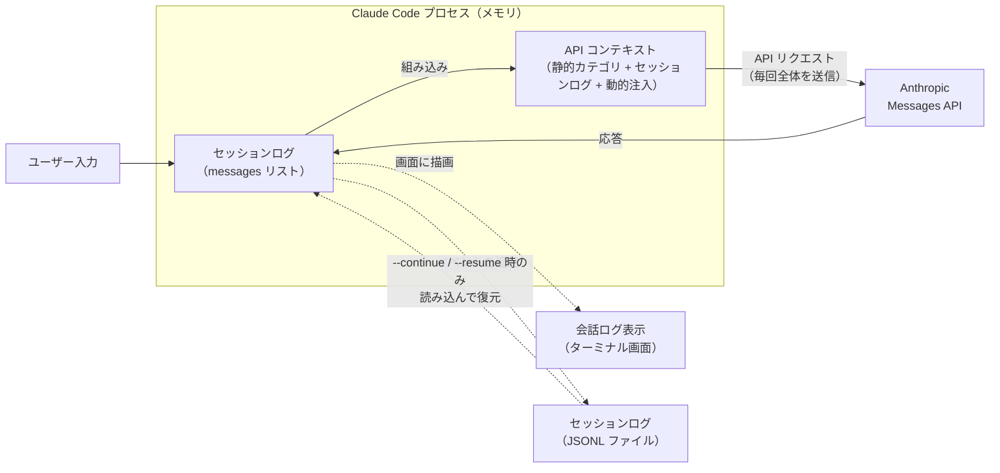
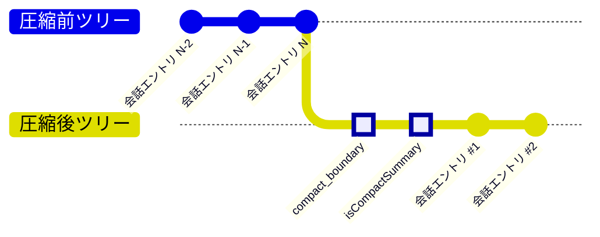

<!--
tags: Claude Code, AI, LLM, トークン消費, コンテキストウィンドウ
-->

# Claude Code のコンテキストサイズとトークン消費量について

## はじめに

Claude Code を使っていると「利用上限に達しました」という制限に遭遇することがあります。この制限に早く到達してしまう最大の原因は何でしょうか？

本記事の主張はシンプルです。**コンテキストが大きい状態を放置したまま会話を続けると、1 回のプロンプトで消費されるトークン量が劇的に増加する**——これが利用上限に早く到達する主因だ、というものです。

この主張を Claude Code が内部に記録しているセッションログ（JSONL ファイル: `~/.claude/projects/{project}/{session-id}.jsonl`）の `usage` データを使って実測・証明していきます。

:::note info
この記事の内容は本人が考えて決めていますが、文章は AI（Claude Code）が 100% 書いています。
:::

### 検証環境

- macOS（Apple Silicon）
- Claude Code v2.1.96（Opus 4.6、1M context）
- ターミナル: [Warp](https://www.warp.dev/) v0.2026.04.01

---

## 3 つの概念を区別する

議論を始める前に、Claude Code まわりで混同されやすい **3 つの概念**をはっきり区別しておきます。

| # | 概念 | 実体 | 確認方法 |
|---|------|------|---------|
| 1 | **会話ログ表示** | ターミナル画面に描画されるセッションログ（UI） | ターミナル画面を見る |
| 2 | **セッションログ（JSONL ファイル）** | セッションのイベントが追記されるファイル | `~/.claude/projects/{project}/{session-id}.jsonl` |
| 3 | **API コンテキスト** | Claude Code がメモリ上に保持し API 送信するデータ | `/context` コマンド |

この 3 つは関連はしていますが、**同じものではありません**。

### 関係図



Claude Code プロセスのメモリ上には **2 つの要素**があります。

- **セッションログ**: ユーザー発言・Claude 応答・ツール呼び出しとその結果が順に並んだ `messages` リスト。新しいイベントが発生するたびにメモリ上の末尾に追記され、同時にローカルの JSONL ファイルにも追記されます（メモリとファイルが同期）。ターミナル画面の描画も、このセッションログが元になります。
- **API コンテキスト**: API 呼び出しのたびに、セッションログに**静的カテゴリ**（システムプロンプト・ツール定義・メモリファイル・Skills 一覧など）と**動的注入**（`<system-reminder>` など）を組み合わせて構築される、API リクエストの全体。`/context` で表示されるのはこちら。

### 3 つの関係性

- **API コンテキスト**は、LLM に送られる「本体」です。セッションログに静的・動的要素を組み合わせて作られ、毎回の API 呼び出しに含まれて送信されます。
- **会話ログ表示**は、セッションログを**人間向けに整形して画面に描画**したものです。動的注入されるメタ情報（`<system-reminder>` 等）は画面には出ないため、**画面に見えるものと API コンテキストは完全一致しません**。
- **セッションログ（JSONL ファイル）**は、メモリ上のセッションログと同期する**追記専用ファイル**です。ただし、compact 要約などのメタエントリや、画面操作由来のイベントも混ざるため、API コンテキストそのものではありません。

### 違いを整理した比較表

| 観点 | 会話ログ表示 | セッションログ（JSONL ファイル） | API コンテキスト |
|------|------------|-----------|---------------|
| 存在場所 | ターミナル画面 | ディスク上のファイル | Claude Code プロセスのメモリ |
| 役割 | 人間向け UI | 過去の送受信の記録 | 次に LLM へ送信する内容 |
| `<system-reminder>` 等のメタ情報 | 省略・装飾表示 | 一部残る（揮発性のものは残らない） | 送信時に動的注入される |
| `/compact` 実行後 | 画面はリセット | 過去エントリは残り、要約エントリが**追記**される | 要約に置き換わる |
| サイズの変動 | 画面スクロール可能 | 単調増加（減らない） | `/compact` で縮小可能 |
| 計測値 | なし | ファイルサイズ（bytes） | トークン数（`/context` で確認可能） |

**この記事で「コンテキスト」「コンテキストサイズ」と呼ぶのは、3 番目の API コンテキストです。** セッションログ（JSONL ファイル）のファイルサイズでも、画面の行数でもありません。

---

## API コンテキストの仕組み

API コンテキストがどう LLM に届き、なぜトークン消費に直結するのかを詳しく見ていきます。

### Messages API はステートレス

Claude Code は Anthropic の Messages API を使って LLM と通信しています。この API は**ステートレス**です。つまり、毎回の API 呼び出しで**コンテキスト全体**をリクエストに含めて送信します。

```
1 回目の呼び出し: [システムプロンプト + ユーザー発言 1]                → ~20k tokens
2 回目の呼び出し: [システムプロンプト + 発言 1 + 応答 1 + 発言 2]      → ~25k tokens
3 回目の呼び出し: [全履歴 + 発言 3]                                  → ~30k tokens
  :
N 回目の呼び出し: [全履歴]                                          → ~500k tokens
```

コンテキストが膨らむほど、たった 1 回の API 呼び出しで送信されるトークン数も増えていきます。

### エージェントループで API は複数回呼ばれる

Claude Code はエージェントループで動作します。ユーザーの 1 プロンプトに対して、Claude がツールを使うたびに API が呼び出されます。

```
ユーザー 1 プロンプト
  ├─ API call 1 → 入力 60k tokens, 出力 475 tokens
  │   └─ tool_use: Bash
  ├─ API call 2 → 入力 61k tokens, 出力 300 tokens
  │   └─ tool_use: Edit
  └─ API call 3 → 入力 62k tokens, 出力 200 tokens
      └─ text response（最終回答）
```

ループが回るたびにツール結果がコンテキストに積み重なるため、**同じプロンプト内でも API 呼び出しごとにトークン数が微増**していきます。

### API コンテキストの構成要素

`/context` で見えるカテゴリ別の使用量は、以下のような構成になっています。

| カテゴリ | 内容 |
|---------|------|
| System prompt | Claude Code 本体のシステムプロンプト |
| System tools | 組み込みツールのスキーマ定義 |
| MCP tools | 接続中の MCP サーバーのツール |
| Custom agents | プロジェクトで定義されたサブエージェント |
| Memory files | `CLAUDE.md`、`@import` で取り込まれたファイル等 |
| Skills | `SKILL.md` の `name` と `description` |
| Messages | 会話ストリーム本体（ユーザー・Claude・ツール結果・動的注入） |
| Autocompact buffer | 圧縮処理用に予約される余剰枠 |
| Free space | 未使用領域 |

セッションが進むにつれて膨らみ、かつ中身のバリエーションが豊富なのは **Messages** カテゴリです。この記事でコンテキストが膨らむと言っているのは、主に Messages の増加を指します。

---

## セッションログ（JSONL ファイル）の構造

セッションログは `~/.claude/projects/{project}/{session-id}.jsonl` の JSONL ファイルとして記録されます。セッションで発生した全イベントが 1 行 1 エントリで追記されていきます。

### エントリの種類

| `type` | 役割 |
|--------|------|
| `user` | ユーザー発言、ツール結果、動的注入の履歴 |
| `assistant` | Claude の応答（`usage` フィールド付き） |
| `system` | セッション内部イベント（`/compact` の境界など） |
| `file-history-snapshot` | 編集前のファイル内容（checkpoint 用） |
| `permission-mode` | Plan/Auto mode などの切替 |
| その他 | `attachment`, `custom-title`, `agent-name` 等 |

### 1 往復（3 エントリ）の全文例

1 回のやり取り（ユーザー発言 → Claude 応答）が実際のセッションログにどう記録されるかを見てみます。ここでは筆者が「これはサンプルメッセージ」と送信し、Claude が返答した 1 往復を抜き出しました（見やすさのため整形済み）。

実は 1 往復の応答は JSONL 上では **3 エントリ**に分かれて記録されていました。Claude Opus 4.6 のような Extended Thinking 対応モデルでは、**1 回の API 呼び出しのレスポンスに `thinking` ブロックと `text` ブロックが含まれ、JSONL ではそれぞれ別エントリとして追記される**ためです。

**エントリ 1: ユーザー発言（`type: "user"`）**

```json
{
  "parentUuid": "99b943a5-4906-45b0-a533-e488ac18a70b",
  "isSidechain": false,
  "promptId": "14ed5b7f-885b-41a1-a573-69c571b0fb1d",
  "type": "user",
  "message": {
    "role": "user",
    "content": "これはサンプルメッセージ"
  },
  "uuid": "129e39c5-fd71-4eb1-a844-abfb41ed1807",
  "timestamp": "2026-04-15T09:47:51.737Z",
  "permissionMode": "auto",
  "sessionId": "431f03bc-95f1-41bd-903a-8cbc8ab569ff",
  "version": "2.1.96"
}
```

**エントリ 2: Claude の思考プロセス（`type: "assistant"`、`content` は `thinking` ブロック）**

```json
{
  "parentUuid": "129e39c5-fd71-4eb1-a844-abfb41ed1807",
  "isSidechain": false,
  "message": {
    "model": "claude-opus-4-6",
    "id": "msg_01SKE6ubRJTFibofdXS84cEi",
    "type": "message",
    "role": "assistant",
    "content": [
      {
        "type": "thinking",
        "thinking": "",
        "signature": "EroECmwIDBgCKkAOrMSvW1cGOuBlfn60gejimsKI3ikqm9eG..."
      }
    ],
    "stop_reason": null,
    "usage": {
      "input_tokens": 6,
      "cache_creation_input_tokens": 588,
      "cache_read_input_tokens": 94634,
      "output_tokens": 8,
      "cache_creation": {
        "ephemeral_5m_input_tokens": 0,
        "ephemeral_1h_input_tokens": 588
      },
      "service_tier": "standard"
    }
  },
  "requestId": "req_011Ca5M1RUXHkW3tshiKQzJ2",
  "type": "assistant",
  "uuid": "56e00cb7-5525-4a67-8149-46697345aa42",
  "timestamp": "2026-04-15T09:47:55.726Z"
}
```

**エントリ 3: Claude の本文応答（`type: "assistant"`、`content` は `text` ブロック）**

```json
{
  "parentUuid": "56e00cb7-5525-4a67-8149-46697345aa42",
  "isSidechain": false,
  "message": {
    "model": "claude-opus-4-6",
    "id": "msg_01SKE6ubRJTFibofdXS84cEi",
    "type": "message",
    "role": "assistant",
    "content": [
      {
        "type": "text",
        "text": "ご指示の意図を確認させてください。以下のどれに近いでしょうか？\n\n1. README_03.md の何らかの箇所にサンプルメッセージを追記したい（→ どの箇所に、どんな内容を？）\n2. 直前の `usage` 実測表のサンプルデータとして何か追加したい\n3. テスト送信で特に操作不要\n4. その他"
      }
    ],
    "stop_reason": "end_turn",
    "usage": {
      "input_tokens": 6,
      "cache_creation_input_tokens": 588,
      "cache_read_input_tokens": 94634,
      "output_tokens": 255,
      "cache_creation": {
        "ephemeral_1h_input_tokens": 588,
        "ephemeral_5m_input_tokens": 0
      },
      "service_tier": "standard"
    }
  },
  "requestId": "req_011Ca5M1RUXHkW3tshiKQzJ2",
  "type": "assistant",
  "uuid": "09f04447-5540-4e55-ac32-30d7bc02fe3a",
  "timestamp": "2026-04-15T09:47:58.627Z"
}
```

この 3 エントリで押さえておきたいポイントは 4 つです。

- **ツリー構造は `user → thinking → text`**: エントリ 2 の `parentUuid` がエントリ 1 の `uuid`（`129e39c5...`）を、エントリ 3 の `parentUuid` がエントリ 2 の `uuid`（`56e00cb7...`）を指しています。
- **`type: "user"` エントリには `usage` がない**: `usage` は API からの応答に付属するフィールドなので、`type: "assistant"` 側にのみ記録されます。
- **エントリ 2 とエントリ 3 は `requestId` が同一**（`req_011Ca5M1RUXHkW3tshiKQzJ2`）: これが**同一の 1 回の API 呼び出し**から生成されたことを示しています。**JSONL 上は別行でも、API 呼び出しの回数としては 1 回**です。
- **`usage` の扱いに注意**: `input_tokens`、`cache_creation_input_tokens`、`cache_read_input_tokens` はエントリ 2・3 で完全に同じ値（6 / 588 / 94,634）、`output_tokens` のみ分かれています（thinking 部分 8 tokens + text 部分 255 tokens）。`requestId` でグルーピングして**入力分は 1 回だけカウント**しないと、二重計上してしまいます。

### `message.usage` の読み方（重要）

`usage` が示しているのは「このメッセージ（`content`）単体のトークン数」ではなく、「**このメッセージを生成するために行われた 1 回の API 呼び出しで、API に送信された/返ってきたトークンの総量**」です。

Messages API はステートレスで、毎回の呼び出しで**その時点の API コンテキスト全体**（静的カテゴリ + セッションログ + 動的注入）を送信します。そのため `usage` の各フィールドは次の意味になります。

| フィールド | 意味 |
|-----------|------|
| `input_tokens` | 今回の呼び出しで新規に送信した入力トークン数（うちキャッシュに乗らなかった分） |
| `cache_creation_input_tokens` | 今回の呼び出しで新規に送信した入力トークン数（うち新しくキャッシュに書き込んだ分） |
| `cache_read_input_tokens` | 今回の呼び出しで送信した入力トークン数（うち既存のキャッシュからヒットした分） |
| `output_tokens` | Claude が生成した応答のトークン数 |

※ 3 つの入力系フィールドはキャッシュ命中状況で分かれているだけで、**利用制限に対しては等価にカウント**されます。キャッシュに乗っていても送信されたトークンはきちんと数えられるため、本題のトークン消費という観点では「合計すれば良い」と考えて構いません。

**入力合計 = `input_tokens` + `cache_creation_input_tokens` + `cache_read_input_tokens` が、この 1 回の API 呼び出しでコンテキストとして送信された総トークン数**です。上の例では:

```
6 + 588 + 94,634 = 95,228 tokens
```

つまり、ユーザーはわずか 12 文字の「これはサンプルメッセージ」を送信しただけなのに、**その時点の API コンテキスト全体（95k tokens 分）が API に送信されていた**ことを意味します。これが「コンテキストサイズ = トークン消費量」の正体です。

### 連続する呼び出しの `usage` を並べるとコンテキストの成長が見える

近接する 6 回の API 呼び出しの `usage` を `requestId` でグルーピングして並べました（`output_tokens` は thinking と text の合計）。

| 呼び出し | `input_tokens` | `cache_creation` | `cache_read` | **入力合計** | `output_tokens`（合計） |
|--------|---:|---:|---:|---:|---:|
| 1 | 1 | 418 | 78,353 | **78,772** | 307 |
| 2 | 1 | 363 | 78,771 | **79,135** | 620 |
| 3 | 1 | 676 | 79,134 | **79,811** | 718 |
| 4 | 1 | 774 | 79,810 | **80,585** | 199 |
| 5 | 1 | 376 | 80,584 | **80,961** | 403 |
| 6 | 6 | 469 | 80,960 | **81,435** | 909 |

注目点:

- **入力合計は単調増加** — 78,772 → 81,435 と 2,663 tokens 増えた。この差分がこの区間でコンテキストに追記された総量（ユーザー発言、Claude 応答、ツール結果などの積み重ね）です。
- **各行の入力合計の増分が、次の行の `cache_read + cache_creation` の構造に反映されている** — 前回送ったコンテキスト全体に加えて、今回新たに追加された分が上乗せで送信されていることが読み取れます。

`usage` は 1 回分の独立した情報ですが、時系列で並べると**コンテキストがどう膨らんでいるか**が明確に可視化されます。

### JSONL ファイルは追記専用

セッションログの JSONL ファイルは**追記専用**です。`/compact` を実行しても古いエントリは消されず、圧縮境界を示す新しいエントリが**末尾に追加**されるだけです。このため、ファイルサイズはセッションが進むほど単調増加します。

---

## `/compact` と `/clear` の動作

API コンテキスト（特に Messages）を縮小する手段として、`/compact` と `/clear` があります。

### `/compact`: セッションログを要約で置き換える

`/compact` は、これまでのセッションログを LLM に要約させ、**要約文で Messages を置き換え**ます。画面上の会話ログ表示はリセットされ、API コンテキストも縮小します。

セッションログ（JSONL ファイル）には以下の 2 種類のエントリが追記されます。以降の JSON サンプルは見やすさのため一部フィールド（`sessionId`、`version`、`cwd` など）を省略していますが、**`uuid` と `parentUuid` はツリー構造の把握に欠かせないため省略せず記載**しています。

#### 1. `compact_boundary` エントリ（圧縮境界）

`subtype: "compact_boundary"` を持つ system エントリが、圧縮の境界を示すために追記されます。`compactMetadata` に圧縮**前**のコンテキストサイズ（`preTokens`）が記録されます。

```json
{
  "parentUuid": null,
  "type": "system",
  "subtype": "compact_boundary",
  "content": "Conversation compacted",
  "compactMetadata": {
    "trigger": "manual",
    "preTokens": 363115,
    "preCompactDiscoveredTools": [
      "AskUserQuestion", "ExitPlanMode", "TaskCreate", ...
    ]
  },
  "timestamp": "2026-04-14T05:09:37.820Z",
  "uuid": "cfcc9992-e9ae-42f0-896d-7ef17924381a"
}
```

ポイントは 2 つです。

- `preTokens: 363115` — 圧縮**前**のコンテキストは 363k tokens ありました。
- `parentUuid: null` — 本流ツリーとの**接続が切れている**ことが明示されています。このエントリが新ツリーのルートです（後述の「ツリーの切り離し」参照）。

#### 2. `isCompactSummary` エントリ（要約本体）

`compact_boundary` の直後に、`isCompactSummary: true` フラグを持つ user エントリが追加されます。これが「前回までの会話の要約」で、これ以降の API コンテキストはこの要約を起点に構築されます。

```json
{
  "parentUuid": "cfcc9992-e9ae-42f0-896d-7ef17924381a",
  "type": "user",
  "message": {
    "role": "user",
    "content": "This session is being continued from a previous conversation that ran out of context. The summary below covers the earlier portion of the conversation.\n\n（以下、要約本文が続く）"
  },
  "isVisibleInTranscriptOnly": true,
  "isCompactSummary": true,
  "uuid": "3d8e39f7-fa02-4eac-9cce-a7dd8cb7344b"
}
```

ポイント:

- `parentUuid` は**直前の `compact_boundary` の uuid**（`cfcc9992...`）を指しており、圧縮後ツリーの内部にぶら下がっています（`null` ではない点に注意）。
- `message.content` の冒頭は全 14 件で同一の定型文（「This session is being continued...」）ですが、その後ろに続く**要約本文が `/compact` の本体**です。筆者のセッションでは要約本文は約 11,896 文字（~3k tokens 程度）でした。**363k tokens が 3k tokens の要約に圧縮された**ことになります。

#### ツリーの切り離し

実データを `parentUuid` で辿ると、`/compact` 実行前後でツリーが**切り離されている**ことが確認できます。筆者のセッションから該当箇所の `parentUuid` 関係を抜粋すると以下の通りです。

```
line 12671  system     compact_boundary       uuid=cfcc9992...  parentUuid=null ← 新ルート
line 12672  user       isCompactSummary=true  uuid=3d8e39f7...  parentUuid=cfcc9992...
line 12673  user       （圧縮後ツリーの次のエントリ） uuid=31b42f85...  parentUuid=3d8e39f7...
```

**`compact_boundary` の `parentUuid` が `null`** になっているのがポイントです。圧縮前の最後のエントリ（line 12670 以前）を親としては持たず、まったく新しいツリーのルートになっています。これを gitGraph で表現すると以下のようになります。



※ 図中の `compact_boundary` と `isCompactSummary` は JSONL 上の実データの値/フィールド名ですが、「会話エントリ N」「圧縮前ツリー」「圧縮後ツリー」は説明のために筆者が付けたラベルで、JSONL 上の予約語ではありません。

※ gitGraph の都合上、2 本のチェーンは同じルートから分岐したように描画されますが、**実際には `compact_boundary` の `parentUuid` が `null` なので圧縮前ツリーとは完全に切り離されています**。両ツリーのエントリは同じ JSONL ファイル内に時系列で並んで記録されていますが、`parentUuid` を辿ると圧縮前側と圧縮後側のどちらか片方にしか行けません。

`--continue` / `--resume` はファイル末尾の最新エントリから `parentUuid` チェーンを逆方向に辿って会話を復元するため、**圧縮後ツリー側しか復元されない**ことになります。これが「`--continue` で復元されるのは最新の compact summary 以降のみ」という挙動の正体です（詳細は次章）。

### `/clear`: セッションログを完全に破棄する

`/clear` は、画面の会話ログ表示と API コンテキストの Messages を**完全にリセット**します。`/compact` とは違い、要約すら残りません。

JSONL ファイルに対する挙動は `/compact` と大きく異なります。`/compact` が同じファイルに `compact_boundary` と `isCompactSummary` を追記していたのに対し、**`/clear` は既存ファイルには一切手を加えず、新しい JSONL ファイル（＝新しいセッション）を作成**します。

実際に `/clear` を実行して挙動を観察した例：

```
実行前のセッション（55 エントリ）:
  /Users/{username}/.claude/projects/{project}/a180b663-...jsonl
    last timestamp: 2026-04-15T11:10:50.200Z   ← このファイルは以降一切書き換わらない

/clear 実行

実行後の新セッション（/clear 直後は 4 エントリ）:
  /Users/{username}/.claude/projects/{project}/a4c4eae8-...jsonl   ← 新ファイル
```

新セッションファイルの先頭は以下のような構造になっています。

```json
// line 2: 新セッションのルートエントリ（自動注入されるメタ情報）
{
  "parentUuid": null,
  "type": "user",
  "message": { "role": "user", "content": "<local-command-caveat>..." },
  "isMeta": true,
  "uuid": "72423dc7-161a-4562-9d69-0fb1e8af2011"
}

// line 3: /clear コマンド自体の記録
{
  "parentUuid": "72423dc7-161a-4562-9d69-0fb1e8af2011",
  "type": "user",
  "message": { "role": "user", "content": "<command-name>/clear</command-name>..." },
  "uuid": "0a5aec8e-4b08-4eaf-a08e-ee7bfe4f8725"
}
```

ポイント:

- 新ファイルには `compact_boundary` のような専用の境界エントリは存在しません。代わりに、**新しい `sessionId` を持つファイルそのもの**が境界の役割を果たします。
- 新ファイル内の最初のエントリは `parentUuid: null`（新ツリーのルート）で、これに `/clear` コマンドエントリがぶら下がります。以降の会話はこの新ルートから連なります。
- 旧ファイル（`a180b663...`）は一切書き換わらず、`claude --resume a180b663...` で明示的に指定すれば復元できます。`/clear` は「過去を消す」のではなく、「新しいセッションに切り替える」動作です。

### 2 つの違い

| 観点 | `/compact` | `/clear` |
|------|-----------|---------|
| API コンテキスト Messages | 要約に置き換わる（縮小） | 空になる（リセット） |
| 過去の会話の記憶 | 要約形式で保持 | 破棄（ただし旧 JSONL ファイルは残る） |
| 画面の会話ログ表示 | リセット | リセット |
| JSONL ファイル | 同一ファイルに `compact_boundary` + `isCompactSummary` を追記 | 新ファイルを作成（旧ファイルは手つかず） |
| セッション ID | 変わらない | 新しい ID に切り替わる |

---

## `--continue` / `--resume` による復元

`--continue` や `--resume` で Claude Code を再起動すると、API コンテキストが再構築されます。前章 [/compact: セッションログを要約で置き換える](#compact-セッションログを要約で置き換える) で見たとおり、Messages はセッションログ末尾から `parentUuid` を逆方向に辿って復元されるため、**最新の `compact_boundary` 以降のエントリだけが復元対象**になります。


`--continue` はセッションログ末尾（上図では `会話エントリ #2`）から `parentUuid` を逆方向に辿るため、**圧縮後ツリー**のみが到達可能です。圧縮前ツリー側は JSONL ファイルには残っていますが、`compact_boundary` の `parentUuid` が `null` で接続が切れているため、復元経路上たどり着けません。

ただし再構築されるのは Messages だけではなく、他のカテゴリは**セッションログに依存せず現在のディスク状態から再初期化**されます。

### カテゴリ別の復元挙動

| カテゴリ | 再開時の挙動 | 注意点 |
|---------|------------|-------|
| System prompt | 現在の状態から再生成 | Claude Code のバージョン更新や環境変化が反映される |
| Tool 定義 | 現在のツールセットを再ロード | 前回以降に追加/削除されたツールは変化する |
| Memory files | 現在のディスク内容を再ロード | `CLAUDE.md` が書き換わっていれば新しい内容が入る |
| Skills | 現在のディスクから再スキャン | 新しく追加された Skill は一覧に出る |
| Messages | セッションログから復元 | 最新の `compact_boundary` 以降のみ（前章参照） |

つまり `--continue` で復元されるのは「**前回と等価なコンテキスト**」であって、**バイト単位で同一ではない**点に注意が必要です。Messages 部分だけがセッションログ由来で、それ以外は**現在のディスク状態**から再初期化されます。

### 測定による裏付け

Messages の復元範囲が「最新の `compact_boundary` 以降のみ」であることは、復元前後のトークン数から定量的に確認できます。

```
セッションログ総エントリ数:           13,041 件
最新の compact_boundary の位置:      line 12,671
/compact 直前のコンテキストサイズ:    363,115 tokens（compact_boundary の preTokens）
--continue 直後の Messages:         66.5k tokens
```

もし `--continue` がセッションログの全エントリ（13,041 件）を復元していれば、Messages サイズは `preTokens: 363,115` を大きく超える数百 k tokens に到達するはずです。しかし実測では 66.5k tokens に収まりました。**復元対象が圧縮後ツリー（`compact_boundary` 以降）に限定されている**ことを裏付ける値です。

---

## 検証: コンテキストサイズが本当に上限消費を左右するのか

論点: 次のうち、どのtoken消費区分が、 `/status --> Usage --> Current session (x% used)` に影響しているのか明らかにしたい。

- input_tokens
- cache_creation_input_tokens
- cache_read_input_tokens
- output_tokens

仮説:

1. 全ての送信したコンテキストが (x% used) にカウントされている
2. cache_read_input_tokens は (x% used) にはカウントされていない。API利用の場合と同様に
3. cache_read_input_tokens は (x% used) にはカウントされているが、1.0 未満の係数がかけられている
