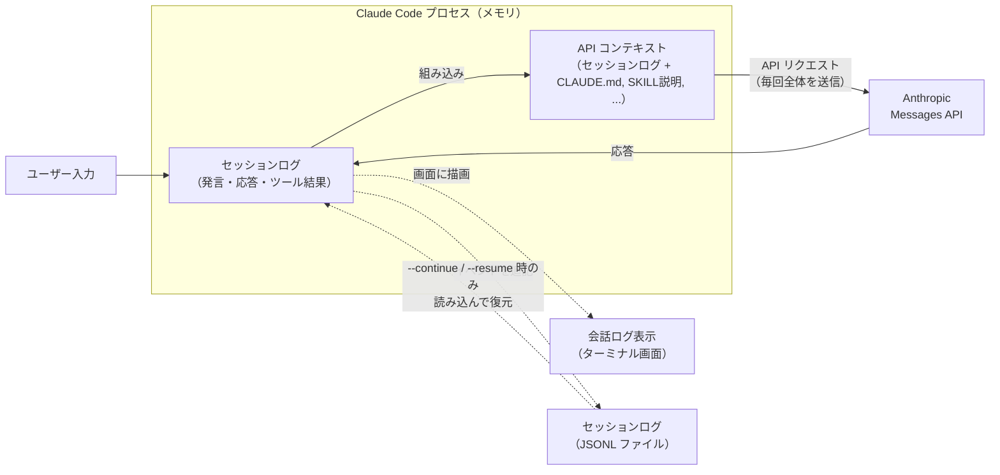
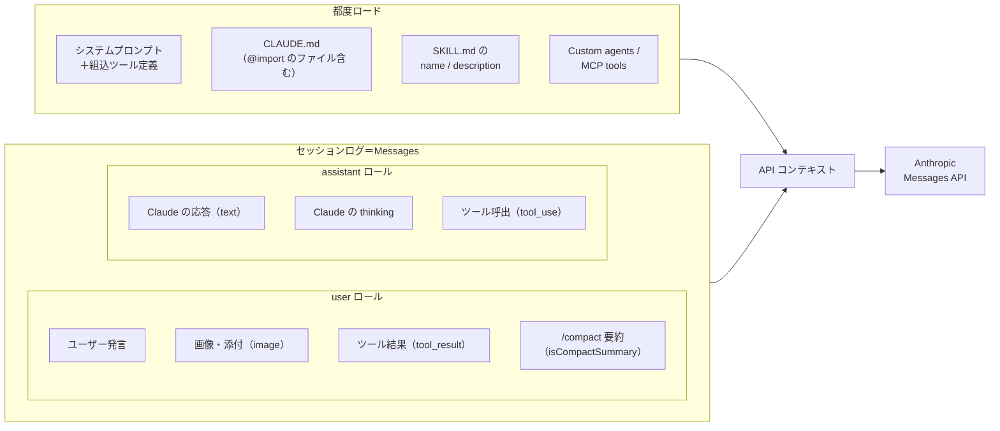
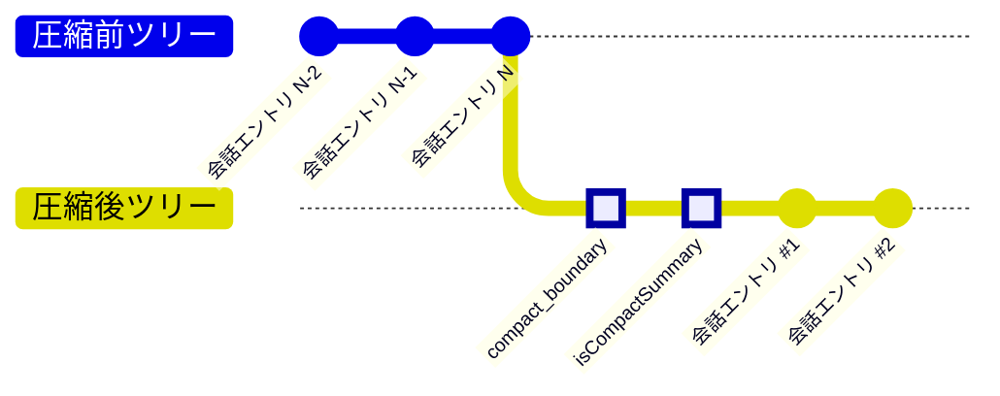

<!--
tags: Claude Code, AI, LLM, トークン消費, コンテキストウィンドウ
-->

# Claude Code のコンテキストサイズとトークン消費量について

## はじめに

Claude Code を使っていると「利用上限に達しました」という制限に遭遇することがあります。この制限に早く到達してしまう最大の原因は何でしょうか？

本記事では、Claude Code が内部に記録しているセッションログ（発言・応答・ツール結果など）とコンテキストとの関係について調査した結果を説明をします。
また、コンテキストサイズがトークン消費量（5時間リミット）にどう影響を及ぼすのか検証をします。

:::note info
この記事の内容は本人が考えて決めていますが、文章は AI（Claude Code）が 100% 書いています。
:::

### 検証環境

- macOS（Apple Silicon）
- Claude Code v2.1.96（Opus 4.6、1M context）
- プラン: Team plan（premium seats）
- ターミナル: [Warp](https://www.warp.dev/) v0.2026.04.01

---

## セッションログとコンテキスト

「はじめに」で触れた「セッションログ」と「コンテキスト」は、同じものではありません。両者を正しく区別できないと本記事の議論が成立しないため、最初にはっきりさせておきます。

| # | 概念 | 実体 | 確認方法 |
|---|------|------|---------|
| 1 | **セッションログ（JSONL ファイル）** | セッションのイベント（発言・応答・ツール結果など）が順に追記される、メモリ上の `messages` リストとディスク上のファイル（両者は同期）。ターミナル画面の会話ログ表示もこれが元。 | `~/.claude/projects/{project}/{session-id}.jsonl` |
| 2 | **API コンテキスト** | API 呼び出しのたびに構築される、API リクエスト全体。セッションログに `CLAUDE.md`・SKILL 説明・システムプロンプト・ツール定義などを組み合わせたもの。 | `/context` コマンド |

この 2 つの関係を、図と比較表で順に見ていきます。

### 関係図



図中の関係性について補足しておくと:

- **API コンテキスト**は、LLM (Claude API) に送られるリクエストボディの全文です。毎回の API 呼び出しに全体が含まれて送信されます。
- **セッションログ（JSONL ファイル）** には `file-history-snapshot`（編集前ファイルの checkpoint）や `permission-mode` 切替などのローカル用メタエントリも混ざるため、API コンテキストそのものではありません。
- なお、ターミナル画面に出る**会話ログ表示**はセッションログを人間向けに整形したビューで、`CLAUDE.md` やシステムプロンプトなどの API コンテキストの情報は画面に出ません。そのため**画面に見えるものと API コンテキストは完全一致しない**点には注意してください。

| 観点 | セッションログ（JSONL ファイル） | API コンテキスト |
|------|-----------|---------------|
| 存在場所 | ディスク上のファイル | Claude Code プロセスのメモリ |
| 役割 | 過去の送受信の記録 | 次に LLM へ送信する内容 |
| `CLAUDE.md`・システムプロンプト等 | 記録されない | 毎回組み込まれる |
| `/compact` 実行後 | 過去エントリは残り、要約エントリが**追記**される | 要約に置き換わる |
| サイズの変動 | 単調増加（減らない） | `/compact` で縮小可能 |
| 計測値 | ファイルサイズ（bytes） | トークン数（`/context` で確認可能） |

**この記事で「コンテキスト」「コンテキストサイズ」と呼ぶのは、API コンテキストのことです。** セッションログ（JSONL ファイル）のファイルサイズではありません。

### コンテキストの構造

API コンテキストは、**API 呼び出しのたびにその場で組み立て直される**データです。どこかに永続化された固定のオブジェクトがあるわけではありません。

`/context` コマンドで見ると、組み立て結果がカテゴリ別に表示されます。


| カテゴリ | 内容 |
|---------|------|
| System prompt | Claude Code 本体のシステムプロンプト |
| System tools | 組み込みツールのスキーマ定義 |
| MCP tools | 接続中の MCP サーバーのツール |
| Custom agents | プロジェクトで定義されたサブエージェント |
| Memory files | `CLAUDE.md`、`@import` で取り込まれたファイル等 |
| Skills | `SKILL.md` の `name` と `description` |
| Messages | 会話ストリーム本体（ユーザー発言・Claude 応答・ツール結果） |
| Autocompact buffer | 圧縮処理用に予約される余剰枠 |
| Free space | 未使用領域 |

セッションが進むにつれて膨らみ、かつ中身のバリエーションが豊富なのは **Messages** カテゴリです。この記事でコンテキストが膨らむと言っているのは、主に Messages の増加を指します。

これらの材料は、由来で大きく 2 系統に分けられます。



この組み立てかたには、3 つの特徴があります。

- **Messages 以外の要素は毎回フレッシュに構築される**: `CLAUDE.md` などディスク上のファイルをセッション中に書き換えれば、次の API 呼び出しから新しい内容が取り込まれます（途中編集が即反映）。
- **Messages だけがセッションログから積み上がる**: 会話を重ねるほどこの部分だけが単調増加していきます。「コンテキストが膨らむ」とは主にこの増加を指します。
- **コンテキストは毎回全文が API 送信される**: Messages API はステートレスで、毎回すべての材料を詰め直して送信します。そのため「コンテキストサイズ = 1 回の API 呼び出しで送信されるトークン数」に直結します。

### セッションログの構造

セッションログは `~/.claude/projects/{project}/{session-id}.jsonl` の JSONL ファイルとして記録されます。セッションで発生した全イベントが 1 行 1 エントリで追記されていきます。

#### エントリの種類

| `type` | 役割 |
|--------|------|
| `user` | ユーザー発言、ツール結果の履歴 |
| `assistant` | Claude の応答（`usage` フィールド付き） |
| `system` | セッション内部イベント（`/compact` の境界など） |
| `file-history-snapshot` | 編集前のファイル内容（checkpoint 用） |
| `permission-mode` | Plan/Auto mode などの切替 |
| その他 | `attachment`, `custom-title`, `agent-name` 等 |

#### 1 往復（3 エントリ）の全文例

1 回のやり取り（ユーザー発言 → Claude 応答）が実際のセッションログにどう記録されるかを見てみます。ここでは筆者が「これはサンプルメッセージ」と送信し、Claude が返答した 1 往復を抜き出しました（見やすさのため整形済み）。

実は 1 往復の応答は JSONL 上では **3 エントリ**に分かれて記録されていました。Claude Opus 4.6 のような Extended Thinking 対応モデルでは、**1 回の API 呼び出しのレスポンスに `thinking` ブロックと `text` ブロックが含まれ、JSONL ではそれぞれ別エントリとして追記される**ためです。

**エントリ 1: ユーザー発言（`type: "user"`）**

```json
{
  "parentUuid": "99b943a5-4906-45b0-a533-e488ac18a70b",
  "isSidechain": false,
  "promptId": "14ed5b7f-885b-41a1-a573-69c571b0fb1d",
  "type": "user",
  "message": {
    "role": "user",
    "content": "これはサンプルメッセージ"
  },
  "uuid": "129e39c5-fd71-4eb1-a844-abfb41ed1807",
  "timestamp": "2026-04-15T09:47:51.737Z",
  "permissionMode": "auto",
  "sessionId": "431f03bc-95f1-41bd-903a-8cbc8ab569ff",
  "version": "2.1.96"
}
```

**エントリ 2: Claude の思考プロセス（`type: "assistant"`、`content` は `thinking` ブロック）**

```json
{
  "parentUuid": "129e39c5-fd71-4eb1-a844-abfb41ed1807",
  "isSidechain": false,
  "message": {
    "model": "claude-opus-4-6",
    "id": "msg_01SKE6ubRJTFibofdXS84cEi",
    "type": "message",
    "role": "assistant",
    "content": [
      {
        "type": "thinking",
        "thinking": "",
        "signature": "EroECmwIDBgCKkAOrMSvW1cGOuBlfn60gejimsKI3ikqm9eG..."
      }
    ],
    "stop_reason": null,
    "usage": {
      "input_tokens": 6,
      "cache_creation_input_tokens": 588,
      "cache_read_input_tokens": 94634,
      "output_tokens": 8,
      "cache_creation": {
        "ephemeral_5m_input_tokens": 0,
        "ephemeral_1h_input_tokens": 588
      },
      "service_tier": "standard"
    }
  },
  "requestId": "req_011Ca5M1RUXHkW3tshiKQzJ2",
  "type": "assistant",
  "uuid": "56e00cb7-5525-4a67-8149-46697345aa42",
  "timestamp": "2026-04-15T09:47:55.726Z"
}
```

**エントリ 3: Claude の本文応答（`type: "assistant"`、`content` は `text` ブロック）**

```json
{
  "parentUuid": "56e00cb7-5525-4a67-8149-46697345aa42",
  "isSidechain": false,
  "message": {
    "model": "claude-opus-4-6",
    "id": "msg_01SKE6ubRJTFibofdXS84cEi",
    "type": "message",
    "role": "assistant",
    "content": [
      {
        "type": "text",
        "text": "ご指示の意図を確認させてください。以下のどれに近いでしょうか？\n\n1. README_03.md の何らかの箇所にサンプルメッセージを追記したい（→ どの箇所に、どんな内容を？）\n2. 直前の `usage` 実測表のサンプルデータとして何か追加したい\n3. テスト送信で特に操作不要\n4. その他"
      }
    ],
    "stop_reason": "end_turn",
    "usage": {
      "input_tokens": 6,
      "cache_creation_input_tokens": 588,
      "cache_read_input_tokens": 94634,
      "output_tokens": 255,
      "cache_creation": {
        "ephemeral_1h_input_tokens": 588,
        "ephemeral_5m_input_tokens": 0
      },
      "service_tier": "standard"
    }
  },
  "requestId": "req_011Ca5M1RUXHkW3tshiKQzJ2",
  "type": "assistant",
  "uuid": "09f04447-5540-4e55-ac32-30d7bc02fe3a",
  "timestamp": "2026-04-15T09:47:58.627Z"
}
```

この 3 エントリで押さえておきたいポイントは 4 つです。

- **ツリー構造は `user → thinking → text`**: エントリ 2 の `parentUuid` がエントリ 1 の `uuid`（`129e39c5...`）を、エントリ 3 の `parentUuid` がエントリ 2 の `uuid`（`56e00cb7...`）を指しています。
- **`type: "user"` エントリには `usage` がない**: `usage` は API からの応答に付属するフィールドなので、`type: "assistant"` 側にのみ記録されます。
- **エントリ 2 とエントリ 3 は `requestId` が同一**（`req_011Ca5M1RUXHkW3tshiKQzJ2`）: これが**同一の 1 回の API 呼び出し**から生成されたことを示しています。**JSONL 上は別行でも、API 呼び出しの回数としては 1 回**です。
- **`usage` の扱いに注意**: `input_tokens`、`cache_creation_input_tokens`、`cache_read_input_tokens` はエントリ 2・3 で完全に同じ値（6 / 588 / 94,634）、`output_tokens` のみ分かれています（thinking 部分 8 tokens + text 部分 255 tokens）。`requestId` でグルーピングして**入力分は 1 回だけカウント**しないと、二重計上してしまいます。

#### `message.usage` の読み方（重要）

`usage` が示しているのは「このメッセージ（`content`）単体のトークン数」ではなく、「**このメッセージを生成するために行われた 1 回の API 呼び出しで、API に送信された/返ってきたトークンの総量**」です。

Messages API はステートレスで、毎回の呼び出しで**その時点の API コンテキスト全体**（セッションログ + `CLAUDE.md`, SKILL 説明, ...）を送信します。そのため `usage` の各フィールドは次の意味になります。

| フィールド | 意味 |
|-----------|------|
| `input_tokens` | 今回の呼び出しで新規に送信した入力トークン数（うちキャッシュに乗らなかった分） |
| `cache_creation_input_tokens` | 今回の呼び出しで新規に送信した入力トークン数（うち新しくキャッシュに書き込んだ分） |
| `cache_read_input_tokens` | 今回の呼び出しで送信した入力トークン数（うち既存のキャッシュからヒットした分） |
| `output_tokens` | Claude が生成した応答のトークン数 |

:::note warn
3 つの入力系フィールドはキャッシュ命中状況で分かれているだけで、合計すれば**今回の API 呼び出しで送信された入力トークンの総量**になります。これらが利用制限（5 時間リミット）にどう反映されるかは、本記事末尾の検証章で扱います。
:::

**入力合計 = `input_tokens` + `cache_creation_input_tokens` + `cache_read_input_tokens` が、この 1 回の API 呼び出しでコンテキストとして送信された総トークン数**です。上の例では:

```
6 + 588 + 94,634 = 95,228 tokens
```

つまり、ユーザーはわずか 12 文字の「これはサンプルメッセージ」を送信しただけなのに、**その時点の API コンテキスト全体（95k tokens 分）が API に送信されていた**ことを意味します。

---

## Claude API へコンテキスト送信

API コンテキストがどう LLM に届き、なぜトークン消費に直結するのかを詳しく見ていきます。

### Messages API はステートレス

Claude Code は Anthropic の Messages API を使って LLM と通信しています。この API は**ステートレス**です。つまり、毎回の API 呼び出しで**コンテキスト全体**をリクエストに含めて送信します。

```
1 回目の呼び出し: [システムプロンプト + ユーザー発言 1]                → ~20k tokens
2 回目の呼び出し: [システムプロンプト + 発言 1 + 応答 1 + 発言 2]      → ~25k tokens
3 回目の呼び出し: [全履歴 + 発言 3]                                  → ~30k tokens
  :
N 回目の呼び出し: [全履歴]                                          → ~500k tokens
```

コンテキストが膨らむほど、たった 1 回の API 呼び出しで送信されるトークン数も増えていきます。

:::note warn
後の検証で後述しますが、Claude API は既に送信された同一のコンテキストをサーバーサイドでキャッシュしています。その為、新たに追加されたコンテキストのみが「消費トークン量」としてカウントされている可能性があります。
:::

### エージェントループで API は複数回呼ばれる

Claude Code はエージェントループで動作します。ユーザーの 1 プロンプトに対して、Claude がツールを使うたびに API が呼び出されます。

```
ユーザー 1 プロンプト
  ├─ API call 1 → 入力 60k tokens, 出力 475 tokens
  │   └─ tool_use: Bash
  ├─ API call 2 → 入力 61k tokens, 出力 300 tokens
  │   └─ tool_use: Edit
  └─ API call 3 → 入力 62k tokens, 出力 200 tokens
      └─ text response（最終回答）
```

つまり、ユーザーから見た「1 回の問い合わせ」でも、裏では**複数回の API 呼び出しが発生し、そのたびにコンテキスト全体が送信されています**。

---

## `/compact` と `/clear` の動作

API コンテキスト（特に Messages）を縮小する手段として、`/compact` と `/clear` があります。

### `/compact`: セッションログを要約で置き換える

`/compact` は、これまでのセッションログを LLM に要約させ、**要約文で Messages を置き換え**ます。画面上の会話ログ表示はリセットされ、API コンテキストも縮小します。

セッションログ（JSONL ファイル）には以下の 2 種類のエントリが追記されます。以降の JSON サンプルは見やすさのため一部フィールド（`sessionId`、`version`、`cwd` など）を省略していますが、**`uuid` と `parentUuid` はツリー構造の把握に欠かせないため省略せず記載**しています。

#### 1. `compact_boundary` エントリ（圧縮境界）

`subtype: "compact_boundary"` を持つ system エントリが、圧縮の境界を示すために追記されます。`compactMetadata` に圧縮**前**のコンテキストサイズ（`preTokens`）が記録されます。

```json
{
  "parentUuid": null,
  "type": "system",
  "subtype": "compact_boundary",
  "content": "Conversation compacted",
  "compactMetadata": {
    "trigger": "manual",
    "preTokens": 363115,
    "preCompactDiscoveredTools": [
      "AskUserQuestion", "ExitPlanMode", "TaskCreate", ...
    ]
  },
  "timestamp": "2026-04-14T05:09:37.820Z",
  "uuid": "cfcc9992-e9ae-42f0-896d-7ef17924381a"
}
```

ポイントは 2 つです。

- `preTokens: 363115` — 圧縮**前**のコンテキストは 363k tokens ありました。
- `parentUuid: null` — 本流ツリーとの**接続が切れている**ことが明示されています。このエントリが新ツリーのルートです（後述の「ツリーの切り離し」参照）。

#### 2. `isCompactSummary` エントリ（要約本体）

`compact_boundary` の直後に、`isCompactSummary: true` フラグを持つ user エントリが追加されます。これが「前回までの会話の要約」で、これ以降の API コンテキストはこの要約を起点に構築されます。

```json
{
  "parentUuid": "cfcc9992-e9ae-42f0-896d-7ef17924381a",
  "type": "user",
  "message": {
    "role": "user",
    "content": "This session is being continued from a previous conversation that ran out of context. The summary below covers the earlier portion of the conversation.\n\n（以下、要約本文が続く）"
  },
  "isVisibleInTranscriptOnly": true,
  "isCompactSummary": true,
  "uuid": "3d8e39f7-fa02-4eac-9cce-a7dd8cb7344b"
}
```

ポイント:

- `parentUuid` は**直前の `compact_boundary` の uuid**（`cfcc9992...`）を指しており、圧縮後ツリーの内部にぶら下がっています（`null` ではない点に注意）。
- `message.content` の冒頭は全 14 件で同一の定型文（「This session is being continued...」）ですが、その後ろに続く**要約本文が `/compact` の本体**です。筆者のセッションでは要約本文は約 11,896 文字（~3k tokens 程度）でした。**363k tokens が 3k tokens の要約に圧縮された**ことになります。

#### ツリーの切り離し

実データを `parentUuid` で辿ると、`/compact` 実行前後でツリーが**切り離されている**ことが確認できます。筆者のセッションから該当箇所の `parentUuid` 関係を抜粋すると以下の通りです。

```
line 12671  system     compact_boundary       uuid=cfcc9992...  parentUuid=null ← 新ルート
line 12672  user       isCompactSummary=true  uuid=3d8e39f7...  parentUuid=cfcc9992...
line 12673  user       （圧縮後ツリーの次のエントリ） uuid=31b42f85...  parentUuid=3d8e39f7...
```

**`compact_boundary` の `parentUuid` が `null`** になっているのがポイントです。圧縮前の最後のエントリ（line 12670 以前）を親としては持たず、まったく新しいツリーのルートになっています。これを gitGraph で表現すると以下のようになります。



`--continue` / `--resume` はファイル末尾の最新エントリから `parentUuid` チェーンを逆方向に辿って会話を復元するため、**圧縮後ツリー側しか復元されない**ことになります。これが「`--continue` で復元されるのは最新の compact summary 以降のみ」という挙動の正体です（詳細は次章）。

### `/clear`: セッションログを完全に破棄する

`/clear` は、画面の会話ログ表示と API コンテキストの Messages を**完全にリセット**します。`/compact` とは違い、要約すら残りません。

JSONL ファイルに対する挙動は `/compact` と大きく異なります。`/compact` が同じファイルに `compact_boundary` と `isCompactSummary` を追記していたのに対し、**`/clear` は既存ファイルには一切手を加えず、新しい JSONL ファイル（＝新しいセッション）を作成**します。

実際に `/clear` を実行して挙動を観察した例：

```
実行前のセッション（55 エントリ）:
  /Users/{username}/.claude/projects/{project}/a180b663-...jsonl
    last timestamp: 2026-04-15T11:10:50.200Z   ← このファイルは以降一切書き換わらない

/clear 実行

実行後の新セッション（/clear 直後は 4 エントリ）:
  /Users/{username}/.claude/projects/{project}/a4c4eae8-...jsonl   ← 新ファイル
```

新セッションファイルの先頭は以下のような構造になっています。

```json
// line 2: 新セッションのルートエントリ（自動注入されるメタ情報）
{
  "parentUuid": null,
  "type": "user",
  "message": { "role": "user", "content": "<local-command-caveat>..." },
  "isMeta": true,
  "uuid": "72423dc7-161a-4562-9d69-0fb1e8af2011"
}

// line 3: /clear コマンド自体の記録
{
  "parentUuid": "72423dc7-161a-4562-9d69-0fb1e8af2011",
  "type": "user",
  "message": { "role": "user", "content": "<command-name>/clear</command-name>..." },
  "uuid": "0a5aec8e-4b08-4eaf-a08e-ee7bfe4f8725"
}
```

ポイント:

- 新ファイルには `compact_boundary` のような専用の境界エントリは存在しません。代わりに、**新しい `sessionId` を持つファイルそのもの**が境界の役割を果たします。
- 新ファイル内の最初のエントリは `parentUuid: null`（新ツリーのルート）で、これに `/clear` コマンドエントリがぶら下がります。以降の会話はこの新ルートから連なります。
- 旧ファイル（`a180b663...`）は一切書き換わらず、`claude --resume a180b663...` で明示的に指定すれば復元できます。`/clear` は「過去を消す」のではなく、「新しいセッションに切り替える」動作です。

### 2 つの違い

| 観点 | `/compact` | `/clear` |
|------|-----------|---------|
| API コンテキスト Messages | 要約に置き換わる（縮小） | 空になる（リセット） |
| 過去の会話の記憶 | 要約形式で保持 | 破棄（ただし旧 JSONL ファイルは残る） |
| 画面の会話ログ表示 | リセット | リセット |
| JSONL ファイル | 同一ファイルに `compact_boundary` + `isCompactSummary` を追記 | 新ファイルを作成（旧ファイルは手つかず） |
| セッション ID | 変わらない | 新しい ID に切り替わる |

---

## `--continue` / `--resume` による復元

`--continue` や `--resume` で Claude Code を再起動すると、API コンテキストが再構築されます。前章 [/compact: セッションログを要約で置き換える](#compact-セッションログを要約で置き換える) で見たとおり、Messages はセッションログ末尾から `parentUuid` を逆方向に辿って復元されるため、**最新の `compact_boundary` 以降のエントリだけが復元対象**になります。


`--continue` はセッションログ末尾（上図では `会話エントリ #2`）から `parentUuid` を逆方向に辿るため、**圧縮後ツリー**のみが到達可能です。圧縮前ツリー側は JSONL ファイルには残っていますが、`compact_boundary` の `parentUuid` が `null` で接続が切れているため、復元経路上たどり着けません。

ただし再構築されるのは Messages だけではなく、他のカテゴリは**セッションログに依存せず現在のディスク状態から再初期化**されます。

### カテゴリ別の復元挙動

| カテゴリ | 再開時の挙動 | 注意点 |
|---------|------------|-------|
| System prompt | 現在の状態から再生成 | Claude Code のバージョン更新や環境変化が反映される |
| Tool 定義 | 現在のツールセットを再ロード | 前回以降に追加/削除されたツールは変化する |
| Memory files | 現在のディスク内容を再ロード | `CLAUDE.md` が書き換わっていれば新しい内容が入る |
| Skills | 現在のディスクから再スキャン | 新しく追加された Skill は一覧に出る |
| Messages | セッションログから復元 | 最新の `compact_boundary` 以降のみ（前章参照） |

つまり `--continue` で復元されるのは「**前回と等価なコンテキスト**」であって、**バイト単位で同一ではない**点に注意が必要です。Messages 部分だけがセッションログ由来で、それ以外は**現在のディスク状態**から再初期化されます。

---

## 検証: コンテキストサイズが本当に上限消費を左右するのか

論点: 次のうち、どのtoken消費区分が、 `/status --> Usage --> Current session (x% used)` に影響しているのか明らかにしたい。

- input_tokens
- cache_creation_input_tokens
- cache_read_input_tokens
- output_tokens

前提条件:

- Claude Code (Team plan, premium seats) のトークン利用上限（および、それに相当する利用額）は、公式には公開されておらず分からない

仮説:

1. 全ての消費トークン種別が等価に (x% used) にカウントされている
2. cache_read_input_tokens は (x% used) にカウントされているが、係数 (> 0, ≦ 1) がかけられている
3. cache_read_input_tokens は (x% used) にカウントされていない (係数 = 0)

## トークン消費量と usage (%) の計測

### 計測条件

- ウィンドウ: 14:00〜19:00 JST（05:00〜10:00 UTC）、リセット直後から開始
- 集計対象: メインセッション JSONL + `subagents/` 配下の全サブエージェント JSONL
- 重複排除: `requestId` 単位（入力系は 1 回、`output_tokens` は全エントリ合算）
- `/status` は手動確認し、確認直後に JSONL を集計

### 計測プロトコル

3 つの独立変数（`cache_creation`, `cache_read`, `output`）の係数を分離するために、**各変数を個別に大きく動かすフェーズ**を設けます。各フェーズ間で `/compact` を実行してコンテキストをリセットし、変数間の共変動を抑制します。

:::note info
`input_tokens` は Claude Code のプロンプトキャッシュにより、キャッシュに乗らなかった端数のみです。W1 の寄与は丸め誤差（±0.5%）に完全に埋もれるため、以降の分析では W1 の寄与を無視し、W2, W3, W4 の 3 係数に集中します。
:::

なお、消費率のモデルは以下の通りですが:

```
消費率(%) = (W2 × cache_creation + W3 × cache_read + W4 × output) / B × 100
```

ここで r2 = W2/B、r3 = W3/B、r4 = W4/B と置くと、B を消去できます。

```
消費率(%) = (r2 × cache_creation + r3 × cache_read + r4 × output) × 100
```

推定すべき未知数は **r2, r3, r4 の 3 つだけ**です。10 データポイントに対して 3 未知数なので、最小二乗法で推定できます。ただし求まるのは W/B の比率であって、W と B を個別に求めることはできません。「`cache_read` の係数は `cache_creation` の何倍か」は分かりますが、「予算は何トークンか」は分かりません。

| 変数 | 大きくする操作 | 小さくする操作 |
|------|-------------|-------------|
| `cache_creation` | `/compact` 直後に大きなファイルを読ませる（新コンテキスト＝全て新規キャッシュ書き込み） | `/compact` せず既存コンテキストのまま操作する |
| `cache_read` | `/compact` せずコンテキストを大きく育ててから何度も API を呼ばせる | `/compact` でコンテキストをリセットしてから操作する |
| `output` | 長い応答を要求する（長文生成、大きなコード生成） | 短い応答のみ要求する（`echo 1`、「はい/いいえで答えて」） |

#### フェーズ 0: ベースライン（S1）

ウィンドウ開始直後、最初の操作前に `/status` を確認し基準値を記録します。

#### フェーズ 1: output 優位（S2〜S3）

`/compact` 直後でコンテキストが最小の状態で、Claude に長い応答を繰り返し生成させます。`cache_read` の寄与が最小なため、`output` の影響を最も純粋に観測できます。

#### フェーズ 2: cache_creation 優位（S4〜S5）

`/compact` 実行後、大きなファイルを複数 Read させつつ、応答は「1行で要約して」と短く指示します。新規コンテキスト投入により `cache_creation` が急増する一方、`output` の増加は抑えられます。

#### フェーズ 3: cache_read 優位（S6〜S8）

フェーズ 2 で育てたコンテキストを **`/compact` せずに維持**し、`echo 1` のような極小コマンドを繰り返します。毎回コンテキスト全体がキャッシュから読み込まれるため、`cache_read` のみが大きく伸びます。

#### フェーズ 4: 混合検証（S9〜S10）

推定した係数の妥当性を確認するため、混合的な操作パターンで予測精度を検証します。

### 注意事項

- `/status` は整数表示（±0.5% の丸め誤差）なので、各スナップショット間で **2〜3% 以上の変化** が出るよう十分な操作量を確保する
- `/compact` 自体も API 呼び出しを発生させる。スナップショットは `/compact` 実行後に取ること
- auto-compact を避けるため、コンテキストを閾値以下に保つ
- 計測セッション中はサブエージェント（Agent ツール）を使用しない
- 計測前に `/context` でコンテキスト構成を確認し、予期しない要素の混入を排除する

### JSONL 集計時の注意

セッション JSONL（`~/.claude/projects/<project>/<session-id>.jsonl`）からトークン消費量を集計する際、以下の 2 点に注意が必要です。

#### 1. `output_tokens` はストリーミングチャンクの累積値

同一 `requestId` のエントリが複数記録されますが、これらは**同一 API 呼び出しのストリーミングチャンク**です。各チャンクの `output_tokens` は増分ではなく**累積値**であるため、`requestId` ごとに **`MAX` を取る**のが正しい集計方法です。`SUM` を取ると約 1.8 倍の過大計上になります。

```
同一 requestId のエントリ例:
  output_tokens: [8, 8, 8, ..., 8, 1469]
                  ~~~~~~~~~~~~~~~~~~~~~~  ~~~~
                  ストリーミング途中の     最終値（これが正しい値）
                  スナップショット
```

一方、`input_tokens`・`cache_creation_input_tokens`・`cache_read_input_tokens` は同一 `requestId` 内で**常に同一値**なので、どのエントリから取っても結果は変わりません。

#### 2. サブエージェント JSONL との重複

`<session-id>/subagents/*.jsonl` に記録されるサブエージェントのエントリは、メインの `<session-id>.jsonl` にも**同一 `requestId` で重複記録**されています。`requestId` ベースの重複排除を行えば自然に解消されますが、ファイル単位で単純合算すると二重計上になります。

#### 正しい集計スクリプト（抜粋）

```python
rid_data = {}
for entry in all_jsonl_entries:
    rid = entry["requestId"]
    usage = entry["message"]["usage"]
    out = usage["output_tokens"]
    if rid not in rid_data:
        rid_data[rid] = {
            "input": usage["input_tokens"],
            "cache_creation": usage["cache_creation_input_tokens"],
            "cache_read": usage["cache_read_input_tokens"],
            "output": out,  # 初回
        }
    else:
        rid_data[rid]["output"] = max(rid_data[rid]["output"], out)  # MAX で更新
```

### 計測結果（第 2 回）

| 時点 | フェーズ | `/status` | API 呼出 | `input` | `cache_creation` | `cache_read` | `output` |
|------|---------|----------:|---------:|--------:|-----------------:|-------------:|---------:|
| S1 | 0: ベースライン | **23%** | 83 | 13,322 | 434,495 | 7,741,558 | 54,550 |
| S2 | 1: output 優位 | **27%** | 88 | 14,629 | 447,144 | 8,482,395 | 61,049 |
| S3 | 1: output 優位 | **28%** | 93 | 14,636 | 457,974 | 8,619,846 | 71,208 |
| S4 | 2: cc 優位 | **38%** | 128 | 15,979 | 571,590 | 10,525,020 | 113,596 |
| S5 | 2: cc 優位 | **39%** | 135 | 16,521 | 591,289 | 11,112,845 | 116,046 |
| S6 | 3: cr 優位 | **40%** | 143 | 16,533 | 596,525 | 11,891,641 | 119,613 |
| S7 | 3: cr 優位 | **41%** | 151 | 16,574 | 602,454 | 12,715,082 | 123,492 |
| S8 | 3: cr 優位 | **44%** | 172 | 16,663 | 620,141 | 15,119,856 | 134,962 |
| S9 | 4: 混合検証 | **54%** | 184 | 17,983 | 953,077 | 16,238,727 | 147,039 |
| S10 | 4: 混合検証 | **57%** | 190 | 17,993 | 1,062,971 | 17,383,187 | 150,045 |

:::note warn
初回集計時に `window_start` を誤って前のウィンドウの開始時刻に設定していたため、前ウィンドウの 138 API コール分のトークンが混入していました。上記は正しいウィンドウ（19:00〜00:00 JST / 10:00〜15:00 UTC）で再集計した値です。差分（Δ）は変わらないため、差分ベースの分析結果には影響しません。
:::

### 第 2 回の計測結果に対する考察

10 データポイントに対して最小二乗法で回帰分析を試みましたが、**多重共線性（multicollinearity）により、係数を正しく推定できませんでした**。

根本原因は、Claude Code の API 呼び出しでは **1 回のコールで `cache_creation`・`cache_read`・`output` の 3 変数がすべて同時に増加する**ため、変数間の独立した変動を確保しにくいことです。フェーズ分離（`/compact` でのリセット、echo 1 の繰り返し等）により累積値の相関は緩和できましたが、特に `cache_read` について以下の問題が残りました。

- **`cache_read` の信号がノイズ以下**: `cache_read` のトークン単価は `cache_creation` の約 1/80 と推定され、1 計測区間あたりの寄与は最大 0.64% にとどまりました。`/status` の表示が整数%（±0.5% の丸め誤差）であるため、`cache_read` の信号が測定ノイズに埋もれています。
- **`cache_creation` と `output` は推定可能**: これらの 1 区間あたりの寄与はノイズの 14〜15 倍あり、信号として十分検出できています。

この問題を解決するには、`cache_read` のみが大きく変動する追加データが必要です。

### 計測プロトコル（第 3 回）

第 2 回の 10 データポイント（S1〜S10）はそのまま残し、**新しい 5 時間ウィンドウで `cache_read` 優位の追加 10 データポイント（S11〜S20）を計測**します。第 2 回データと結合して回帰分析を行うことで、`cache_read` の係数推定精度を改善します。

#### 方針

- `cache_creation` と `output` の増加を抑え、**`cache_read` のみを大きく増加させる**
- 1 計測区間あたり Δ`cache_read` ≧ 8M tokens を目標とする（`cache_read` の寄与が測定ノイズの 4 倍以上になる水準）
- 第 2 回と同じセッション JSONL 集計方法（`requestId` ベースの重複排除、`output_tokens` は MAX）を使用する

#### 前提

第 2 回の計測セッション終了時点で、コンテキストサイズが約 324k tokens まで育っています。このセッションを `claude --continue` で再開すればコンテキストがそのまま引き継がれるため、コンテキストを育てる手順を省略でき、`cache_creation` の余計な増加も抑えられます。

1 回の API コールで約 324k tokens の `cache_read` が発生するため、100 API コール（echo 1 × 1000 回 ÷ 10 並列）で Δ`cache_read` ≈ 32M tokens が見込めます。

#### 手順

1. **5 時間ウィンドウのリセットを待つ**
2. **`claude --continue` で第 2 回の計測セッションを再開する**（コンテキスト 324k tokens を引き継ぐ）
3. **ウィンドウ開始時刻を特定する**: `/status` で 0% 付近を確認した時点の UTC 時刻を `date -u '+%Y-%m-%dT%H:%M:%S'` で取得し、**直近の 5 時間境界に切り下げた値**を `window_start` とする。同時に `window_end = window_start + 5 時間` も記録する。第 2 回では `window_start` を 1 ウィンドウ分誤って設定したため、前ウィンドウのデータが混入した。この手順で同じ間違いを防ぐ
4. **`/compact` はこの後一切実行しない**（コンテキストを維持して `cache_read` を蓄積するため）
5. **JSONL を集計して S11 のベースラインとして記録する**。集計スクリプトには手順 3 で特定した `window_start` と `window_end` の**両方**を指定する
6. **echo 1 を 1000 回実行させる**: 「echo 1 を 1000 回実行して」と指示する。Claude Code は echo 1 を約 10 個ずつ並列実行するため、1000 回 ÷ 10 並列 ≈ 100 API コールとなる
7. **`/status` を確認**し、usage の伸びが 2〜3% 以上あれば JSONL を集計して記録する。不足していれば echo 1 の追加実行で補う
8. **手順 6〜7 を繰り返し**、S12〜S20 を記録する

#### JSONL 集計スクリプト（第 3 回用）

第 2 回からの変更点: **`window_end` フィルタを追加**。`window_start` と `window_end` は手順 3 で特定した値に置き換えること。

```python
import json, os, glob

window_start = '20XX-XX-XXT??:00:00'  # ← 手順 3 で特定した値に置換
window_end   = '20XX-XX-XXT??:00:00'  # ← window_start + 5 時間
session      = 'XXXXXXXX-XXXX-XXXX-XXXX-XXXXXXXXXXXX'  # ← セッション ID

base = os.path.expanduser('~/.claude/projects/-Users-yuusuke-kawatsu-src-claude-code-doc-verify')
files = [os.path.join(base, f'{session}.jsonl')]
sub_dir = os.path.join(base, session, 'subagents')
if os.path.isdir(sub_dir):
    files += glob.glob(os.path.join(sub_dir, '*.jsonl'))

rid_data = {}
for f in files:
    if not os.path.exists(f): continue
    with open(f) as fh:
        for line in fh:
            line = line.strip()
            if not line: continue
            try: entry = json.loads(line)
            except: continue
            if entry.get('type') != 'assistant': continue
            msg = entry.get('message', {})
            usage = msg.get('usage')
            if not usage: continue
            ts = entry.get('timestamp', '')
            if ts < window_start or ts >= window_end: continue
            rid = entry.get('requestId', '')
            if not rid: continue
            out = usage.get('output_tokens', 0)
            if rid not in rid_data:
                rid_data[rid] = {
                    'input': usage.get('input_tokens', 0),
                    'cache_creation': usage.get('cache_creation_input_tokens', 0),
                    'cache_read': usage.get('cache_read_input_tokens', 0),
                    'output': out,
                }
            else:
                rid_data[rid]['output'] = max(rid_data[rid]['output'], out)

api_calls = len(rid_data)
totals = {'input': 0, 'cache_creation': 0, 'cache_read': 0, 'output': 0}
for vals in rid_data.values():
    for k in totals:
        totals[k] += vals[k]
print(f'API calls: {api_calls}')
for k, v in totals.items():
    print(f'{k}: {v:,}')
```

#### 注意事項

- echo 1 の回数（1000 回）は目安であり、`/status` の変化量を見て臨機応変に増減する
- auto-compact が発動しないよう、コンテキストが閾値に近づいていないか `/context` で適宜確認する
- 計測セッション中はサブエージェント（Agent ツール）を使用しない
- **`window_start` / `window_end` は計測開始時に必ず確認・記録する**（第 2 回の教訓）

### 計測結果（第 3 回）

- **window_start**: `2026-04-17T00:00:00` UTC（09:00 JST）
- **window_end**: `2026-04-17T05:00:00` UTC（14:00 JST）
- **セッション ID**: `4e68c636-716a-4da7-bd7d-f8a0450321a2`（第 2 回から `--continue` で継続）
- **計測開始時コンテキスト**: 387k tokens（`/compact` なしで第 2 回から引き継ぎ）

| 時点 | `/status` | API 呼出 | `input` | `cache_creation` | `cache_read` | `output` |
|------|----------:|---------:|--------:|-----------------:|-------------:|---------:|
| S11 | **3%** | 2 | 4 | 100,846 | 99,871 | 1,729 |
| S12 | **5%** | 19 | 23 | 199,608 | 1,769,447 | 4,954 |
| S13 | **7%** | 23 | 29 | 202,444 | 2,196,784 | 5,735 |
| S14 | **8%** | 27 | 35 | 204,860 | 2,634,294 | 6,625 |
| S15 | **9%** | 35 | 47 | 212,507 | 3,545,786 | 11,830 |
| S16 | **10%** | 42 | 56 | 218,859 | 4,393,793 | 15,784 |
| S17 | **12%** | 49 | 65 | 225,189 | 5,286,102 | 19,753 |
| S18 | **14%** | 56 | 74 | 231,505 | 6,222,697 | 23,708 |
| S19 | **16%** | 63 | 83 | 237,827 | 7,203,528 | 27,033 |
| S20 | **18%** | 70 | 92 | 244,149 | 8,228,613 | 30,064 |
| S21 | **20%** | 83 | 109 | 256,034 | 10,242,494 | 35,898 |
| S22 | **22%** | 90 | 118 | 262,220 | 11,394,664 | 39,068 |
| S23 | **24%** | 97 | 127 | 268,414 | 12,590,168 | 42,901 |
| S24 | **26%** | 104 | 136 | 274,640 | 13,829,232 | 46,730 |
| S25 | **28%** | 111 | 145 | 280,843 | 15,111,596 | 49,889 |

### 回帰分析

#### 手法

モデルは `usage(%) = r2 × cc + r3 × cr + r4 × out`（切片なし）です。切片を入れると「トークン消費 0 でも usage > 0%」という物理的に無意味なモデルになるため、切片なしが正しいです。

第 2 回（S1〜S10）と第 3 回（S11〜S25）はウィンドウが異なりますが、各ウィンドウ内の累積値に対して同じ係数が成り立つため、25 ポイントを統合して回帰できます。

手法は OLS（最小二乗法）と NNLS（非負制約付き最小二乗法）の 2 つを試しましたが、OLS の係数が全て正だったため、結果は完全に一致しました。

#### 結果（25 ポイント統合）

```
a(cc)  = 1.774e-07
a(cr)  = 1.060e-08
a(out) = 1.375e-06
R²     = 0.9976
max|resid| = 1.7%
```

cc : cr : out の比率（cc = 1 に正規化）:

| | cc | cr | out |
|--|---:|---:|----:|
| **測定値（25 点統合）** | **1.0** | **0.060** | **7.8** |
| API 価格（Opus 4.6） | 1.0 | 0.080 | 4.0 |

- **cr/cc = 0.060** — API 価格（0.080）の 75%
- **out/cc = 7.8** — API 価格（4.0）の約 2 倍

#### 誤った回帰分析の例（第 2 回で犯したミス）

1. **切片ありモデルを使った**: `usage = a*cr + b` で R² = 0.995 を得たが、b = 0.031（3.1%）は「何も消費していなくても 3.1% 使用済み」を意味し、物理的に無意味。切片が高い R² を水増ししていた
2. **差分モデル（Δusage = a*Δcc + b*Δcr + c*Δout）**: 第 3 回のデータは cache_read 優位で、各区間の Δcc:Δcr:Δout の比率がほぼ一定。変数間の独立な変動がないため、差分モデルは R² = -0.93 と完全に崩壊した。差分モデルが機能するには、各区間で変数の増加パターンが異なることが必要
3. **データ不足の変数は推定が不安定**: 第 2 回のみ（10 点）では cr/cc = 0.023（API の 29%）だったが、cr 優位の第 3 回を加えた 25 点では 0.060（75%）に改善。逆に out は第 3 回でほとんど変動しないため、out/cc の推定精度は低い

#### 分析精度を上げるために必要なこと

現在の 25 ポイントでは **output の独立な変動が不足**しています。cc と out は相関が高く（API 呼び出しごとに両方増える）、分離が難しい状態です。

第 4 回の計測では **output 優位** のデータを追加すべきです。具体的には:

1. **`/compact` でコンテキストを最小化**してから開始する（cache_read を抑える）
2. **Claude に長文生成を繰り返し指示**する（「5000 語の解説を書いて」など）
3. **ファイル Read は極力避ける**（cache_creation を抑える）
4. 1〜2 回の長文生成ごとにスナップショットを記録し、S26〜S35 とする

これにより out が大きく変動し cc/cr が小さい区間が得られ、out/cc の推定精度が改善する見込みです。

### 計測プロトコル（第 4 回）— output 優位

#### 目的

第 2 回・第 3 回で不足している **output 優位のデータ**を追加し、out/cc の推定精度を改善する。

#### 背景: ウィンドウリセットとコンテキストの違い

- **ウィンドウリセット**: 5 時間経過で usage(%) が 0% にリセットされるが、**コンテキストはリセットされない**。`--continue` で再開するとコンテキスト（206k tokens）がそのまま残り、毎回の API 呼び出しで cache_read が大きくなる
- **`/compact`**: コンテキストを 30k 程度に圧縮する。会話の経緯・計測手順は要約として残るため、計測を継続できる
- **新規セッション**: コンテキスト ≈ 17k（system prompt のみ）。最小だが、計測の経緯を失う

output 優位にするには cache_read を抑える必要がある。`/compact`（30k）と新規セッション（17k）の差は 13k 程度で実用上十分なので、**`/compact` で継続する方が安全**。

#### 手順

1. **5 時間ウィンドウのリセットを待つ**
2. **`/compact` を実行する**（コンテキストを最小化しつつ、計測の経緯を保持）
3. **ウィンドウ開始時刻を特定する**: `/status` で 0% 付近を確認した時点の UTC 時刻を `date -u '+%Y-%m-%dT%H:%M:%S'` で取得し、5 時間境界に切り下げた値を `window_start` とする
4. **JSONL を集計して S26 のベースラインを記録する**
5. **Claude に長文生成を指示する**: 「以下のテーマについて 5000 語の解説を書いてください: ○○」のように output を最大化する。ファイル Read は避ける
6. **`/status` を確認**し、usage の伸びが 2〜3% 以上あれば JSONL を集計して記録する
7. **手順 5〜6 を繰り返し**、S27〜S35 を記録する

#### 注意事項

- セッション ID は同一（`--continue` + `/compact`）。JSONL パスは変わらない
- ファイル Read や Agent ツールは使わない（cache_creation / cache_read を抑えるため）
- **計測中に `/compact` を追加実行しない**（コンテキストが育つと cache_read が増えてしまう）
- 長文生成の指示は具体的なテーマを与えること（Claude が tool_use に逃げないように）
